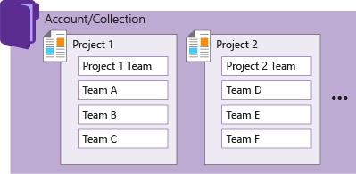

## Support a growing organization, manage work across the enterprise

[!INCLUDE [temp](../_shared/version-vsts-tfs-all-versions.md)]

How do you manage work across the enterprise using Agile tools?  How will you scale your Agile tools to support your growing enterprise?  

When you connect to VSTSor an on-premises TFS, you connect to an account or team project collection. Within that collection, one or more team projects may be defined. At a minimum, at least one team project must be created in order to use the system.

When you create your team project, a team of the same name is automatically created. For small teams, this is sufficient.  

However, for enterprise-level organizations, it may be necessary to scale up, to create additional teams and/or team projects. These can be created within the single account or collection.

You can scale your system as needed by adding teams and/or team projects. These can be created within the single account or collection. As your organization grows, your tools can grow to support a [culture of team autonomy as well as organizational alignment](agile-culture.md). 

<table width="100%">
<tbody valign="top">
<tr>
<td width="40%">
**Single team project, team defined within an account/collection**  
  
</td>

<td width="60%">
**Multiple team projects and teams defined within an account/collection**   
  

</td>
</tr>
</tbody>
</table>
 

To learn more, see the following topics:  
/azure/devops/agile/scale-agile-large-teams
- [Scale Agile to large teams](/azure/devops/agile/scale-agile-large-teams)
- [About teams and Agile tools](../../organizations/settings/about-teams-and-settings.md) 
- Manage a [portfolio of backlogs](portfolio-management.md) and gain insight into each team's progress as well as the progress of all programs.  
- Use [Delivery plans](review-team-plans.md) to review the schedule of stories or features your teams plan to deliver. Delivery plans show the scheduled work items by sprint (iteration path) of selected teams against a calendar view. 
- Incrementally adopt [practices that scale](practices-that-scale.md) to create greater rhythm and flow within your organization, engage customers, improve project visibility, and develop a productive workforce.
- Structure team projects to gain [visibility across teams](visibility-across-teams.md) or to support [epics, release trains, and multiple backlogs to support the Scaled Agile Framework](scaled-agile-framework.md). 