# Set team defaults  

[!INCLUDE [temp](../_shared/dev15-version-header.md)]
 
Each team has access to a number of Agile tools as described in [About teams and Agile tools](../../settings/about-teams-and-settings.md). Each tool references the team's default area path(s). Several tools reference the team's default and active iteration paths or sprints. Most teams choose one area path and several iteration paths to support their work tracking activities. However, to support other scenarios, it's possible for teams to choose several area paths to appear on their backlogs and boards. 

Prior to setting team defaults, [add the teams](multiple-teams.md) you want and [schedule your shared sprint schedule](../scrum/define-sprints.md). Optionally, [add area paths](../customize/set-area-paths.md) you want to use to group work items. 

## Backlog iteration versus default iteration 

For TFS 2015 and earlier versions, the default iteration is the same as the backlog iteration. The one value selected both filters items that appear on the team's backlogs and boards, and is assigned to work items created from the team context.  

For VSTS, teams can now set a default iteration different from the backlog iteration. The backlog iteration determines which items appear on the team's backlogs and boards. And, the default iteration determines what value is assigned to work items created from the team context. 

For both platforms, all work items that you create from your team context are automatically assigned both the team's default area path and default iteration path. 

You navigate to your team context from the top navigation bar.  

  

## Open the admin context for your team  

You set team defaults from the team admin context. 

From a web browser, open the web portal administrative context for your team.  

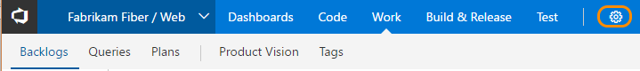  

If you're not a team administrator, [get added as one](../scale/add-team-administrator.md). Only team or project administrators can change team settings. 

## Set team default area path(s) 

All work items assigned to the area paths selected for a team appear on the backlogs and boards for that team. 

- From VSTS, you can select one or more area paths and optionally include their sub-area paths.  
- From TFS, you can select a single area path, and optionally include their sub-area paths.  
The default area path determines the default area path assigned to work items that are created from the team context.  

Choose to include sub-area paths when you want to support rollup views of work performed across several teams or areas.  

> [!IMPORTANT]  
> Work items that appear on more then one team's Kanban board can yield query results that don't meet your expectations. Because each team can customize the Kanban board [columns](../kanban/add-columns.md) and [swimlanes](../kanban/expedite-work.md), the values assigned to work items which appear on different boards may not be the same. The primary work around for this issue is to maintain single ownership of work items by team area path.   

### VSTS and TFS 2017 and later versions 

1.	Open the Work, Areas admin page for the team context.  

	Here, we navigate to the Fabrikam Fiber Team, the default team for the team project.  

	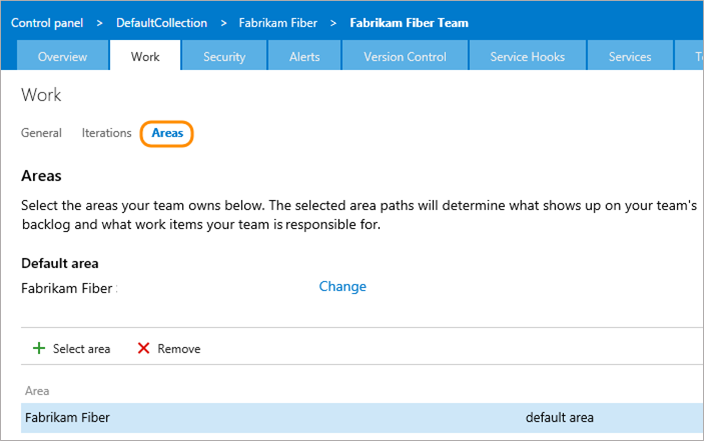  

2. Choose the area path(s) to be active for each team. In general, feature teams set a single area path as their default.   

	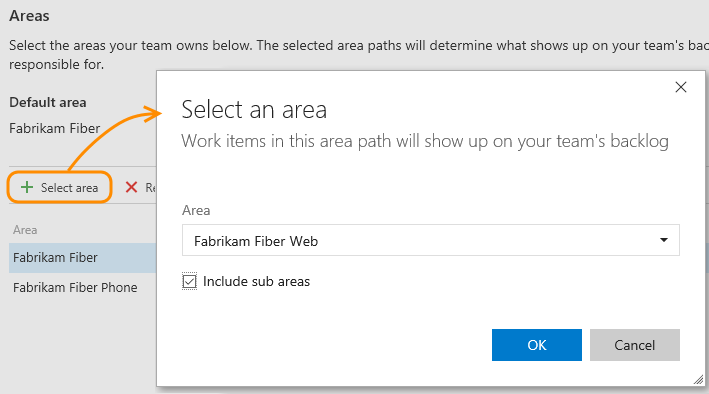  

	In this instance, we choose to activate all three sub-area paths for the team project. This allows the management team to track progress across all three teams.  

	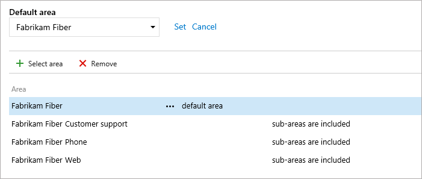  

3.	When you've finished, refresh the product backlog page for the team, and you'll see those work items assigned to the team. Add Area Path to the columns shown to see the assignments made to work items.  

	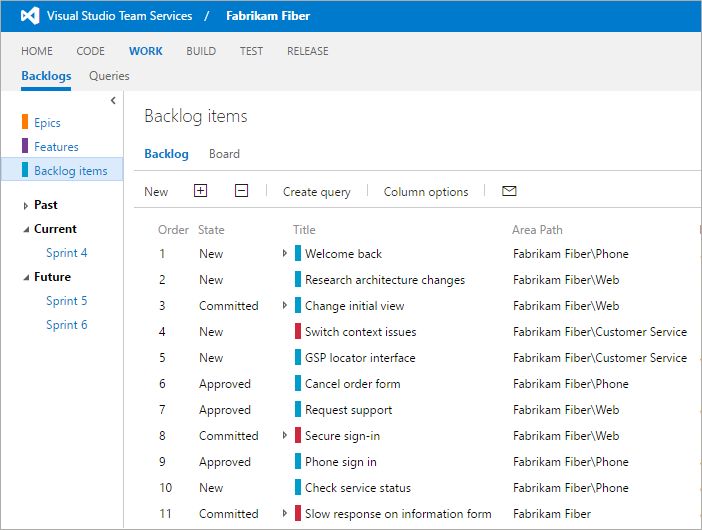  

### For TFS 2015 and earlier versions  

1. Open the Areas admin page for the team context.  

	Here, we navigate to the Web team. The checked box indicates the area paths selected for the team. To exclude sub-areas, select the option from the area path context menu.  

	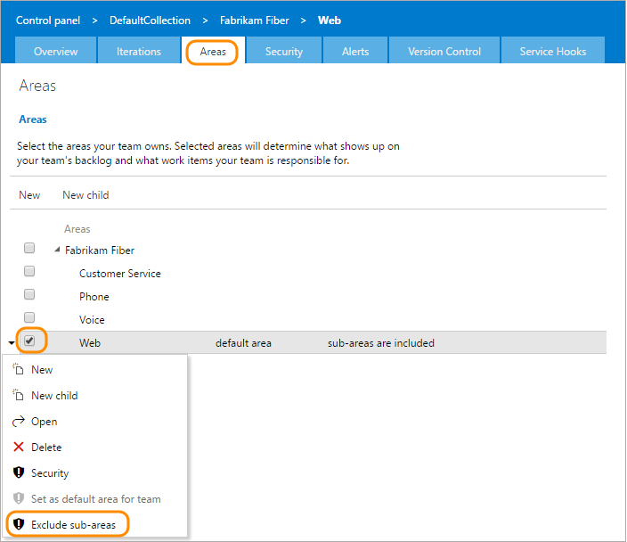  

2.	Refresh the product backlog page for the team, and you'll see only those work items assigned to the Fabrikam Fiber\Web area path.   

	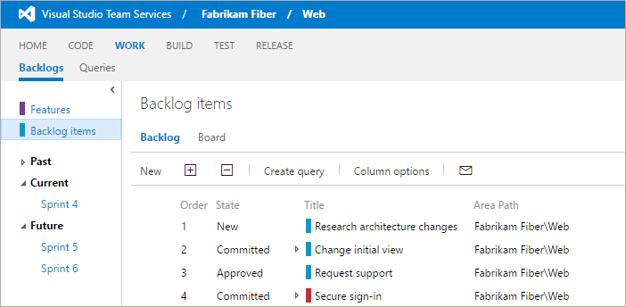  

## Select team sprints and default iteration path  

You [define sprints for the team project](../scrum/define-sprints.md) and then activate them for each team. You assign the default iteration to use when creating new work items. 

You activate sprints for each team from the admin pages for each team context. The steps differ slightly depending on your platform.

### For VSTS and TFS 2017 and later versions  

1.	Open the Work, Iterations page for the team context.  

	Here, we navigate to the Fabrikam Fiber Team.  

	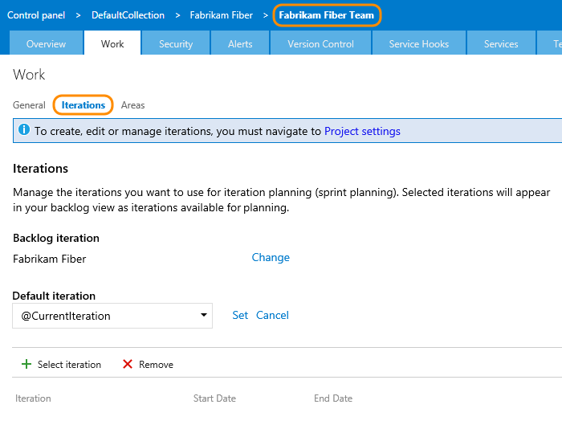  

2. **Backlog iteration**. Only work items assigned to an iteration equal to or under this backlog iteration appear in the team's backlogs and boards. 

	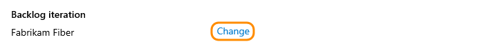  

	Also, all work items added through a team's backlog or board are assigned the backlog iteration. 

3. **Default iteration**. The default iteration defines the iteration used when a work item is created from the team dashboard (new work item widget) and queries page. You can use an explicit value or use @CurrentIteration to assign new work items to the team's current iteration. This is the same macro used in [queries to list work items assigned to the currently active iteration assigned to the team](../track/query-by-date-or-current-iteration.md#current-iteration).  

	For example, you might want all new work items to be added to a future iteration path which you use to triage and assign to specific sprints at periodic intervals.  

	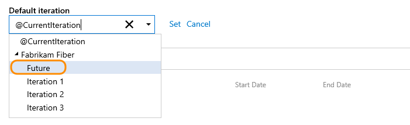  

4. **Active sprints**. Add an iteration for each sprint backlog you want active for the team. Add each sprint, one by one, by selecting it from the menu.  

 	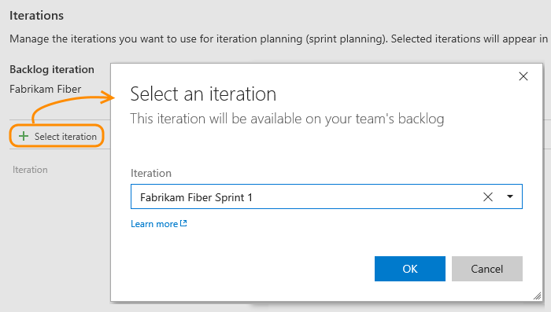 

	When you're done, you should see a list of sprints, similar to the following.  

	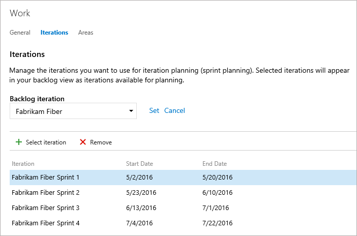  

	If you don't see the sprints you need, or the dates aren't set, then [return to the team project admin context and define them there](../customize/set-iteration-paths-sprints.md#define-sprints-team-services).  

3.	To see the newly activated sprint backlogs, refresh your team's [product backlog page](../backlogs/create-your-backlog.md).  

### For TFS 2015 and earlier versions 

1.	Open the Iterations page for the team context.  

	Here we open the Iterations page for the Web team.  

	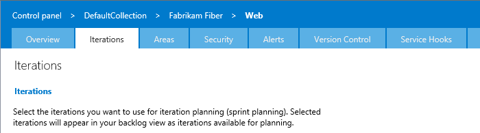  

	If your team isn't listed in the navigation row, open the Overview tab, select your team, and then return to the Iterations tab.  

2.	**Default iteration**. Only work items assigned to an iteration equal to or under the default iteration appear in the team's backlogs and boards. Also, the default iteration defines the iteration used when a work item is created from the team dashboard (new work item widget) and queries page. 
	
	Open the context menu for the iteration path you want.

	Here we set the P1 1 path.  Only child iterations of the backlog iteration can be active for a team. 

	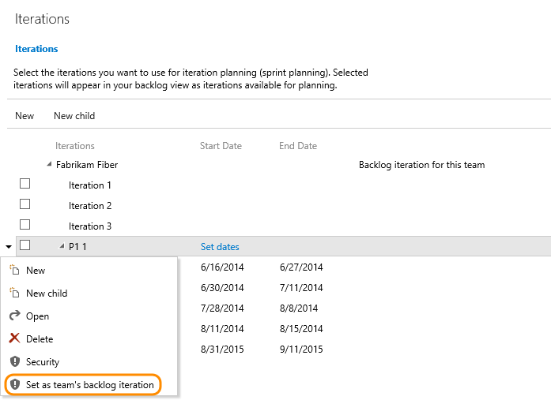  

	This path determines which work items appear in your team backlogs and boards, and [the default assigned to](#default_path) work items created from any area under your team's context.  

3.	**Active sprints**. Check each box under the default iteration that you want active for the team.  

	Here, the Fabrikam Fiber Web team activates Sprints 1 through 7. 

	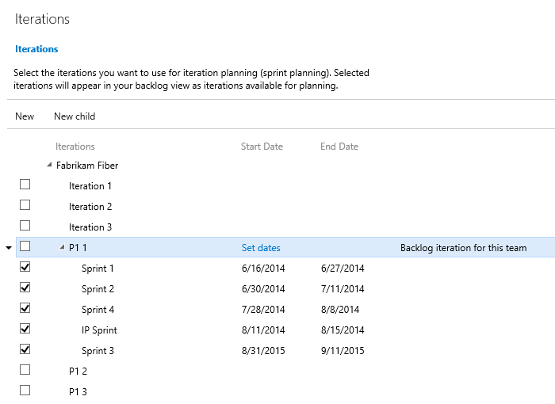  

	Check boxes only appear for sprints defined under the default iteration path.  

4.	To see the newly activated sprint backlogs, refresh your team's [product backlog page](../backlogs/create-your-backlog.md).  

## Related articles  

- [Schedule sprints](../scrum/define-sprints.md)  
- [Customize area and iteration paths](../customize/set-area-paths.md)  
- [Query by date or current iteration](../track/query-by-date-or-current-iteration.md)
- [Multiple teams](multiple-teams.md)  
- [Configure team settings](manage-team-assets.md)  
- [Portfolio management](portfolio-management.md)  

