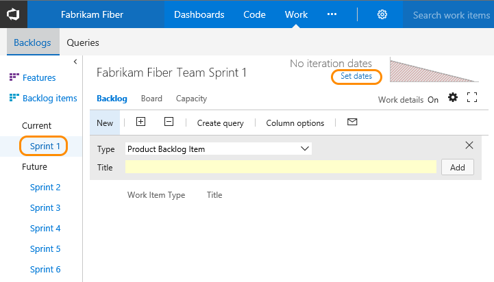
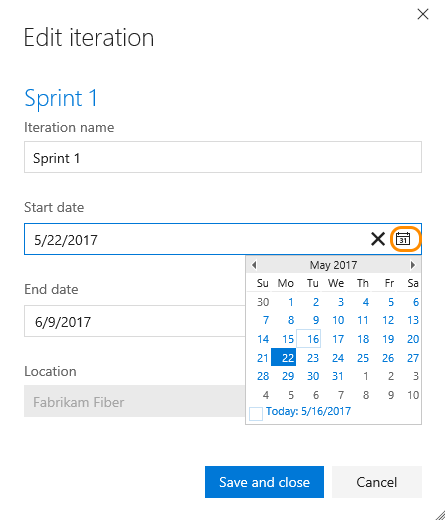
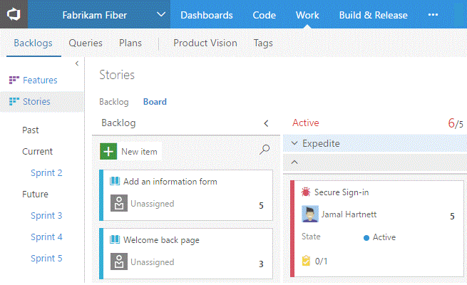
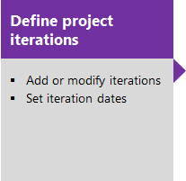
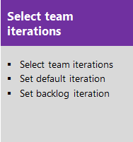
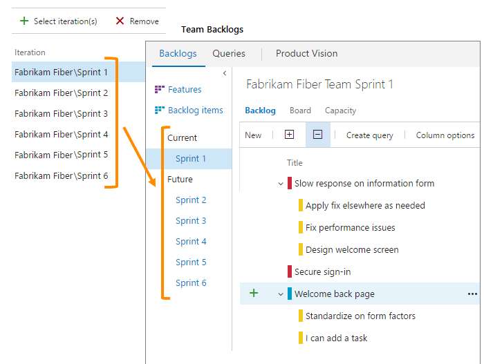

# Schedule sprints  

[!INCLUDE [temp](../_shared/version-vsts-tfs-all-versions.md)]

With Scrum, teams plan and track work at regular time intervals, referred to as a sprint cadence. 
You define sprints to correspond to the cadence your team uses. 

Many teams choose a two or three week cadence. However, you can specify shorter or longer sprint cycles. Also, you can create a release schedule which encompasses several sprints.     

## Quick start guide to scheduling sprints

To quickly get started, you can use the default sprints, also referred to as iterations, that were added when your team project was created. Note, you must be a [member of the Project Administrators group](../../security/set-project-collection-level-permissions.md) in order to add sprints and schedule sprint dates. (If you created the team project, you're a member.) 

[!INCLUDE [temp](../_shared/image-differences.md)]

1. Choose the sprint listed under Current and then click **Set dates**.  

	  

	> [!NOTE]   
	> If you don't see any sprints listed or the **Set dates** link, then no sprints have been selected for the team context you've selected. To select sprints for the team context, see [Select team sprints](../scale/set-team-defaults.md). To switch team context, see [Switch team project or team focus](../../settings/switch-team-context.md). 

2. Click the calendar icon to choose the date for the start and then the end of the sprint. 

	  

That's it! You can now start [planning your first sprint](sprint-planning.md). 

Of course, if you have several teams, more complex release and sprint cadences to schedule, or want to create child , or creating child iterations, then you'll need to read further. You define these through the admin context for the team project.  

> [!NOTE]    
>**Terminology note:** Your set of Agile tools uses the Iteration Path field to track sprints and releases. When you define sprints, you define the pick list of values available for the [Iteration Path](../customize/set-area-paths.md) field. You use iterations to group work into sprints, milestones, or releases in which they'll be worked on or shipped. 

## Assign work to a sprint using drag-and-drop

You can quickly assign work items to a sprint by dragging and dropping them from the product backlog to the sprint. 

--

## Add and schedule new sprints for several teams and release cadences 
 
> [!NOTE]    
>Your sprint backlog and task board are designed to support your Scrum processes. In addition, you have access to product and portfolio backlogs and Kanban boards. For an overview of the features supported on each backlog and board, see [Backlogs, boards, and plans](../backlogs/backlogs-boards-plans.md).  

Your team project comes with several sprints predefined. However, they aren't associated with any dates. For Scrum and sprint planning, you'll want to assign start and end dates for the sprints your team will use.   

Defining additional sprints is a two-step process. You first define the sprints for your team project&mdash;[Define project iterations](../customize/set-area-paths.md)&mdash;and then you select the sprints that each team will use&mdash;[Select team sprints](../scale/set-team-defaults.md). In this way, the system supports teams that work on different sprint cadences.  

Each sprint that you select for your team provides access to a [sprint backlog, task board, and other sprint planning tools](scrum-sprint-planning-tools.md) for planning and tracking work. 

For example, by selecting Sprints 1 thru 6, the Fabrikam Fiber team gets access to six sprint backlogs. They also get access to capacity planning tools and a task board for each sprint. 

## Try this next
> [!div class="nextstepaction"]
> [Plan a sprint](sprint-planning.md) or [Define iterations for the team project](../customize/set-iteration-paths-sprints.md) 

## Related articles 
If you work with several teams, and each team wants their own backlog view, you can [create additional teams](../scale/multiple-teams.md). Each team then gets access to their own set of Agile tools. Each Agile tool filters work items to only include those assigned values under the team's [default area path and iteration path](../scale/set-team-defaults.md).  
