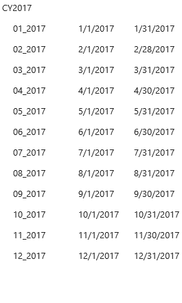
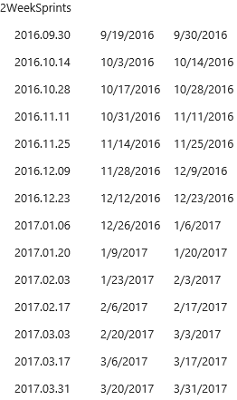
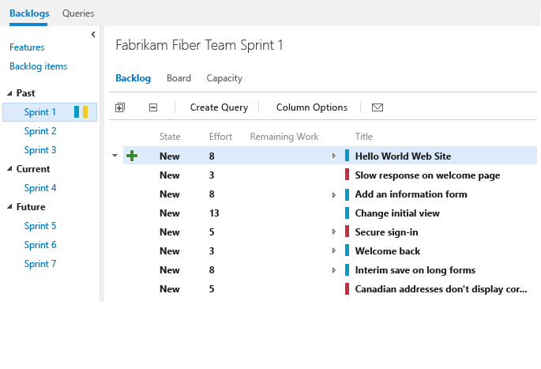
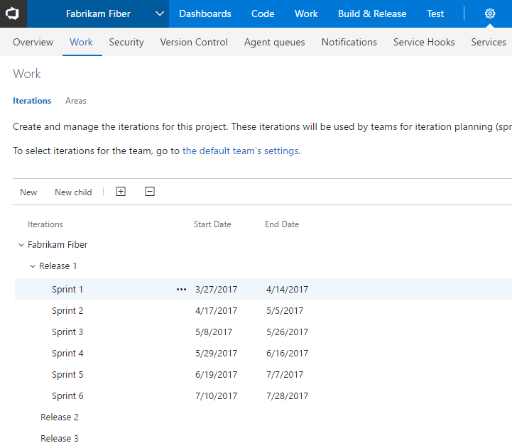
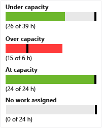
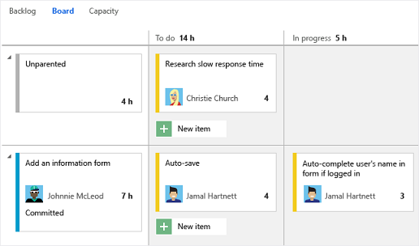
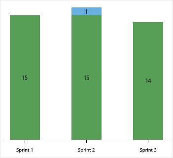
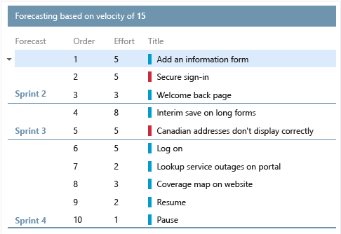

# Schedule sprints  

<b>Team Services | TFS 2017 | TFS 2015 | TFS 2013</b> 

With Scrum, teams plan and track work at regular time intervals, referred to as a sprint cadence. 
You define sprints to correspond to the cadence your team uses. 

Many teams choose a two or three week cadence. However, you can specify shorter or longer sprint cycles.   

[!INCLUDE [temp](../_shared/image-differences.md)]  

## Quick start guide to scheduling sprints

To quickly get started, you can use the default sprints, also referred to as iterations, that were added when your team project was created.  Note, you must be a [member of the Project Administrators group](../../setup-admin/add-administrator-tfs.md) in order to add sprints and schedule sprint dates. (If you created the team project, you're a member.) 

1. Choose the sprint listed under Current and then click **Set dates**.  

	  

2. Click the calendar icon to choose the date for the start and then the end of the sprint. 

	  

That's it! You can now start [planning your first sprint](sprint-planning.md). 

Of course, if you have several teams or more complex release and sprint cadences to accomodate, then you'll need to read further. 

>[!NOTE]  
>**Terminology note:** Your set of Agile tools uses the Iteration Path field to track sprints and releases. When you define sprints, you define the pick list of values available for the [Iteration Path](../customize/modify-areas-iterations.md) field. You use iterations to group work into sprints, milestones, or releases in which they'll be worked on or shipped. 

## Define and schedule sprints for several teams and release cadences 
 
>[!NOTE]  
>Your sprint backlog and task board are designed to support your Scrum processes. In addition, you have access to product and portfolio backlogs and Kanban boards. For an overview of the features supported on each backlog and board, see [Backlogs, boards, and plans](../backlogs-boards-plans.md).  

Your team project comes with several sprints predefined. However, they aren't associated with any dates. For Scrum and sprint planning, you'll want to assign start and end dates for the sprints your team will use.   

Defining additional sprints is a two-step process. You first define the sprints for your team project&mdash;[Define project iterations](../customize/modify-areas-iterations.md)&mdash;and then you select the sprints that each team will use&mdash;[Select team sprints](../scale/set-team-defaults.md). In this way, the system supports teams that work on different sprint cadences.  

### Sprints are a shared resource  

Because the sprints or iterations you defined are a shared resource, they're managed by project admins. Renaming, deleting, modifying the sprint hierarchy, or changing scheduled dates for an iteration impacts all teams that use it. Because of this, you'll want to coordinate changes when working in an enterprise environment with multiple teams.  

#### Schedule sprints for a team project  
To schedule sprints for the team project, you must belong to the [Project Administrators group](../../setup-admin/add-administrator-tfs.md) or have your **Edit project-level information** permission set to **Allow**.  See [Customize areas and iterations, Add an iteration and set iteration dates](../customize/modify-areas-iterations.md#iterations) to perform these tasks:
- Define sprints or iterations for the team project
- Set iteration dates 
- Modify the name of an iteration
- Change the structure of iterations you've defined 
- Archive a set of sprints within a new area 
- Delete iterations you no longer want to use 

>[!NOTE]  
>Deleting an iteration will delete all sprint backlogs, task boards, and burndown charts associated with that iteration.

#### Select sprints for a team 
To select sprints and set defaults for a team, you must be a [team administrator](../scale/manage-team-assets.md), belong to the [Project Administrators group](../../setup-admin/add-administrator-tfs.md), or have your **Edit project-level information** permission set to **Allow**. 

See [Set team defaults, Select team sprints and default iteration path](../scale/set-team-defaults.md#activate) to perform these tasks:
- To select sprints for your team  
- To set the backlog iteration for your team
- To set the default iteration to use when adding new work items within your team context 
- To remove selected sprints from appearing on your backlog page 

>[!NOTE]  
>Only iterations that are descendants of the backlog iteration for a team can be selected, and show up as current, past, or future iterations. The Iteration Path is a tree-path field. Only values under a single branch of the tree can be selected for use by a team.  

Here we show three sets of cadences defined for the same team project.  

| Monthly sprints | 2-week sprints | 3-week sprints |
|-----------------|----------------|----------------|
|  |  |  |

### Past and future sprints  
Your Scrum Agile tools support you in planning and tracking sprints. But they also provide a historical record your team can use to evaluate their progress sprint over sprint. You can access any sprint backlog, task board, and burndown chart from the Past folder as long as that sprint remains active for your team.  

  

 

### Sprints and releases  

How do you plan and track a release, in addition to planning and tracking sprints?  

One way you can accomplish this is to schedule a set of releases at regular intervals. Then, define the sprints that occur within those intervals as their children. Here's an example of such a structure.  

Iterations admin page, Sprints defined within releases" style="border: 1px solid #CCCCCC;" />   
 
For a worked example of how a management team can focus on releases and feature teams on sprints, see [Portfolio management](../scale/portfolio-management.md). For additional examples illustrating a release train, see [Implement Scaled Agile Framework® to support epics, release trains, and multiple backlogs](../scale/scaled-agile-framework.md). 

## Sprint planning tools 

Once you've defined and selected the sprints for your team, [you can start using these tools to plan your sprint](sprint-planning.md).  

###Track team capacity

At the start of each sprint, you'll want to plan the work that your team can commit to. The three Agile tools that support this work include the sprint backlog, capacity planning, and capacity bars. The sprint backlog contains a filtered subset of backlog items whose iteration path corresponds to the current sprint. 

<table valign="top" > 
<tr valign="top" > 
<td width="35%">

<b>Team capacity planning tool</b>

By setting team capacity, the team knows exactly the total number of work hours or days the team has for each sprint. With this tool, you set individual team member capacity as well as days off. And, conveniently, you can set holidays or shared days off taken by the entire team. 

Setting capacity for each team member working during a sprint causes the capacity bar for that individual to appear. 

You <a href="#team_settings">set recurring days off</a>, such as weekends, through team settings.

</td>
<td>
 
</td>
</tr>
<tr valign="top" > 
<td>

<b>Individual and team capacity bars</b>

With capacity bars, you can quickly see who is over, at, or under capacity. Capacity bars update with each of these activities: 

<ul>
<li>

Tasks are assigned with non-zero remaining work

</li>
<li>

Change in remaining work

</li>
<li>

Date change within the sprint cycle. Individual and team capacity always reflects their capacity from the current day till the end of the sprint.  

</li>
</ul>

Here's how to interpret the capacity colors:

</td>
<td width="455px">

</td>
</tr>
</table>

### Update tasks, monitor burndown 
During a sprint, your team can use the task board and sprint burndown chart to track their progress. Your sprint burndown chart provides you with an at-a-glance visual to determine if your team is on track to meet their sprint plan.  
 
<table valign="top">
<tr valign="top" > 
<td width="35%">

<b>Task board</b>

Your [task board](task-board.md) provides an interactive progress board for work required to complete the sprint backlog. During your sprint you'll want to update the status of tasks and the remaining work for each task. 

Updating tasks daily or several times a week yields a smoother burndown chart. 

</td>
<td width="520px">

</td>
</tr>
<tr valign="top" > 
<td>

<b>Sprint burndown chart</b>

You use the [sprint burndown chart](sprint-burndown.md) to mitigate risk and check for scope creep throughout your sprint cycle. The burndown chart reflects the progress made by your team in completing all the work they estimated during their sprint planning meeting. 

The ideal trend line always indicates a smooth and steady burndown. The blue area, however, represents what's actually going on. It shows the buildup of work as team members add tasks and the reduction of work as team members complete those tasks.

</td>
<td>

</td>
</tr>
</table>

### Velocity and forecast 

While you use sprint planning and tracking tools for each sprint, you use the velocity and forecast tools to estimate work that can be completed in future sprints. 

Velocity provides a useful metric for gaining insight into how much work your team can complete during a sprint cycle. And, the forecast tool provides a means for determining how much work your team can complete within a sprint based on a specified team velocity. 

After your team has worked several sprints, they can use the [velocity chart](../../report/guidance/team-velocity.md) and [forecast](forecast.md) tool to estimate work that can be accomplished in future sprints.  

<table valign="top" > 
<tr valign="top" > 
<td>

<b>Velocity chart</b>

Each team is associated with one and only one velocity chart. The green bar within the chart indicates the total estimated effort (story points or size) of backlog items (user stories or requirements) completed within the sprint. (Blue corresponds to the estimated effort of items not yet completed.)  

Velocity will vary depending on team capacity, sprint over sprint. However, over time, the velocity should indicate a reliable average that can be used to forecast the full backlog. 

By minimizing the variability of backlog item size─effort or story points─you gain more reliable velocity metrics.

</td>
<td width="500px">

</td>
</tr>
<tr valign="top" > 
<td>

<b>Forecast tool</b>

You can use the forecast tool to get an idea of how many and which items you can complete within a sprint. 

By plugging in a velocity, you can see which items are within scope for the set of sprints the team has selected. As shown here, a velocity of 15 indicates that it will take three sprints to complete the work shown. 

</td>
<td>

</td>
</tr>
</table>  

## Related notes 
If you work with several teams, and each team wants their own backlog view, you can [create additional teams](../scale/multiple-teams.md). Each team then gets access to their own set of Agile tools. Each Agile tool filters work items to only include those assigned values under the team's default area path and iteration path, which you configure via the [Set team defaults](../scale/set-team-defaults.md) .  

- [What is Scrum?](https://www.visualstudio.com/learn/what-is-scrum/)
- [Add teams and team members](../scale/multiple-teams.md)  
- [Customize areas and iterations](../customize/modify-areas-iterations.md) 
- [Configure team settings](../scale/manage-team-assets.md)  
- [Portfolio management](../scale/portfolio-management.md)  
- [Implement Scaled Agile Framework® to support epics, release trains, and multiple backlogs](../scale/scaled-agile-framework.md)

### How selected sprints show up on the backlog 
Each sprint that you select for your team provides access to a sprint backlog, task board, and other Agile tools for planning and tracking work. 

<ul class="nav nav-pills" style="padding-right:15px;padding-left:15px;padding-bottom:5px;vertical-align:top;font-size:18px;">
<li style="float:left;" data-toggle="collapse" data-target="#sprints">Selected sprints</li>
<li style="float: right;"><a style="max-width: 374px;min-width: 120px;vertical-align: top;background-color:#AEAEAE;margin: 0px 0px 0px 8px;min-width:90px;color: #fff;border: solid 2px #AEAEAE;border-radius: 0;padding: 2px 6px 0px 6px;outline-style:none;height:32px;font-size:14px;font-weight:400" data-toggle="pill" href="#tfs2015-sprints">TFS 2015</a></li>
<li class="active" style="float: right"><a style="max-width: 374px;min-width: 120px;vertical-align: top;background-color:#007acc;margin: 0px 0px 0px 0px;min-width:90px;color: #fff;border: solid 2px #007acc;border-radius: 0;padding: 2px 6px 0px 6px;outline-style:none;height:32px;font-size:14px;font-weight:400" data-toggle="pill" href="#ts-sprints">Team Services & TFS 2017</a></li>

</ul>
 

 

For example, by selecting Sprints 1 thru 6, the Fabrikam Fiber team gets access to six sprint backlogs. They also get access to capacity planning tools and a task board for each sprint.  

For example, by selecting Sprints 1 thru 4, the Fabrikam Fiber team gets access to four sprint backlogs. They also get access to capacity planning tools and a task board for each sprint.  

 

 

