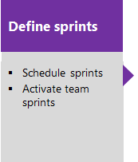

# About Scrum and project management 

[!INCLUDE [temp](../_shared/version-vsts-tfs-all-versions.md)]

The Scrum method uses sprints to plan work to perform by a team within a specific time period and cadence. To get started, several sprints are predefined for your team.  If you're new to Scrum, get an overview from [What is Scrum?](https://www.visualstudio.com/learn/what-is-scrum/). 

You can quickly assign work items to a sprint by dragging and dropping them from the product backlog to the sprint. 

