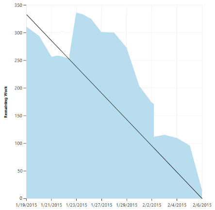
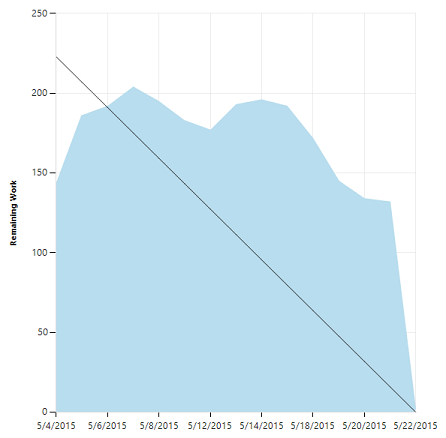

# Sprint burndown 
 
[!INCLUDE [temp](../_shared/dev15-version-header.md)]

Throughout your sprint, you can monitor the sprint burndown chart to determine if your team is on track to complete its [sprint plan](sprint-planning.md). Review your sprint burndown chart throughout your sprint cycle to check for these indicators:  
<ul>
<li>Is remaining work getting updated regularly? Flat spaces within the blue area indicate that a lack of updates.</li>
<li>Is remaining work increasing instead of decreasing? Increases can indicate unestimated or unplanned work.  Both signal a need for the team to discuss how they'll complete the sprint tasks on time.   </li>
<li>Based on the actual burn rate, does the team feel confident that they'll complete the work by the end of the sprint?</li>
</ul>

>[!NOTE]  
>The system automatically builds a sprint burndown chart based on the tasks and Remaining Work estimates you define and update throughout the sprint cycle. For details, see [Sprint planning](sprint-planning.md) and [Task board](task-board.md).  To open the sprint burndown chart, jump to the section [Open sprint burndown chart](#open-chart).   

<table>
<tr valign="top">
<td width="35%">

A healthy sprint burndown chart will look something like this. The *Ideal Trend* line connects the two points: 

-	**(1)** Team's total capacity at the start of the sprint     
-	**(2)** 0 Remaining Work at the end of the sprint.  

The slope represents the rate at which the team needs to burn down work to finish the sprint on time. 

The actual graph, the blue area, represents the total amount of planned sprint work and how it changes throughout the course of the sprint. The blue area corresponds to the sum of all Remaining Work set for all sprint tasks, and possibly bugs, that have the current sprint as their iteration path.  

</td>
<td>

</td>
</tr>
</table>

##Scope management  
By estimating remaining work of tasks for each product backlog item, teams have a good understanding of what they can accomplish within a sprint. Because the sprint tasks represent the overall sprint scope, the sprint scope is well defined. Anything that is not represented by a task in the sprint should be considered out of scope for the sprint.

As the team makes progress, divergences from the ideal trend line help the team monitor divergences from scope. 
<table>
<tr valign="top">
<td width="35%">

Increases instead of decreases within the blue graph may indicate:
 
<ul>
<li>Poor estimates made to tasks</li>
<li>Discovery of new work not accounted for in sprint planning</li>
<li>Scope creep, additional work not agreed to by the team.</li>
</ul>

Whatever the cause, teams should come together quickly to determine how to remedy the increased workload.

Solutions may include reassigning tasks or recruiting additional resources. The team should move all non-essential sprint work to the backlog and consider it during the next sprint planning meeting.

</td>
<td>

</td>
</tr>
</table>

##Mitigate risk through daily inspection
Your burn-down chart shows you if your project is on schedule. A daily check can mitigate risks and provide early warning of potential schedule or cost overruns, two metrics associated with traditional project management. 

<table>
<tr valign="top">
<td width="35%">

For example, when the actual remaining work (blue area) goes flat for a period of time, or remains high above the ideal trend line, the team is at risk of not meeting their sprint commitments.

Teams should meet immediately to course correct and either reassign work, recruit more resources, or reset expectations.

</td>
<td>

</td>
</tr>
</table>
 
##Required and recommended activities   

In order to access the sprint burndown chart and use it to monitor your sprint progress, your team must perform the following actions.  

**Required:** 
*	[Schedule sprints for your team](define-sprints.md).  
*	[Define and estimate tasks](sprint-planning.md#define-tasks) for each product backlog item you're working on in the sprint. If you work from your team's backlog and task board, the items you create will automatically be assigned to the current sprint (Iteration) and to your team's default Area Path.  
*	[Update Remaining Work for each sprint task](task-board.md#update-tasks) as work progresses.  

**Recommended:**  
*	Define tasks that take a day or less to complete to lessen the impact of poor estimates.  
*	Don't divide tasks into subtasks. If you divide a task into subtasks, specify hours only for the subtasks. These hours are rolled up as summary values for the parent task.   
*	Update Remaining Work daily or several times within a week to support monitoring and achieve a smoother burndown chart.  
*	At the end of the sprint, update the task status of completed tasks and determine how to handle incomplete tasks.  

##Current and past sprint burndown charts
As you complete each sprint, the system maintains a history of your activity. You can always review past sprints and sprint burndown charts by choosing the sprint listed under the Past section.  

###Open sprint burndown chart 
Click the chart to display it in a larger view. 

>[!NOTE]  
>You can't add the system-generated sprint burndown chart to a dashboard. However, you can add the [Sprint burndown widget](../../report/widget-catalog.md#sprint-burndown-widget), which captures the same information for the current sprint, to a dashboard. 

In particular you can review your sprint burndown charts to show the team patterns in execution. The burndown charts maintain a record of the team's ability to plan and estimate.  

| Sprint 1   |  Sprint 2  | Sprint 3 | 
|------------|------------|----------| 
| |  | |

Teams may find it useful to review this record periodically during their sprint retrospectives. It may spark useful discussions and lead to setting one or more sprint goals, such as: 
*	How does our projected velocity match up to our actual velocity? 
*	How can we more accurately determine how much we will be able to accomplish in a sprint? 
*	How can we complete work at a more regular pace throughout the sprint?

##Try this next
In addition to the sprint burndown chart, teams can review the velocity at which they work sprint over sprint. The velocity chart tracks how many backlog items your team works on in a sprint.  

You can use your team [velocity as input into the forecasting tool](velocity-and-forecasting.md) to help plan your sprints.   

##Related notes

You can learn more about defining, planning, and executing your sprints from these topics:  
*	[Schedule sprints](define-sprints.md)  
*	[Sprint planning](sprint-planning.md)  
*	[Task board](task-board.md)  

And, from these industry resources:  
*	[Understanding the Scrum Burndown Chart](http://www.methodsandtools.com/archive/scrumburndown.php)  
*	[Task sizing in Agile software development](http://www.solutionsiq.com/task-sizing-in-agile-software-development/)  

<!---
[//]: TBD - when have more time and when dashboards become more evident
[//]: # ###Other types of burndown charts
[//]: #  Release burndown 
-->

For on-premises TFS deployments, you can [specify the format that appears&mdash;**h** for hours or **d** for days&mdash;for the remaining work field](../reference/process-configuration-xml-element.md#fields).  

### Empty sprint burndown chart 
If your sprint burndown chart appears empty, check the following:
- Have you assigned tasks to the sprint associated with the chart?
- Have you assigned remaining work to the tasks assigned to the sprint? 
- Are the parent work items of the tasks assigned to the same sprint? If not, the tasks may appear in another sprint associated with the parent item. 

### Sprint review meetings
Conduct your sprint review meetings on the last day of the sprint. Your team demonstrates each product backlog item that it completed in the sprint. The product owner, customers, and stakeholders accept the user stories that meet their expectations and identify any new requirements. Customers often understand their additional needs more fully after seeing the demonstrations and may identify  changes that they want to see.

Based on this meeting, some user stories will be accepted as complete. Incomplete user stories will remain in the product backlog, and new user stories will be added to the  backlog. Both sets of stories will be ranked and either estimated or re-estimated in the next sprint planning meeting.  

After this meeting and the retrospective meeting, your team will plan the next sprint. Because business needs change quickly, you can take advantage of this meeting with your product owner, customers, and stakeholders to review the priorities of the product backlog again.

### Sprint retrospective meetings
Retrospectives, when conducted well and at regular intervals, support continuous improvement. 

The sprint retrospective meeting typically occurs on the last day of the sprint, after the sprint review meeting. In this meeting, your team explores its execution of Scrum and what might need tweaking. 

Based on discussions, your team might decide to change one or more processes to improve its own effectiveness, productivity, quality, and satisfaction. This meeting and the resulting improvements are critical to the agile principle of self-organization. 

Look to address these areas during your team sprint retrospectives:  

*	Issues that affected your team's general effectiveness, productivity, and quality.
*	Elements that impacted your team's overall satisfaction and project flow.
*	What happened to cause incomplete backlog items? What actions will the team take to prevent these issues in the future?  
	
	For example, consider a team that had several tasks that only one individual on the team could perform. The isolated expertise created a critical path that threatened the sprint's success. The individual team member put in extra hours while other team members were frustrated that they could not do more to help. Going forward, the team decided to practice [eXtreme Programming](http://www.extremeprogramming.org) to help correct this problem over time.

As a team, work to determine whether to adapt one or more processes to minimize the occurrence of problems during the sprint. 

In some cases, your team may need to do some work to implement an improvement. For example, a team that found themselves negatively impacted by too many failed builds decided to implement continuous integration. Because they didn't want to disrupt process, they allocated a few hours to set up a trial build before turning it on in their production build. To represent this work, they created a spike and prioritized that work against the rest of the product backlog.

For additional guidance, see:
*	[What is Scrum?](https://www.visualstudio.com/learn/what-is-scrum/)
*   [Agile Principles and Values by Jeff Sutherland](https://msdn.microsoft.com/library/dd997578.aspx)
*	[Putting the Fun Back In Your Retrospectives](http://www.agilealliance.org/files/session_pdfs/Putting%20the%20Fun%20Back%20In%20Your%20Retrospectives.pdf)  
*	[Agile Retrospectives: Making Good Teams Great](http://www.amazon.com/Agile-Retrospectives-Making-Teams-Great/dp/0977616649/)	
 