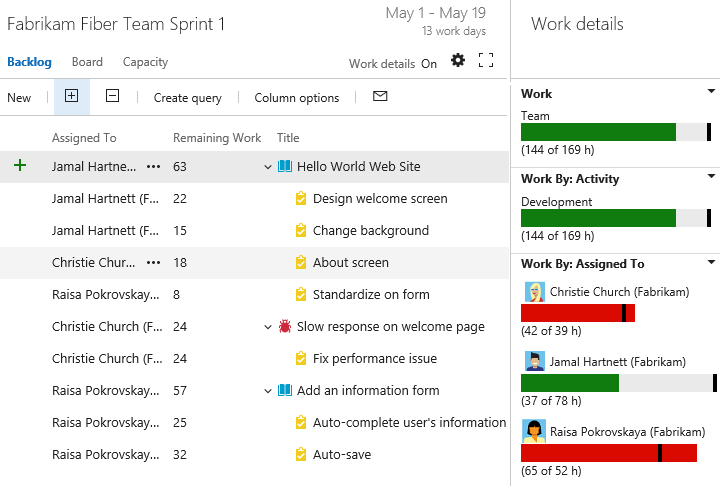
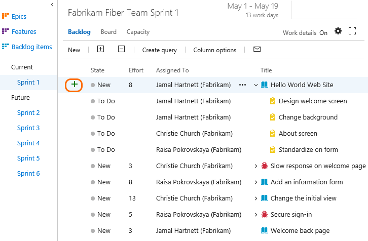
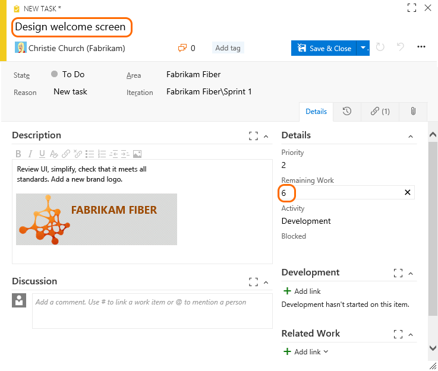
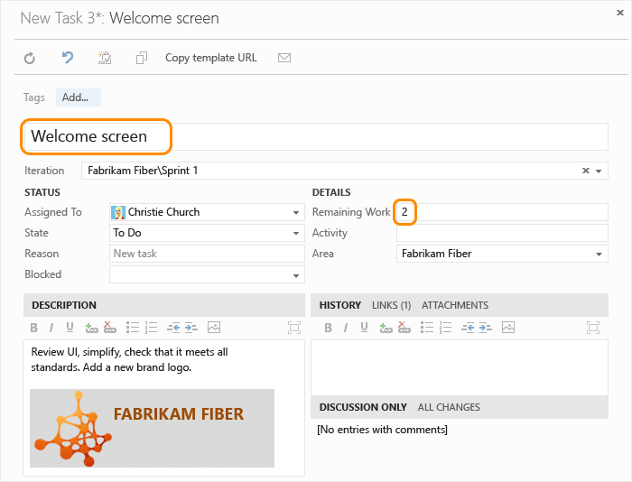
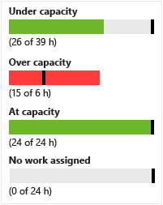
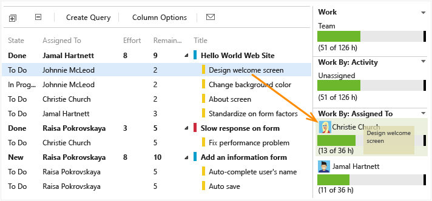
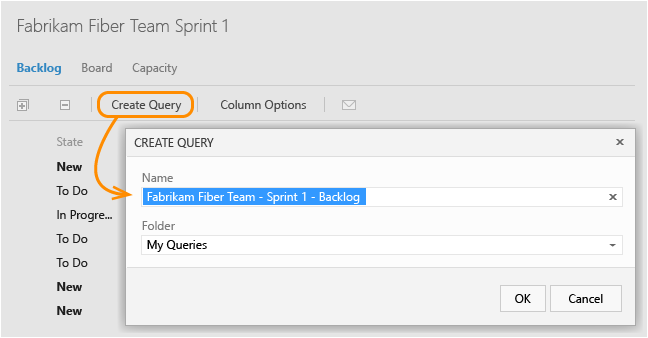
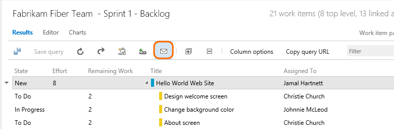
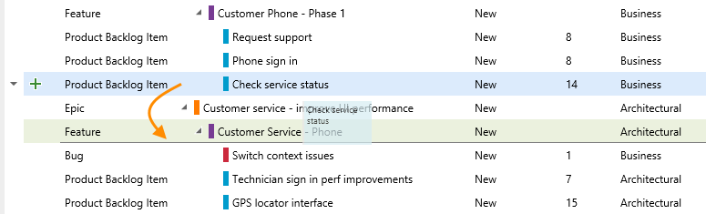

# Sprint planning
 
[!INCLUDE [temp](../_shared/version-vsts-tfs-all-versions.md)]  

Your team builds the sprint backlog during the sprint planning meeting, typically held on the first day of the sprint. 
Each sprint corresponds to a time-boxed interval which supports your team's ability to work using Agile processes and tools. 
During the planning meeting, your product owner works with your team to identify those stories or backlog items to complete in the sprint.  

Planning meetings typically consist of two parts. In the first part, the team and product owner identify the 
backlog items that the team feels it can commit to completing in the sprint, based on experience with previous sprints. 
These items get added to the sprint backlog. In the second part, your team determines how it will develop and test each item. 
They then define and estimate the tasks required to complete each item. Finally, your team commits to implementing 
some or all of the items based on these estimates. 

In this topic you'll learn how to:  

>[!div class="checklist"]      
> * Assign backlog items to a sprint   
> * Set your team's capacity        
> * Add tasks to backlog items  
> * Adjust work to fit team capacity  
> * Share your sprint plan      

> [!NOTE]  
>Your sprint backlogs are one of three classes of backlogs available to you. For an overview of the features supported on each backlog and the two types of boards, see [Backlogs, boards, and plans](../backlogs/backlogs-boards-plans.md?toc=/vsts/work/scrum/toc.json&bc=/vsts/work/scrum/breadcrumb/toc.json). 
>
>For a beginner's guide to planning and tracking work, see [Get started with Agile tools](../backlogs/overview.md?toc=/vsts/work/scrum/toc.json&bc=/vsts/work/scrum/breadcrumb/toc.json).  

Here's an example of a sprint plan that consists of backlog items and the tasks required to complete each item. 
By setting team capacity and estimating tasks, the team can see when the team or a team member is at, under, or over capacity.

 

> [!NOTE]
>Sprint planning doesn't need to be challenging. It can be fun and a time for the entire Scrum team to build camaraderie by working together to answer the question of "What can we commit to?" For examples and strategies to keep your sprint planning focused and effective, check out the [What is Scrum?](/azure/devops/agile/what-is-scrum).
>  
>When you've completed your sprint plan, your sprint backlog should contain all the information your team needs to successfully complete work within the time allotted without having to rush at the end. 

##First pass: identify an initial set of work to complete
   
[!INCLUDE [temp](../_shared/image-differences.md)]  

To plan sprints, you should be a member of the team and belong to the Contributors group. If you don't have access to the team project, [get invited to the team](../scale/multiple-teams.md#add-team-members).  

1. Before you start planning your sprint, you'll want to have [created, prioritized, and estimated your backlog](../backlogs/create-your-backlog.md). 

2. Also, you'll want to have [set the start and end dates for your sprint](define-sprints.md#quick-start-schedule). 

3. Begin your planning efforts by moving items from your backlog to your current sprint, one item at a time. Simply drag each item from the product backlog onto the sprint.  

	   
	
	If you don't see any links listed under Current or Future, your team admin needs to [select your team's sprints](../scale/set-team-defaults.md#activate).  
	
	That's your initial guess at what you'll be able to do in the sprint. Next, you'll define tasks, estimate that work, and use your team's capacity to make sure it fits in the sprint. 

2. Next, check the total level of effort of your sprint items. For example, the Fabrikam Fiber team has four members with a total velocity of 40 effort points per three week sprint cycle. So, they're in good shape to commit to the 6 items in the Sprint 1 backlog.  
	
	   
	
	If you don't see the Effort, Story Points, or Size fields, you can add them by clicking [Column Options](../backlogs/set-column-options.md?toc=/vsts/work/scrum/toc.json&bc=/vsts/work/scrum/breadcrumb/toc.json). For a description of how these fields are used, see [Create your backlog, Add details and estimates](../backlogs/create-your-backlog.md#estimates). 

	Your initial plan should identify the subset of requirements that's within your team's capacity based on estimated effort and team velocity. Velocity corresponds to the total Effort or Story Points a team can complete within the sprint time period.  

##Set your team's capacity

As a next step, you'll want to determine your team's actual capacity. Whereas velocity correlates to how your team estimates requirements, capacity correlates to actual task time - either hours or days. Capacity takes into account variation in work hours by team members as well as holidays, vacation days, and non-working days. 

Because days off and time available for each team member can vary from sprint to sprint, you set capacity for each sprint. The capacity tool helps you make sure your team isn't over or under committed for the sprint. Also, as you work day-to-day, you'll be able to see if your team is on track.

From the Capacity page, enter the capacity and days off for each member of your team.  For details on setting capacity, see [Capacity planning](../scale/capacity-planning.md?toc=/vsts/work/scrum/toc.json&bc=/vsts/work/scrum/breadcrumb/toc.json).  

Most teams specify capacity in terms of hours, however, you can also specify it in days. For example, .5 days would correspond to 4 hours for a typical 8 hour day. Choose the same unit you will use to estimate the time a task will take to complete. You only have to indicate planned days off. You [manage weekend days or other recurring days off](../customize/set-working-days.md) under team settings.

## Define tasks to complete each item

The capacity tool tells you how much work your team can commit to. However, to compare capacity with actually planned work, you need to define and estimate tasks for each backlog item.

Add as many tasks as needed to capture the work required to complete each item. Tasks can represent different work to be performed - such as design, code, test, content, sign off. Usually, each team member adds their own tasks and sets estimates for the work. However, a development lead could define the initial tasks for a requirement.

1. In the sprint backlog, add a task.  

	     

	Creating tasks from the sprint backlog automatically links the task to its parent backlog item.  

2. Name the task and enter an estimate for Remaining Work. Also, if you know who'll perform the work, go ahead and assign the task to that team member.  

	<!--- **Feature availability:** From the web portal for VSTS and TFS 2017, you'll have access to the [new form with the new work tracking experience](../backlogs/add-work-items.md). For TFS 2015 and ealier versions, the old form is supported.   --> 
	
	::: moniker range="vsts || >= tfs-2017 <= tfs-2018"
    <a id="task-form-team-services" /> 
	<!--- Task form, new form -->

		
	::: moniker-end
    ::: moniker range=">= tfs-2013 <= tfs-2015"
	<a id="task-form-tfs-2015-13" /> 
	<!--- Task form, old form -->

	  	
	::: moniker-end

	At the planning stage, Remaining Work corresponds to an estimate of how long it will take to complete the task.  
	
	A good rule of thumb is to size tasks to take no more than a day to complete. If a task is too large, the team should break it down. In some cases, you may not be able to estimate some tasks effectively until other tasks have been completed. Create the task now, but estimate it when you have enough information.  
	
	During the sprint, team members update remaining work to continually reflect the time required to complete the task. This value can actually increase after work begins. For example, after working 4 hours on a task that was estimated to take 8 hours, the team member realizes he needs 16 hours over what he estimated. He would update the Remaining Work field with 20 (8-4+16).  As you perform a task, you might find that more time is required. Always update the task with your best estimate of remaining work. That way, you help accurately reflect the total amount of work remaining in the sprint.  

3. As you define tasks and estimate the work, you'll see capacity charts start to fill in for each team member. Capacity bars track the remaining work against the capacity for each team member as well as the entire team.  

	You'll also see a roll-up of the remaining work required to complete each requirement or bug.  

	  

	From this view, you can easily see which individuals are at or near capacity. Teams can determine if work needs to be moved out of the sprint or to reassign tasks.  

	> [!TIP]  
	>Define tasks that take a day or less to complete. This helps mitigate the risks that come from poor estimates.
	>
	>Also, don't divide tasks into subtasks as the [task board will only show leaf node tasks](../backlogs/resolve-backlog-reorder-issues.md?toc=/vsts/work/scrum/toc.json&bc=/vsts/work/scrum/breadcrumb/toc.json#bugs-as-tasks). If you do divide a task into subtasks, specify Remaining Work only for the subtasks, as the system rolls up summary values to the parent task. 

## Second pass: adjust work to fit team capacity

After you've defined all the tasks for all the items, check whether your team is at or over capacity. If under capacity, you can consider adding more items onto the sprint. If over capacity, you'll want to remove items out of the backlog.  

Next, check whether any team member is under, at, or over capacity. Or, if someone hasn't even been assigned any work. Use the capacity bars to make these determinations.  

  

###Team over capacity: move items out of the sprint

If your team's over capacity, drag items from the bottom of the list onto Backlog items. This will reset the Iteration Path to the default set for your team. Or, you can move the item into the next sprint your team will work in. All the tasks that you've defined for that item will move with it.   

  

> [!TIP]    
> Dragging a backlog item to the backlog or another sprint reassigns all child tasks to the same iteration path. 
> Also, you can multi-select several items and drag them to the backlog or another sprint. 

### Load balance work across the team

To quickly reassign tasks, drag the task onto the new assignee's capacity bar. As you reassign tasks, capacity bars automatically update.  

  

::: moniker range="vsts || >= tfs-2015 <= tfs-2018"

### Use multi-select to bulk modify items

Multi-select of work items on the product and sprint backlogs works in the same way as multi-select works within query results. 

<!---
> [!NOTE]     
><b>Feature availability: </b> Multi-select of work items on the backlog and sprint backlogs is currently supported from VSTS and TFS 2015.1 and later versions. This feature works in the same way as multi-select works within query results. 
-->

With multi-select, you can perform several actions on several work items at once, such as: 

- Add links
- Change one or more field values
- Change the backlog priority   
- Assign to a team member
- Move to a sprint
- [Map items or change the parent an item is linked to](/vsts/work/backlogs/organize-backlog#mapping)
::: moniker-end
::: moniker range="tfs-2015"
Multi-select of backlog work items requires TFS 2015.1 or later version.
::: moniker-end
::: moniker range="vsts || >= tfs-2015 <= tfs-2018"
To select several items in a sequence, hold down the shift key. To select several non-sequential items, use the Ctrl key. Then, you can either drag the selected items to a new position within the backlog, to a different sprint, or select an option from the context () or action () menu of one of the items. 

To learn more, see [Bulk modify work items](../backlogs/bulk-modify-work-items.md). 
::: moniker-end

## Try this next
 
Now that you've defined your sprint plan, your team's ready to begin work on the sprint tasks. Use your [task board during your daily scrum meetings](task-board.md) to perform these tasks: 

- Update task status and remaining work (daily updates of remaining work leads to smoother burndown charts)    
- Review progress with the team during the daily Scrum meetings
- Update items and address uncompleted work at the close of the sprint  

Also, you can [monitor your burndown chart](sprint-burndown.md) to make sure your team remains on track throughout the sprint. 

You can use [hotkeys and keyboard shortcuts](../backlogs/backlogs-keyboard-shortcuts.md?toc=/vsts/work/scrum/toc.json&bc=/vsts/work/scrum/breadcrumb/toc.json) to navigate within the backlog list. 

## Related articles

If you need to add or rename the sprints your team uses, you must first [define them at the project level](../customize/set-iteration-paths-sprints.md) and then [select them for your team](../scale/set-team-defaults.md). 

### Share your sprint plan
 
Any stakeholder on your team (someone with permissions to connect to your team project) can view your sprint plan. 
Simply send them the URL of your sprint backlog page. But also, you can share it with them through email or print a version. 

To email it, create and save the query for the sprint backlog. 

Then, open the query and click the email icon. 

  

In the form that appears, enter the name(s) of valid users (ones who have access to the team project). 

Or, you can select all the items in the list, choose **Copy as HTML**, and paste the formatted list into an email form or Word document. See [Copy a list of work items](../backlogs/copy-list.md?toc=/vsts/work/scrum/toc.json&bc=/vsts/work/scrum/breadcrumb/toc.json). 

### Order, re-parent, and reassign items to different sprints
When you need to change the order of an item, simply drag the item to its new location. Also, you can [re-parent an item using the mapping pane](../backlogs/organize-backlog.md), or simply drag it within the hierarchy to change its parent. 

Ordering and re-parenting backlog items requires that you don't nest items of the same type within each other. That is, you don't create product backlog items that are children of other product backlog items, or tasks that are children of tasks. You can only re-parent tasks under backlog items, backlog items under features, and features under epics. 

If you receive the following message, [you can fix it by removing nested child items](../backlogs/resolve-backlog-reorder-issues.md?toc=/vsts/work/backlogs/toc.json&bc=/vsts/work/backlogs/breadcrumb/toc.json).

  

 

