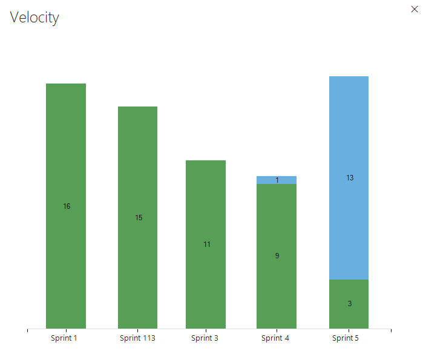

# Velocity & forecasting

<b>Team Services | TFS 2017 | TFS 2015 | TFS 2013</b> 

Teams use velocity charts and forecast tools to monitor their ability to deliver working software. Velocity provides an indication of how much work a team can complete during a sprint based on the estimates made to Effort (PBIs), Story Points (user stories), or Size (requirements). And, with the forecast tool, you can forecast the sprints required to accomplish future work based on an estimated team velocity. 
 
Both tools are team-specific tools that rely on the team's ability to estimate backlog items. Once your team has completed a sprint or two, they can use the velocity chart to forecast how much of the backlog they can finish within the upcoming sprints. 

[!INCLUDE [temp](../_shared/image-differences.md)]

<table>
<tr valign="top">
<td>
**Velocity chart** 
 
</td>
<td>

</td>
</tr>
</table>

##Work with team velocity
Velocity provides a useful metric for gaining insight into how much work your team can complete during a sprint cycle. Each team is associated with one and only one velocity chart.  

Velocity will vary depending on team capacity, sprint over sprint. However, over time, the velocity should indicate a reliable average that can be used to forecast the full backlog.  

[!INCLUDE [temp](../_shared/image-differences.md)]

1.	From the backlog page, open the velocity chart.  

	  

	For charts to appear, your team must perform these activities: 
	- Select sprints for your team  
	- Assign backlog items to sprints   
	- Estimate backlog items by defining the Effort, Story Points, or Size.
 
2.	The chart tracks your estimated backlog work (sum of Effort, Story Points, or Size) that your team has completed (green) in the previous sprints, or that are still in progress (blue).  

	As this chart shows, velocity will fluctuate from sprint-to-sprint for a variety of reasons. However, you can quickly determine the average velocity by averaging the values shown in green for each sprint. You can then plug the average  into the Forecast tool.

	

	>[!NOTE]  
	>Work items based on the [Scrum process](../guidance/scrum-process.md) get counted in the chart once their State is set to Committed, whereas items based on the [Agile](../guidance/agile-process.md) and [CMMI](../guidance/cmmi-process.md) processes get counted once their State is set to Active. This behavior is set through the [process configuration workflow states to category state mappings](../reference/process-configuration-xml-element.md#map). 

 

## Forecast an upcoming sprint

You can use the forecast tool to get an idea of how many items you can complete within a sprint. By plugging in a velocity, you can see which items are within scope for the set of sprints the team has activated.   

To forecast your sprint, turn forecasting on and enter your team's predicted velocity. If Forecast doesn't appear, set Parents to Hide. Also, make sure that you're on the product backlog page. You can only forecast the product backlog of Stories, Backlog items, or Requirements. 

The tool draws lines for each future sprint selected by the team. The Forecast lines show how much work your team should be able to complete in future sprints. Typically, items above the first line are already in progress for the current sprint. Items that fall between the first and second forecast lines indicate what can be completed in the named sprint.   

>[!NOTE]  
>The forecast logic has changed for Team Services. Previously, the forecast tool limited the number of items shown between the forecast lines to those that could be completed within the sprint or using unused Effort points from the previous sprint. 
>
>Now, all items listed between the lines can be started in the sprint labeled by the first line, but may not be completed within the sprint. The velocity points that can't be completed in one sprint is carried over to the next sprint. For example, for a velocity of 15, if Item 1 has 35 story points, 20 velocity points are carried over to next sprint, then again 5 velocity points are carried over to sprint after that. 

### Team Services 

In this example, a Velocity of 15 is used. The forecast tool shows between two and four items can be worked on during the first five sprints based on the amount of Effort assigned to each work item. The forecast logic carries over velocity points from one sprint to the next. 

- Sprint 1: 19 Effort points, items 1 and 2 can be completed and item 3 can be started; 4 velocity points are carried over to the next sprint
- Sprint 2: 13 Effort points, item 3 from the previous sprint can be completed and the next 2 items can be started; 2 velocity points are carried over to the next sprint   
- Sprint 3: 15 Effort points, item 5 from the previous sprint can be completed and 4 new items can be started; 2 velocity points are carried over to the next sprint  
- Sprint 4: 13 Effort points, item 9 from the previous sprint can be completed, 2 new items can be started and completed 
- Sprint 5: 19 Effort points, 3 items can be started 

### TFS 2013 - TFS 2017.1 

The forecast tool shows only those work items that can be completed within a sprint between the forecast lines. Unused velocity points from one sprint are considered in the forecast of the following sprint.  

The forecasted sprint is listed along with the last item that can be completed during that sprint. For example, The first two items with a total of 13 Effort points can be completed in Sprint 2.

In summary: 
- Sprint 2: 13 Effort points, which reflects 7 unused velocity points 
- Sprint 3: 24 Effort points, which uses 4 of the 7 unused velocity points from Sprint 1 
- Sprint 4: 21 Effort points, which uses 1 of the 3 unused velocity points from Sprint 1  
- Sprint 5: 16 Effort points, which reflects 4 unused velocity points 
- Sprint 6: 19 Effort points  

### Tips for using the forecast tool

*	Set **In progress** items to **Hide** to hide those items that that won't be counted in the forecast. The forecast tool ignores Scrum items set to Committed or Done and Agile and CMMI items set to Active, Resolved, or Completed. 
*	Select enough future sprints for your team to forecast your entire product backlog
*	Check the results manually to understand discrepancies in what you expect and what the forecast tool displays  
*	Check the amount of effort (story points or size) forecasted per sprint 
*	Question forecast results where the effort of an item is near to, or greater than, team velocity  

### Determine the velocity needed to complete all items in the backlog
Another way to use the forecast tool is to enter different velocity values until all the backlog items are complete within a given set of sprints. This provides an estimate of what velocity is required to complete your backlog of items. 

You can then assess the delta between the current team's velocity and the required velocity to determine what additional resources are required to meet production demands within a required time. 

## Required and recommended activities   

Here's what needs to happen for you and your team to gain the greatest utility from the velocity chart and forecast tool.  

**Required:** 
*	[Define sprints for the team project](../customize/set-area-paths.md) - Sprints should be of the same duration. 
*	[Select sprints for each team](../scale/set-team-defaults.md#activate)
*	[Define and estimate backlog items](../backlogs/create-your-backlog.md#estimates). If you work from your team's backlog, the items you create will automatically be assigned to the current sprint (Iteration) and to your team's default Area Path.  
*	Update the status of backlog items once work starts and when completed. Only backlog items whose State maps to a metastate of In Progress or Done show up on the velocity chart. 

**Recommended:**  
*	Define and size backlog items to [minimize variability](#minimize-variability).  
*	Determine how your team wants to [treat bugs](../customize/show-bugs-on-backlog.md). If your team chooses to treat bugs like requirements, bugs will show up on the backlog and be counted within the Velocity chart and forecasting. 
*	[Set your team's area path](../customize/set-area-paths.md). The forecast tool will forecast those items based on your team's default settings. These settings can specify to include items in area paths under the team's default or exclude them.     
*	Don't  create a hierarchy of backlog items and bugs. The Kanban board, sprint backlog, and task board only show the last node in a hierarchy, called the leaf node. For example, if you link items within a hierarchy that is four levels deep, only the items at the fourth level appear on the Kanban board, sprint backlog, and task board.  Instead of nesting requirements, bugs, and tasks, we recommend that you maintain a flat list─only creating parent-child links one level deep between items. Use [Features to group requirements or user stories](../backlogs/organize-backlog.md). You can quickly map stories to features, which creates parent-child links in the background.  
*	At the end of the sprint, update the status of those backlog items that the team has fully completed. Incomplete items should be moved back to the product backlog and considered in a future sprint planning meeting.   

## Other types of velocity charts

While the velocity chart provides a measure of Effort, Story Points, or Size that gets completed sprint-over-sprint, there may be other types of velocity that you may want to track. You can create similar charts by creating a work item query and [chart the count of or sum of items](../../report/charts.md).  

For example, you can create a chart of the number of Product backlog items and bugs completed for the last several sprints. For examples on creating this type of chart, see [Query by numeric fields](../track/query-numeric.md).

 

##Try this next
Now that you understand how to work with velocity and forecasting, you can use these tools to support your team's [sprint planning activities](sprint-planning.md).

##Related notes

*	[Define sprints for the team project](../customize/set-area-paths.md)  
*	[Select sprints for a team](../scale/set-team-defaults.md)  
*	[Sprint Agile tools](../concepts/sprint-planning-tools.md)
*	Use the [task board](task-board.md) to track work during your sprint
*	Monitor the [sprint burndown chart](task-board.md) to determine if your team is on track to complete the sprint plan

### Add other teams
If you work with several teams, and each team wants to work with their own backlog view, velocity chart, and forecast tool, you can [create additional teams](../scale/multiple-teams.md). Each team then gets access to their own set of Agile tools. Each Agile tool filters work items to only include those whose assigned area paths and iteration paths meet those [set for the team](../customize/set-area-paths.md). 

### Minimize variability in your estimates 
Variability increases uncertainty. By minimizing the variability of your estimates, you increase the likelihood of more reliable velocity metrics and forecast results.  

Estimates, by their nature, don't reflect reality. They represent a best guess by the team as to the effort required to complete an item, relative to the effort of other items on the backlog. 

### Velocity is not a KPI 

While the Velocity chart provides a measure of the team's ability to deliver work over time, you shouldn't confuse it as a key performance indicator of the team. 

Velocity simply provides an aid to determine team capacity. Nothing more, nothing less. Asking a team to increase their velocity, basically asks them to accomplish more with the same resources. This request will mostly likely lead to "Story points inflation" and lead to less desirable outcomes. 

###Backlog controls

| Control           | Function                 | 
|-------------------|--------------------------| 
| Backlog           | [Switch to backlog view](sprint-planning.md) | 
| Board             | [Switch to Kanban board view](../kanban/kanban-basics.md)  |
| Forecast: On/Off  | Turn forecast tool on/off (appears only when Parents is set to Hide, and only available for the product backlog) |
| Mapping: On/Off   | [Turn mapping pane on/off](../backlogs/organize-backlog.md)     |
| Parents: Show/Hide | [Turn tree hierarchy on/off](../backlogs/organize-backlog.md)  |
| In progress items: Show/Hide | Show or hide list of backlog items whose State is active or in progress   |
| /   | Enter or exit full screen mode      | 
|   | [Open team settings](../scale/manage-team-assets.md#team-settings)  |