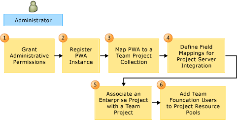

# System and setup requirements to support TFS-Project Server integration  

[!INCLUDE [temp](../_shared/tfs-ps-sync-header.md)]

 You can synchronize data between Visual Studio Team Foundation Server (TFS) and Microsoft Project Server by installing Team Foundation Server Extensions for Project Server. You can install the extensions on Project Server 2010 with SP1 or Project Server 2013.  
  
 To ask a question of the community, see the following forum post on the Microsoft website: [Team Foundation Server and Project Server Integration](http://go.microsoft.com/fwlink/?LinkId=207282).  
  
##   Prerequisite software  
 You must have the following software installed before you configure the integration between Team Foundation Server and Project Server:  
  
-   **For administrators of Team Foundation Server**:  
  
    -   Visual Studio Team Foundation Server 2013  
  
    -   A version of Visual Studio 2013 or Team Explorer 2013 must be installed on the same machine that will be used to configure the integration of the two server products.  
  
-   **For administrators of Project Server**: One of the following versions of Project Server:  
  
    -   Project Server 2010 with SP1.  
  
    -   Project Server 2013.  
  
    > [!IMPORTANT]
    >  For Project Server 2010, the SharePoint web application for the instance of PWA must be set to **Classic Mode Authentication**. You will not be able to register it if the authentication is set to **Claims Based Authentication**.  
    >   
    >  For Project Server 2013, both **Classic Mode** and **Claims Based** authentication are supported.  
  
-   **For project managers**: Visual Studio 2012 and one of the following versions of Microsoft Project must be installed on the same machine that will be used to manage enterprise project plans that will participate in data synchronization with team projects:  
  
    -   Project Professional 2007 with SP2 and the update that you can download from the following page on the Microsoft website: [Description of the Office Project 2007 hotfix package (Project-x-none.msp): February 23, 2010](http://go.microsoft.com/fwlink/?LinkId=211633).  
  
    -   Project Professional 2007 with SP3.  
  
    -   Project Professional 2010.  
  
    -   Project Professional 2013.  
  
> [!IMPORTANT]
>  Active Directory is not required, but it is highly recommended that you deploy Active Directory in your network to synchronize the accounts of users, groups, and services that are valid within Team Foundation Server and Project Server.  
  
##   Installation requirements  
 The following table summarizes the software that you must install to support the data synchronization between the two server products. To install software, you must have administrative permissions on the machine where the software is installed.  
  
|Software|Install on|  
|--------------|----------------|  
|Visual Studio 2013 or Team Explorer 2013|Each machine on which Project Professional is used to synchronize data between enterprise project plans and team projects and each machine that is used to administer the configuration of the two server products. **Note:**  You can download Team Explorer 2013 from [Visual Studio 2013 Download](https://visualstudio.microsoft.com/vs/older-downloads/).|  
|Visual Studio Team Foundation Server 2013|Each application-tier server that hosts Team Foundation Server and that will participate in synchronizing data with Project Server. For more information, see [Install](/tfs/server/install/get-started).|  
|Team Foundation Server Extensions for Project Server|Each web-tier and application-tier server that hosts Project Server  and that will participate in synchronizing data with Team Foundation Server.   For more information, see [How to: Add Project Server to Team Foundation Server](https://msdn.microsoft.com/library/hh548139.aspx).|  
  
##   Configuration requirements  
 Before you can synchronize data between the two server products, you must first configure several points of integration between them. The following sequence describes the main configuration elements that are required:  
  
1.  **Project Server must be configured**. Before you configure the integration of TFS and Project Server, you must have configured Project Server to support your enterprise project plans. You must have defined at least once instance of Project Web Access or Project Web App (PWA) that will participate in data synchronization.  
  
2.  **At least one enterprise project plan must be defined**. Before you can map the project plan with a team project, you must have created the plan and published it to Project Server.  
  
3.  **At least one team project collection must be defined**. Before you can map a collection to an instance of PWA, you must define that collection.  
  
4.  **The team project that you want to synchronize must be defined**.  You must have a team project that you will map to an enterprise project plan. You can synchronize data with any team project. Also, before you upload field mappings to a team project collection, you must have defined a team project for that collection.  
  
5.  **Configure the integration**. As the following illustration shows, you must perform six main steps when you configure the integration of the two server products.  
  
       
  
     For more information, see [Configure TFS-Project Server integration](configure-tfs-project-server-integration.md).  
  
6.  **Customize the field mappings**. You will have to customize the default field mappings if you are mapping a project plan to a team project that was created from the Visual Studio Scrum process template.  
  
     You might have to customize the field mappings if the team project was not created from a Microsoft process template, either Agile Software Development or Capability Maturity Model Integration (CMMI) Process Improvement. Also, if you have customized the types of work items in your team project, you might have to further customize the field mappings to support data synchronization.  
  
     For more information, see [Customize the field mapping](customize-field-mapping-tfs-project-server.md).  
  
##   Mapping components and the synchronization process  
 To understand how components map to one another and the synchronization process, see the following topics:  
  
-   [Map components](map-project-server-components.md)  
  
-   [Synchronization process overview](synchronization-process-overview.md)  
  
  
## Related articles  
 [Configuration quick reference](configuration-quick-reference.md)   
 [Assign permissions](assign-permissions-support-tfs-project-server-integration.md)   
 [Map integration components](map-integration-components.md)   
 [Administer TFS-Project Server integration](administrate-integration-tfs-project-server.md)