# Add work item tags to categorize and filter lists and boards  
 
[!INCLUDE [temp](../_shared/version-vsts-tfs-all-versions.md)]


Tagging work items helps you quickly filter the product backlog or a work 
item query by categories that you define. 
A tag corresponds to a one or two keyword phrase that you define and that  
supports your needs to filter a backlog or query, or define a query. 

You can add and modify tags from the web portal, from Team Explorer plug-in for Visual Studio. Also, you can open a query in [Excel](../backlogs/office/bulk-add-modify-work-items-excel.md) to perform bulk modifications of tags.  


<a id="assign"></a>
## Add tags to a work item

From the web portal, open a work item and add a tag. Click Add and type your keyword. Or, select from the list of previously assigned tags.  

::: moniker range="vsts || >= tfs-2017 <= tfs-2018"

> [!div class="mx-imgBorder"]
> 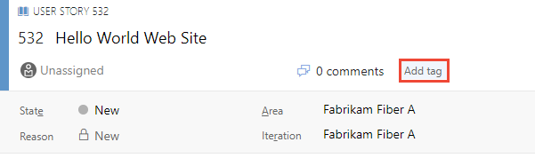
::: moniker-end
::: moniker range=">= tfs-2013 <= tfs-2015"
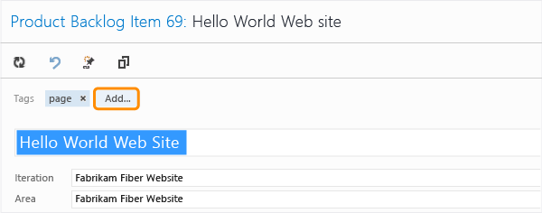  
::: moniker-end
To add several tags at one time, type a comma between tags. Tags are case sensitive.  

Tags that appear in the tag bar are already assigned to the work item. To unassign a tag, simply choose the x on the tag,.   


> [!NOTE]   
> By default, all Contributors are granted permissions to create and modify 
> tags. Stakeholders can add tags that are already defined, but not create 
> new tags. To grant or restrict permissions to create new tags, you set 
> the permission **Create tag definition** at the project-level. To learn
> more, see [Add administrators, set permissions at the project-level or  
> project collection-level](../../security/set-project-collection-level-permissions.md).
	


<a id="bulk-modify"></a>
##Bulk add or remove tags 
::: moniker range="vsts || >= tfs-2017 <= tfs-2018"

You can bulk update work items to add or remove tags from the web portal.
You bulk modify tags in the same way as you [bulk modify other fields using the web portal](../backlogs/bulk-modify-work-items.md#tags). Or, you can use [Excel](../backlogs/office/bulk-add-modify-work-items-excel.md) to bulk add or remove tags.   

> [!div class="mx-imgBorder"]
> 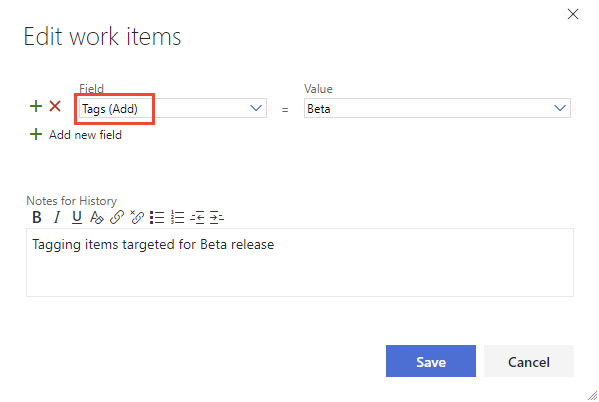 

<!---
> [!NOTE]    
><b>Feature availability: </b>The bulk modify tags feature from the web portal is available from VSTS and TFS 2017 or later versions.

  
-->
::: moniker-end

::: moniker range=">= tfs-2013 <= tfs-2015"

[Use Excel to bulk modify tags](../backlogs/office/bulk-add-modify-work-items-excel.md).

::: moniker-end

> [!NOTE]   
> Bulk modify of tags from the Visual Studio client isn't supported. 


<a id="query"></a>
## Query for work items based on tags  

<!---
> [!NOTE]    
><b>Feature availability: </b>To add tags to a query clause, you must work from VSTS and TFS 2013.2 or later versions.  
-->


To query work items based on tags, add a clause for each tag you want to use to support your query.  

::: moniker range="tfs-2013"
> [!Note]    
> Adding tags to a query is supported from TFS 2013.2 and later versions.
::: moniker-end

For example, here we query for all work items that are tagged either ```Web``` or ```Service```. 

> [!div class="mx-imgBorder"]
> 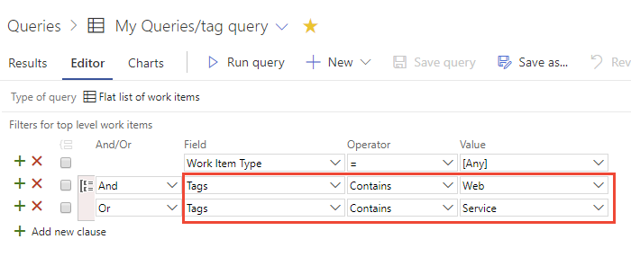 

> [!TIP]    
> You can use the **Contains** or **Does Not Contain** operators. To learn more about queries, see [Create managed queries](using-queries.md). 


<a id="show-tags"></a>
## Show tags in your backlog or query results

::: moniker range="vsts || >= tfs-2017 <= tfs-2018"
Click **Column Options** to add the Tags field to the product backlog or a work item query. If the option doesn't appear, click the  to select it from the menu of options.    

> [!div class="mx-imgBorder"]
> 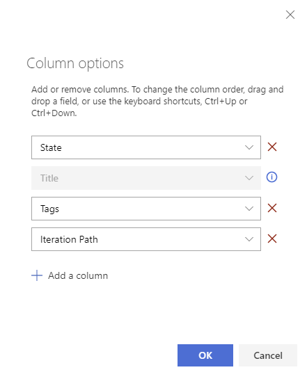

All tags that have been added to the listed work items appear.

> [!div class="mx-imgBorder"]
> 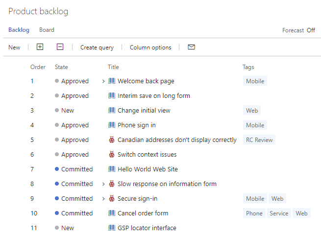 
 
::: moniker-end
  

::: moniker range=">= tfs-2013 <= tfs-2015"

1. Click **Column Options** to add the Tags field to the product backlog or a work item query. If the option doesn't appear, click the  actions icon to select it from the menu of options.    

	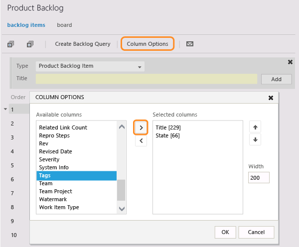

2. All tags that are assigned to the listed work items appear.

	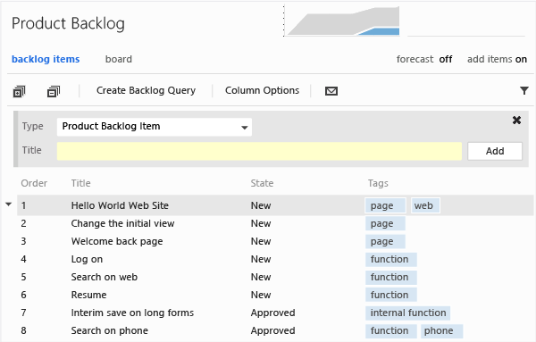 
 
::: moniker-end

<a id="filter"></a>
## Filter lists using tags  
From the web portal, you can filter backlogs, boards, and query results using tags. 
 
::: moniker range="vsts || >= tfs-2017 <= tfs-2018"

Begin by clicking the  filter icon. 

Check the boxes of those tags that you want to filter on. Keep the OR selection to perform a logical OR for all the tags you selected. Or, click the AND option to perform a logical AND on all the selected tags. 

> [!div class="mx-imgBorder"]
> 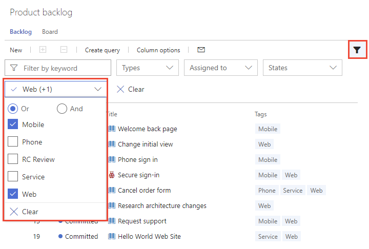 


::: moniker-end

::: moniker range=">= tfs-2013 <= tfs-2015"

1. Turn on filtering and choose a tag.  

	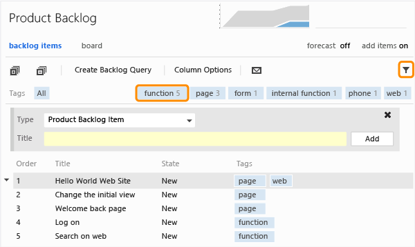  

	The list refreshes. Only those work items with the selected tag are displayed. Filtering the list disables add-a-backlog-item panel, stack ranking, and forecasting.  

	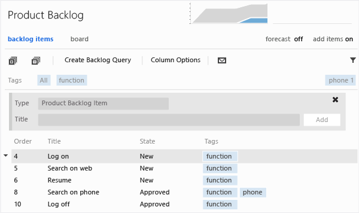  

2. To apply a sub-filter, choose another tag. You filter successively by choosing from the set of tags that appear in the filter tag bar. To start your filter process over, choose All to show all tags.  

3. To show all items, choose All or choose the Tag filter image on backlog and queries pages filter icon to turn filtering off.   

::: moniker-end

## Delete, remove, or manage tags 

You can't delete a tag itself. However, if you delete a tag from all work items to which it's currently assigned, the system will delete the tag. The system automatically deletes unassigned tags after 3 days of disuse.  

If you misspell a tag, don't assign the misspelled tag to any work item and the system will automatically delete it within 3 days.  

::: moniker range="vsts || >= tfs-2018"  

Another option is to install the [Marketplace Tags Manager](https://marketplace.visualstudio.com/items?itemName=YodLabs.TagsManager2) which adds a page under the Work hub to manage tags. 

::: moniker-end

## Related articles

Tags are a shared resource, they're associated with a team project and not a team. If your team project contains multiple teams, all teams will add to and work from the same set of tags. 
- [Use the query editor to list and manage queries](using-queries.md) 
- [Show tags on cards](../customize/customize-cards.md)
- [Bulk modify work items from the web portal](../backlogs/bulk-modify-work-items.md)  
- [Bulk modify work items from Excel](../backlogs/office/bulk-add-modify-work-items-excel.md)  

<!---
### Filter backlogs or boards using tags  

If you've added tags to your backlog or board items, you can filter your backlog list using the  tag filter.   

To filter the Kanban board using tags, make sure that you first [customize cards to Show tags](../customize/customize-cards.md).  

> [!NOTE]    
><b>Feature availability: </b>This feature is currently supported only on the Kanban board from VSTS or the web portal for TFS 2015 Update 1 or later version. 

To learn more about filtering, see [Filter your backlog or board](../backlogs/filter-backlogs.md).  

-->

### Limits on number of tags
While no hard limit exists, creating more than 100K tags for a team project collection can negatively impact performance. Also, the auto-complete dropdown menu for the tag control displays a maximum of 200 tags. When more than 200 tags are defined, begin typing to cause the tag control to display relevant tags.  

You can't assign more than 100 tags to a work item or you'll receive the following message:  

	TF401243: Failed to save work item because too many new tags were added to the work item.

Simply save the work item with the tags (100 or less) that you've added, and then you can add more tags. 

Limit queries to fewer than 25 tags. More than that and the query will likely time out.  


::: moniker range=">= tfs-2013 <= tfs-2018"

### Add tags to the default column view on the product backlog 

To add the Tags field as a column field for the product backlog, you modify the ProcessConfiguration file to include ```System.Tags```.  To learn how, see the [Process configuration XML element reference](../customize/reference/process-configuration-xml-element.md).

::: moniker-end

<!---
### Add or modify tags using an API 

You can use ```WorkItem.Fields``` or Work Item Field Explorer, provided with the Process Editor, to determine if the Tags field is editable (IsEditable). To acquire the Process Editor: 
* For TFS 2017 and later versions, [install the TFS Process Template editor from the Visual Studio Marketplace](https://marketplace.visualstudio.com/items?* For TFS 2015 and earlier versions, install [TFS Power Tools](https://marketplace.visualstudio.com/items?itemName=TFSPowerToolsTeam.MicrosoftVisualStudioTeamFoundationServer2015Power). 
-->