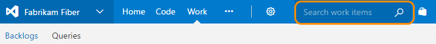

# Adhoc vs managed work item queries

<b>VSTS | TFS 2018 | TFS 2017</b> 

>[!NOTE]  
>**Feature availability:**&#160;&#160;The Work item search feature is available from VSTS and TFS 2017 and later versions.     

You have two ways to perform work item searches: adhoc and managed. You perform adhoc queries using the work item search box (shown below), whereas you perform managed queries using the built-in search function available from the Work hub, Queries page.  

**Use adhoc queries when you want to:**
- Find a specific work item using its ID or a keyword 
- Find one or more work items across all team projects in a fast, flexible manner
- Perform full text search across all work item fields
- Review work items assigned to a specific team member
- Search against specific work item fields to quickly narrow down a list of work items 
- Determine what key words will support a managed search 

	>[!NOTE]  
	>With Work item search, searches are performed against a full-text search engine that has indexed all work item fields.  

**Use managed queries when you want to:**
- Review or triage a group of work items  
- Perform bulk updates on several work items such as change Assign To, Iteration Path, or more 
- Review parent-child or dependent links among work items 
- Create a status or trend chart from a flat list query  
- Create a list of work items that you'll export to [Excel](../backlogs/office/bulk-add-modify-work-items-excel.md) or [Project](../backlogs/office/create-your-backlog-tasks-using-project.md) (requires that you have installed the [Team Foundation Server Standalone Office Integration 2015 (free)](https://www.visualstudio.com/downloads/#team-foundation-server-office-integration-2015-update-3-1) plug-in)   
	

## Work item search box context 
Note that with  Work item search, the work item search box is repurposed to support adhoc queries. In order to initiate a managed search, you need to open the **Work>Queries** page. 

##Resources 

- [Use the query editor to create managed queries](using-queries.md)
- [Code and work item search](../../search/index.md)
 