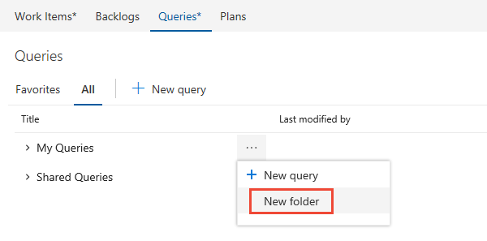
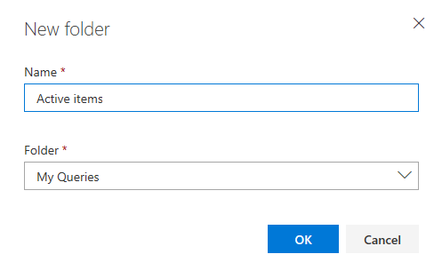
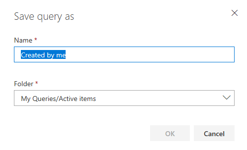
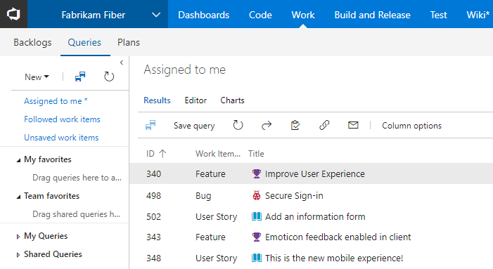
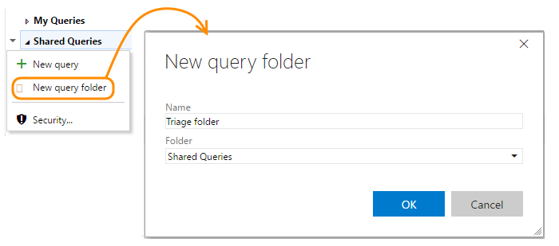
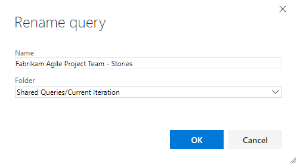

# Organize queries, add a query folder    

[!INCLUDE [temp](../_shared/version-vsts-tfs-all-versions.md)]

Organize your personal or shared queries by adding a query folder. You can then add queries to or move existing queries into those folders.
 
## Prerequisites
If you're not a member of the Project Administrators group, [get added](../../security/set-project-collection-level-permissions.md), or have your **Edit project-level information** permission set to **Allow**.  

> [!NOTE]  
> **Feature availability**: The New Queries experience is supported on VSTS. To enable the new experience, see [Preview features](../../collaborate/preview-features.md). To learn more about the new experience, see [New Queries experience](queries-preview.md).  

## Add a query folder, move items into a folder 

# [New Queries Experience](#tab/new-query-exp)
::: moniker range="vsts || >= tfs-2018"
To enable the New Queries Experience, see [Preview features](../../collaborate/preview-features.md). To learn more about the new experience, see [New Queries experience](queries-preview.md).  

You add query folders from the **Work>Queries>All** page.

0. From your web browser, open your product backlog from the **Work** hub, **Queries** page. 
 
	 

0. If you see the following message, click **Try it!** to enable the new queries experience.   
 
	 

	Otherwise, you can enable it from the [Preview features menu](../../collaborate/preview-features.md). 
 
0. Click **All**. Expand **My Queries** or Shared Queries depending on where you want to add a query folder. 
 
0. To add a folder, click the  for an existing folder or the top container folder, My Queries or Shared Queries, and choose **New folder**. 

	

0. Enter the name for the folder in the New folder dialog.  

	

	If you want to change the location of the folder, select it from the Folder drop down menu. 

0. To move items into a folder, drag-and-drop a query onto the folder. 

	Optionally, you can click the   for an existing query, choose **Edit**, and then choose **Save As**. In the Save query as dialog, choose the folder you want to save the query in. 

	
  
::: moniker-end
::: moniker range=">= tfs-2013 <= tfs-2017"
The New Queries experience is available from TFS 2018 and later versions. For TFS 2013 through TFS 2017, you only have access to the old queries experience. 
::: moniker-end  
# [Old Queries Experience](#tab/old-query-exp)

You add query folders from the **Work>Queries** page.

0. From your web browser, open the **Work** hub, **Queries** page. 
 
	 

0. To add a folder, click the   context menu for an existing folder or the top container folder, My Queries or Shared Queries, and choose **New query folder**. 

	Enter the name for the folder in the New query folder dialog.  

	 

0. To move items into a folder, drag-and-drop a query onto the folder. 

	Optionally, you can click the  context menu for an existing query and choose **Rename**. In the Reanme query dialog,l choose the folder you want to save the query in. 

	

---

### Add a query to the dashboard or share it with your team 
To add a query to the home page or a dashboard, open the  (or ) context menu for the query and [add it to a specific dashboard](../../report/dashboards/dashboards.md) or as a team favorite.   

Share queries with your team by adding them to a folder under the Shared Queries space.  To save a query to a Shared Queries folder, get added to the [project administrators group](../../security/set-project-collection-level-permissions.md) or have your [permissions set for a folder under Shared Queries](set-query-permissions.md). 

You can only add shared queries to dashboards or as team favorites, and only if you have [team administrator or project administrator permissions](../scale/manage-team-assets.md). 

## Q & A   
<!-- BEGINSECTION class="md-qanda" -->

### Q: Can I change the owner of a query or folder?

::: moniker range="vsts || >= tfs-2015 <= tfs-2018"
**A:** No. You can only enable permissions for users and groups from the permissions window for the query or folder.
::: moniker-end

::: moniker range=">= tfs-2013"
**A:** Yes. This is a supported feature from the [query Security dialog](set-query-permissions.md). 
::: moniker-end
### Q: Can I add folders to team favorites?

**A:** No. You can only add folders under My Queries and under Shared Queries.

### Q: Are the queries and folders I create from the web portal the same as in Team Explorer?

**A:** Yes. You might have to refresh your browser or client to see changes you make in another client.

### Q: Can I move a query or a folder?  

**A:** Yes. In the web portal, choose **Rename** from the context menu. In Visual Studio Team Explorer, simply drag the folder to the new location.  

In Team Explorer for Eclipse, choose **Move** from the context menu and select the folder to which you want to move the item.

<!-- ENDSECTION --> 

## Related articles
- [Query keyboard shortcuts](queries-keyboard-shortcuts.md)
- [Set query permissions](set-query-permissions.md)
- [Set project-level permissions](../../security/set-project-collection-level-permissions.md)