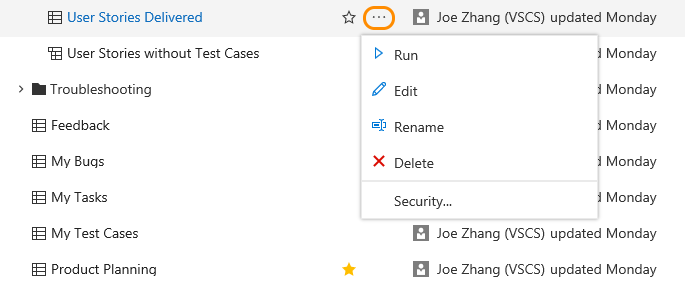
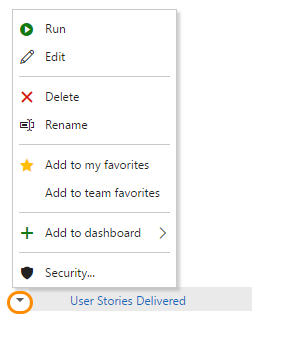

# Organize, view, and run queries    

<b>VSTS | TFS 2017 | TFS 2015 | TFS 2013</b> 

!!! WORK IN PROGRESS !!!

## Enable or disable the New queries experience

The New queries experience provides more screen room to view and triage query results. It also allows you to search within the set of queries you've defined or that are shared across your team project.  

## View queries

To view queries defined for a team project, open the **Work>Queries** page.  

**New queries experience** 

The page opens to **Favorites** which lists all queries you have favorited. 

- Click **All** to view all queries defined for the team project 
- Expand a folder to view queries within the folder 
- Click a query title to run the query 
- Click the star icon to favorite or unfavorite a query
- Open the context menu to access other options: 

	

**Old queries experience**

The page opens to the **Assigned to me** query which lists all work items current assigned to you.  

- Click **All** to view all queries defined for the team project 
- Expand a Shared Queries folder to view queries within the folder 
- Click a query title to run the query 
- Open the context menu to access other options: 

	

You can change the permissions set for a shared query folder or shared query. For details, see [Set query permissions](set-query-permissions.md). 

## Add a query folder  (UI changes) 

 - move queries into a folder (drag and drop) or do a Rename to move it into a different folder 
 - Or you can copy it by doing a Save As 

## View favorited queries, favorite a query (UI changes) 

(NEW - across all team projects) 

## Search on queries (New query experience) 

## Run a query 
- Select a query from the drop down menu (NEW) 

 
## Sort a query 

## Create a new query (UI changes) 
	• Move query to a different folder 
 

## Related notes 

- [Set query permissions](set-query-permissions.md) 

