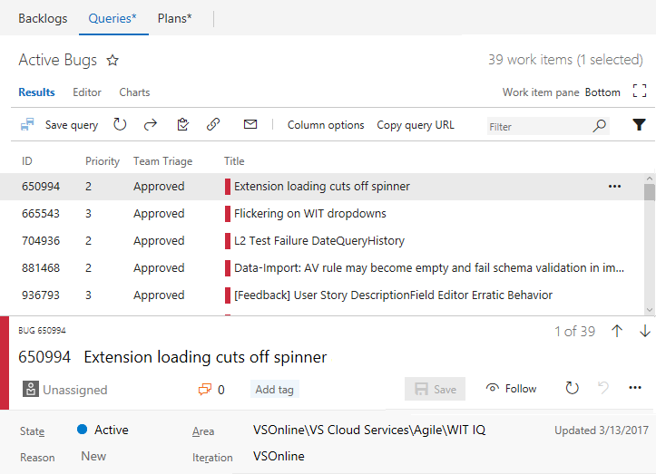

# New Queries experience

**VSTS**   

>[!NOTE]    
><b>Feature availability: </b>The New queries experience is in preview for VSTS and available when you enable it from the web portal. You enable it from the [Preview features menu](../../collaborate/preview-features.md) that you access from your account profile.     
   
We have launched a preview version of a modernized query experience that you access from the **Work>Queries** page in your VSTS account. 

## What's new in the Queries hub

The Queries hub now opens to a list of your favorite queries, or you can click All to show all queries defined for the team project. 

* Query lists highlight additional metadata for each query that include:
    * The type of query
    * The path within the hierarchy
    * Who last modified it
    * When it was last modified
* Easily access all your personal favorite queries as well as the team favorites for any team that you are a member of.

## What's new in Triage view

Open a query to view the query results and access the query triage mode. 

* Navigate back to your queries list or subfolders using the browser or by clicking back on the Hub name
* Quickly favorite a query by using the star next to the query name
* To create work items, use the top level Work drop-down menu 

## Got feedback?
Fill out the comment box that appears when you turn the feature on/off. See also our [comprehensive feedback and support page](../../provide-feedback.md).  

## Related notes

- [Work from the account home page](../../connect/account-home-pages.md)