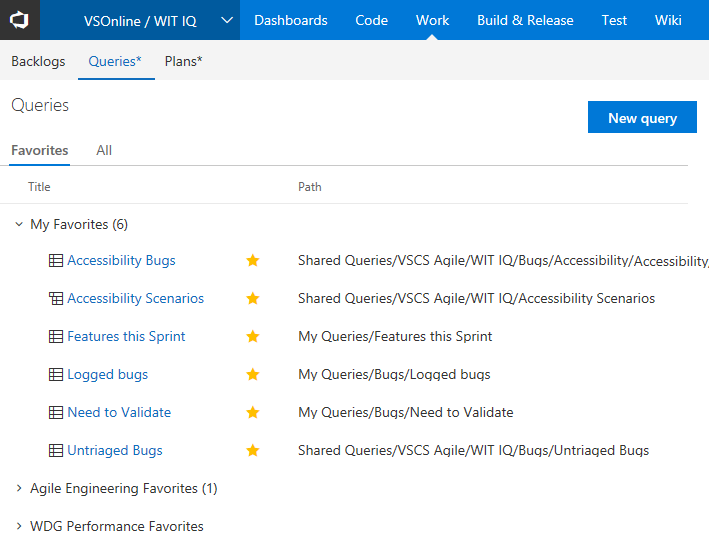

# New Queries experience

**VSTS | TFS 2018**   

> [!NOTE]      
><b>Feature availability: </b>The **New Queries Experience** is in preview for VSTS and TFS 2018. To access it, you [enable it from the web portal](../../collaborate/preview-features.md) from your account profile.

The **New Queries Experience** streamlines many of the query features you have access to. It now provides a directory page, separate from the queries results page,  from which to select, manage, and favorite queries. 

## Enable the New Queries Experience

To try out the **New Queries Experience**, open your account provide and select Preview features. For details, see [Enable  preview features](../../collaborate/preview-features.md).

## User focused navigation
After you enable the **New Queries Experience**, click the  **Work>Queries** hub. You"™ll notice that the left pane is gone. To navigate quickly between your favorite queries, click Queries and favorite those queries of most interest to you. Then, you can use the drop-down menu in the query title to select queries you've favorited.

Use the **Queries** directory to browse all your personal and shared queries and favorite what is important to you. To open this page, click **Queries** within the breadcrumb.

In addition, the directory pages highlight new metadata for each query including:
* The type of query
* The path within the hierarchy
* Who last modified it
* When it was last modified.

## Find queries faster with a keyword filter
You can filter the queries listed on the **Favorites** and **All** directory pages by entering a keyword in the filter box.

## Other improvements
Besides the big changes listed above, here are some other improvements:
* Create and edit followed work item queries with the **@Follows** macro
* "Save as" now copies charts to the new query
* Compact command bar and expanded quick filter capabilities

## What's next?
We plan to continue to invest in the Queries hub beyond the new features in this preview. Some things to look forward to include:
* Simplified column configuration experience
* Expanded query filtering capabilities to filter by folders

## Send us your feedback
Let us know what you think in the comment box that appears when you toggle the new hub on or off. Additionally, feel free to reach out to us via Developer Community with suggestions or issues. See also our [comprehensive feedback and support page](../../user-guide/provide-feedback.md).  

## Related articles

- [View or run a query](view-run-query.md)
- [Change column options](https://docs.microsoft.com/en-us/vsts/work/backlogs/set-column-options?toc=/vsts/work/track/toc.json&bc=/vsts/work/track/breadcrumb/toc.json)
- [Work from the account home page](../../user-guide/account-home-pages.md)
