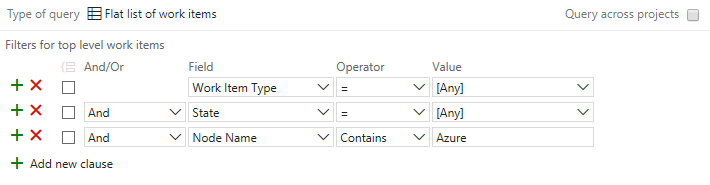

# Query by area or iteration path 

[!INCLUDE [temp](../_shared/version-vsts-tfs-all-versions.md)]

<!---
Add examples of usage for areas and iteration paths. 
Mention node names. 
Tips for usage 
--> 

The Area Path and Iteration Path are two fields that appear on the work tracking form for all work item types. You define them for a team project&mdash;[area paths](../customize/set-area-paths.md) and [iteration paths](../customize/set-iteration-paths-sprints.md) &mdash;and then select the ones you want to [associate with a team](../scale/set-team-defaults.md). 

To better understand how to work with area and iteration paths, see [About area and iteration paths (aka sprints)](../customize/about-areas-iterations.md).

## Supported operators and macros 
When creating queries and specifying the Area Path and Iteration Path fields, you can use the following operators: 

> [!div class="mx-tdBreakAll"]  
> |Operator     | Use when you want to...  | 
> |-------------|--------------|
> | **=**           | Specify one, specific area path.  |
> | **<>**          | Filter out one, specific area path. |
> | **In**          | Filter for a set of area paths.  |
> | **Not In**      | Exclude items that are assigned to a set of area paths. |
> | **Under**       | Specify all paths under a select area path. |
> | **Not Under**   | Exclude items assigned under a specific area path.  |

In addition, you can use the @CurrentIteration macro when filtering on the Iteration Path. For examples, see [Query by date or current iteration](query-by-area-iteration-path.md). 

<!--- S131 updates

In addition to these operators, you can use the following macros when you select the Iteration Path. For examples, see [Query by date or current iteration](query-by-area-iteration-path.md). 

> [!div class="mx-tdBreakAll"]  
> |Macro   | Use when you want to...  |
> |-------------|--------------|
> | **@CurrentIteration**        | Specify the current iteration associated with the selected team context.  |
> | **@CurrentIteration +/- n**  | Filter items based on assignment to a sliding window of sprints associated with the selected team context.  |

> [!NOTE]   
> **Feature availability**: The **@CurrentIteration** macro is supported for VSTS and TFS 2015 and later versions. The **@CurrentIteration =/- n** macro is supported for VSTS. These two macros only work when run them from the web portal. 

-->

## Query for items assigned under several areas 

You can specify to filter for work items assigned to several area paths by using the **In** operator as shown in the following example.  
 
> [!div class="mx-imgBorder"]


Or, you can use the Node Name and **In** to get the same results. 

> [!div class="mx-imgBorder"]


## Query for items based on a keyword contained within several area paths   

Using the Node Name field, you can filter on work items assigned to area paths based on a keyword using the **Contains** operator. The Node Name specifies the leaf node of an Area Path, which corresponds to the last node in the tree hierarchy. 

In this example, the filter will return any work items assigned to an area path whose leaf node contains the word "Azure".

> [!div class="mx-imgBorder"]


## Query for items based on the leaf node of the area path 

Another way to filter items based on the area path is to use the Node Name. The Node Name corresponds to the last node within the area path. 

> [!div class="mx-imgBorder"]


<a name="field-reference"></a>
## Classification field reference 

|**Field name**|**Description**|**Reference name**|
|---|---|---|
|**Area Path**|Groups work items into product feature or team areas. The area must be a valid node in the project hierarchy.|System.AreaPath |
|**Iteration Path**|Groups work items by named sprints or time periods. The iteration must be a valid node in the project hierarchy.|System.IterationPath |

For each field, data path=```TreePath```, reportable type=```Dimension```, index attribute=```True```. 
 
If you define a path name that is longer than 256 characters, you will not be able to specify it in Microsoft Project. To avoid this problem, define path names of no more than 10 characters, and do not nest nodes more than 14 levels deep.

You can't apply most field rules to the System.AreaPath and System.IterationPath fields. To learn more, see [Apply a field rule](../customize/reference/apply-rule-work-item-field.md).

The following fields do not appear on work item forms but are tracked for each work item type. These fields provide a numeric value for each classification value that is defined for a team project. You can use these fields to filter queries and create reports.

|**Field name**|**Description**|**Reference name**|**Data type**|
|---|---|---|---|
|Area ID|The unique ID of the area to which this work item is assigned.|System.AreaId|Integer|
|Iteration ID|The unique ID of the iteration to which this work item is assigned.|System.IterationId|Integer|
|Node Name|The name of the leaf node of an area path. For example, if the area path is Project\A1\B2\C3, the node name is C3.|System.NodeName|String|

The default reportable type is none. Area ID and Iteration ID are indexed, Node Name is not. To learn more about field attributes, see [Work item data type reference](../customize/reference/define-modify-work-item-fields.md).


## Related notes 

*	[Add another team](../scale/multiple-teams.md)  
*	[Set team defaults](../scale/set-team-defaults.md)  
*	[Customize iteration paths](../customize/set-iteration-paths-sprints.md)  
*	[Customize area paths](../customize/set-area-paths.md)  
*	[Manage team assets](../scale/manage-team-assets.md)  
*	[Set permissions and access for work tracking](../../security/set-permissions-access-work-tracking.md) 


<a name="field-rules"></a>
### Supported field rules  

For the Hosted XML and On-premises XML process models, you can apply rules to fields. However, for system fields (System.XXX), such as the Area Path and Iteration Path, you can [specify only a small subset of rules](../customize/reference/apply-rule-work-item-field.md#system), such as ```HELPTEXT``` and ```READONLY``` to  fields. 

[!INCLUDE [temp](../_shared/rest-apis-queries.md)]
 
[!INCLUDE [temp](../../_shared/help-support-shared.md)] 