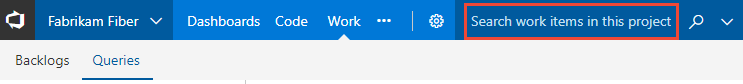
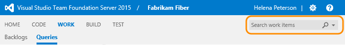
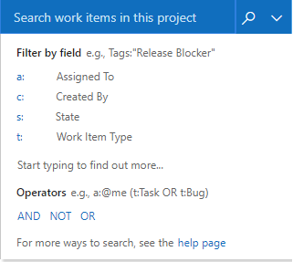

# Perform an adhoc search

[!INCLUDE [temp](../_shared/version-vsts-tfs-all-versions.md)]

<a id="search-box"/>

You can find items using shortcut filters or by specifying keywords or phrases, specific fields/field values, assignment or date modifications, or using Equals, Contains, and Not operators.

Search box queries automatically scope to the items defined to the team project you're currently connected to. To search across team projects, use the [query editor](using-queries.md). Also, searching is not case-sensitive.

::: moniker range="vsts || >= tfs-2017 <= tfs-2018"
<a id="search-selector" /> 
<a id="search-box" /> 
## Code search vs work item search
::: moniker-end
::: moniker range=">= tfs-2017 <= tfs-2018"
> [!NOTE]    
><b>Feature availability: </b>You can add the Code Search extension or configure Work Item Search to [TFS 2017 or later versions](../../project/search/administration.md).   

If you've added the [Code Search extension](https://marketplace.visualstudio.com/items?itemName=ms.vss-code-search), you'll notice that the search box moves to the top row, and you can quickly switch between work item and code searches. 
::: moniker-end
::: moniker range="vsts || >= tfs-2017 <= tfs-2018"
The search box retains the last used search context for each hub. To learn more about code search, see [Get started with Code Search](../../project/search/code-search.md).

Type the ID in the Search work items box and then choose the search icon. The Search work items box is available from a team project context.  

::: moniker-end

::: moniker range=">= tfs-2017 <= tfs-2018"

[!INCLUDE [temp](../_shared/search-box.md)]

::: moniker-end

::: moniker range="vsts || >= tfs-2017 <= tfs-2018"
 
> [!div class="mx-imgBorder"]


Click within the box to view the set of filters for [assignment,  workflow state](query-by-workflow-changes.md), [keyword, or work item type](titles-ids-descriptions.md). 

For example, enter ```A=@Me T=Task``` to list all tasks assigned to you.  

::: moniker-end

<!---
  

Use the  context menu to add a filter based on [assignment or workflow status](query-by-workflow-changes.md), [a keyword or work item type](titles-ids-descriptions.md). 

-->

## Use shortcut filters

You can enter or select one or more of the following shortcut identifiers:

-   `A` =for **A**ssigned To, (for example, `A:Annie` or `A=@me`)
-   `C` for = **C**reated By, (for example, `C:Peter` or `C=@me`)
-   `S` for = **S**tate, (for example, `S=New`)
-   `T` for = Work Item **T**ype, (for example, `T=Task`).

Use the `@Me` and `@Today` macros to specify your user name or today's date.

Use the `=`, `:`, and `"“` operators to specify the operations **Equals**, **Contains**, and **Not**, respectively.

# [Browser](#tab/browser) 

::: moniker range="vsts"

> [!div class="mx-imgBorder"]  
>    

::: moniker-end

::: moniker range=">= tfs-2017 <= tfs-2018"

**With Work Item Search configured**

> [!div class="mx-imgBorder"]  
>    

> [!NOTE]    
> Work Item Search can be configured with TFS 2017.2 and later versions. To learn more, see [Set up and administer Microsoft Code Search and Work Item Search](../../project/search/administration.md). 

**Without Work Item Search configured**

> [!div class="mx-imgBorder"]  
>    


::: moniker-end


::: moniker range=">= tfs-2013 <= tfs-2015"

Open the  context menu and select an option.

> [!div class="mx-imgBorder"]  
>     

::: moniker-end

# [Visual Studio](#tab/visual-studio)

Open the  context menu and select an option.

> [!div class="mx-imgBorder"]  
>  


Finding work items using the search box (Team Explorer)

  

You can combine shortcuts and use search operators within the search box.

Use the  **Clear** button to remove content from the search box. To switch your context to the search box from within Visual Studio, enter **Ctrl+'**.

---

<a id="keywords" /> 
## Find items based on keywords or phrases

Keywords or phrases that you type into the search box return a list of work items that contain those keywords or phrases in the **Description**, **Repro Steps**, or **Title** fields. You must enclose each phrase in quotation marks.

In the **Search work items** box, type a keyword or phrase that appears in the **Title**, **Description**, or **Repro Steps** fields for the work items of interest.

Enclose multiple words in quotation marks.

For example, to find work items with the specified keywords in the **Title** or **Description** fields:

-   For the keyword "duplication" enter **duplication**.  
-   For the phrase "Getting Started" enter **"Getting Started"**.  
-   For the phrase "Getting Started" or the keyword "feature" enter **feature "Getting Started"**.

|Filter for items that contain these keywords or phrases:|Type the following string:|
|---|---|
|duplication|`duplication`|
|Getting Started|`"Getting Started"`|
|feature and Getting Started|`feature "Getting Started"`|

You can perform partial or exact match queries on a keyword or a phrase contained within any text field. Or, you can perform a full-text search query by filtering on keywords and phrases contained within the full-text search index. Team Foundation automatically indexes all long-text fields with a data type of **PlainText** and **HTML** and the **Title** field for full-text search.

## Find items based on specific fields and field values

To find work items based on a keyword or phrase contained within other text string fields, specify either the friendly name or the reference name of the field. Enclose each phrase in quotation marks. You can determine the friendly name of a field by hovering over the field within a work item form. To determine the reference name of commonly used fields or to find a field that is not listed on the form, see [Work item field index](../work-items/guidance/work-item-field.md).

|Filter for items that meet this criteria:|Type the following string:|  
|---|---|  
|Contains one attached file.|`System.AttachedFileCount=1`|  
|Cut user stories.|`T:Story Reason=Cut`<br/>Or<br/>`T="User Story" System.Reason=Cut`|  
|Resolved by Peter.|`"Resolved By":Peter` <br/>Or<br/>`Microsoft.VSTS.Common.ResolvedBy:Peter` |  
|Modified today.|`"Changed Date"=@Today`|  
|Created yesterday as a test activity.|`"Created Date"=@Today-1 Activity=Test `|  

> [!NOTE]     
>Some fields, such as **History** and **Description**, do not support partial word text searches. For example, if the **History** field contains the phrase `reproducible behavior` and you search for `History:repro` the work item will not be found. However, if you search for the complete string `History:reproducible` the work item will be found.

## Use @Me or @Today macros

The **@Me** macro expands to the full name of the current user in any work item search. The **@Me** macro is especially useful for creating a search that you can share with other users, and it can simplify your work by reducing the number of characters you must type to specify your own user name. For a description of all macros, see [Query fields, operators, and macros, Query macros or variables](query-operators-variables.md#macros). 

<table width="100%">
<tbody valign="top">
<tr>
<th width="50%">Filter for</th>
<th width="50%">Type the following string</th>
</tr>
<tr>
<td>Currently assigned to you
</td>
<td>
`A=@Me`
</td>
</tr>

<tr>
<td>Created by you
</td>
<td>
`C=@Me` 
</td>
</tr>


<tr>
<td>Resolved yesterday
</td>
<td>
`"Resolved Date"=@Today-1` 
</td>
</tr>

<tr>
<td>Modified 7 days ago
</td>
<td>
`System.ChangedDate=@Today-7`
</td>
</tr>

<tr>
<td>
Created yesterday under the Phone Saver team
</td>
<td>
&#160;&#160;&#160;&#160;&#160;&#160;&#160;&#160;&#160;&#160;&#160;```Created Date _ = _ @Today-1```  
```And _ Area Path _ = _ FabrikamFiber\Phone Saver```  

</td>
</tr>

</tbody>
</table>  


## Use Equals, Contains, and Not operators

Use these search operators to specify search criteria:

&#160;&#160;&#160;**=** (EQUALS) to search for exact matches of text.  
&#160;&#160;&#160;**:** (CONTAINS) to search for partial matches of text.  
&#160;&#160;&#160;**"“** (NOT) to exclude work items that contain certain text. The NOT operator can only be used with field names.

The following examples show how to use operators when you create a search string.

|Filter for items that meet this criteria:|Type the following string:|  
|---|---|
|Assigned to Peter and not Active.|`A:Peter -S=Active`|
|In which the Activity field was not `Development`.|`- Activity=Development`|
|Resolved by Peter.|`"Resolved By":Peter`|
|Contain the keyword `triage` in the title or description, are not assigned to you, and are not closed.|`triage -A=@me -S=Closed`|
|Active bugs that are assigned to you that do not contain the keyword `bugbash` in the title.|`S=Active T=bug A=@Me -Title:bugbash`


## Related articles

- [Adhoc versus managed queries](adhoc-vs-managed-queries.md)  
- [Create managed queries with the query editor](using-queries.md)   
- [Query fields, operators, and macros](query-operators-variables.md)   
- [Work item field index](../work-items/guidance/work-item-field.md)     

[!INCLUDE [temp](../_shared/image-differences.md)]

### Does the search box support less than/greater than operators?

No. The search box doesn't recognize comparison operators such as greater than (>) or less than (<). It translates queries with these operators into a search phrase.

