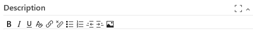
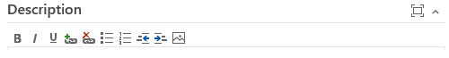
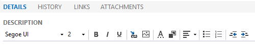
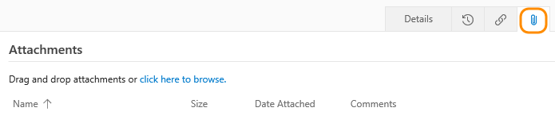
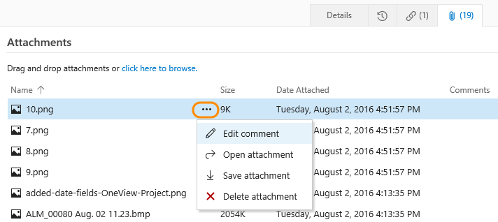
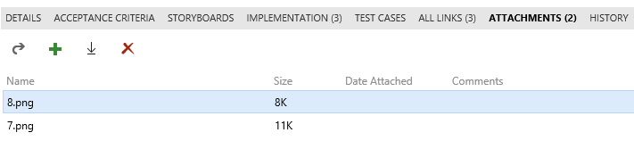
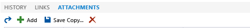
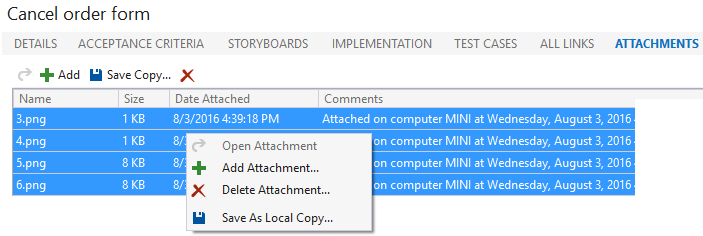
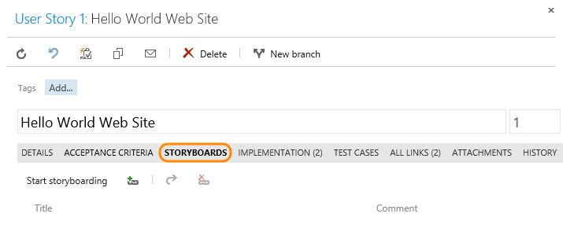
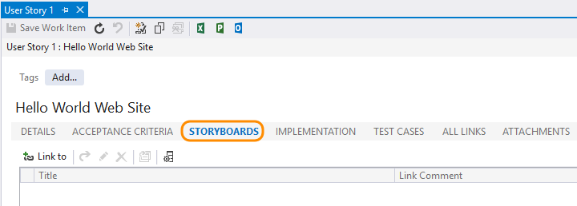

# Share work plans and progress 

<b>VSTS | TFS 2018 | TFS 2017 | TFS 2015 | TFS 2013 | Visual Studio 2017 | Visual Studio 2015 | Team Explorer Everywhere </b>  

Using work items to track your work provides a host of benefits, including the ability to easily share information. You can capture most information within the work item Description or other rich-text formatted field. If you need to maintain the information in a different format, you can easily link to or attach a file.  

Here's a list of the most common ways in which teams share information and plans using work item tracking. 

>[!NOTE]  
><b>Feature availability: </b>Some features are only available from the web portal or a Team Foundation client such as Visual Studio or the Eclipse plug-in, Team Explorer Everywhere (TEE). 

<table >
<thead align="center">
<tr >
<th align="left" width="46%">Task/feature </th>
<th align="center" width="15%">Web portal</th>
<th align="center" width="15%">Visual Studio</th>
<th align="center" width="24%">TEE (Eclipse plug-in)</th>

</tr>
</thead>
<tbody align="center"  >

<tr>
<td align="left">[Rich text fields](#rich-text) </td>
<td></td>
<td></td>
<td></td>

</tr>

<tr>
<td align="left">[Link objects](#link-items), [attach files](#attachments)</td>
<td></td>
<td></td>
<td></td>

</tr>

<tr>
<td align="left">[Storyboard and link to storyboards](#storyboard)</td>
<td></td>
<td></td>
<td></td>

</tr>

</tbody>
</table>

In addition, if you have stakeholders who don't contribute code but want to contribute to the discussion and review progress, make sure you provide them [stakeholder access](../../security/get-started-stakeholder.md) so that they can view work items and dashboards.  

## Rich text fields  

To convey detailed information, you can format text and insert images inline within the description field or any HTML field type.   

The rich text formatting toolbar appears above each text box that can be formatted. It only becomes active when you click within the text box. You can format text in HTML data fields, such as the Description, Accepted Criteria, and History. Available fields depend on the work item type, if you've [customized the process](../customize/process/customize-process.md), and the platform you work on.   

The specific set of formatting features differs depending on the client you use. In all clients, you can bold, italicize, and underline text. You can also add and remove hyperlinks, format text as ordered or unordered lists, and add images. 

# [Browser](#tab/browser)
#### VSTS &  TFS 2017, Rich text formatting toolbar

In VSTS, you can use the  icon or CTRL+Spacebar to remove formatting from highlighted text.

> [!NOTE]  
> The History field is no longer a rich-text field. To annotate the work item history, add to the Description or Discussion fields. 

<a id="tfs-portal-rich-text" />
#### TFS 2015, TFS 2013, Team Explorer Everywhere, Rich text formatting toolbar 

# [Visual Studio](#tab/visual-studio) 

<a id="team-explorer-rich-text" />
#### Visual Studio, Rich text formatting toolbar

From Team Explorer you can choose the font, font size, and text and background colors.

If inline images aren't displaying correctly, see [Resolve images that don't display in Team Explorer](#images-missing-te).

You can also use the following shortcut keys to format your text: 
- **Bold**: Ctrl+B  
- *Italic*: Ctrl+I  
- <u>Underscore</u>: Ctrl+U 

You can copy and paste HTML text or an image from another application directly into the text box using Ctrl+C and Ctrl+V shortcuts.

---

## Link items

To support traceability and add context to work items, you can link items to other work items or objects. From a links control tab, you can choose from various link types to based on the objects you want to link to. 

Again, your link options will differ depending on the client you use. For specific guidance, see these resources:

- [Add link to work items](../backlogs/add-link.md)  
- [Link items to support traceability and manage dependencies](link-work-items-support-traceability.md)  

## Attach files

To help track a work item, use the  or **Attachments** tab to attach a file with supplemental information. 

For example, you can attach a screen image that illustrates a problem, a line of code in a text file, a log, an e-mail thread, or a product feature's specification.

<a id="team-services" />
# [Browser](#tab/browser)
#### VSTS &  TFS 2017, Attachment control toolbar 

  

> [!TIP]    
> From VSTS, you can drag and drop files into the attachment area. From the browse menu, you can multi-select several files and attach within a single action. Also, from VSTS and TFS 2017.1 and later versions, you can add attachments to your pull request comments. You can also add attachments in pull request comments by drag-and-drop or by browsing. For details, see [Syntax support for Markdown files, widgets, and pull request comments, Attachments](../../collaborate/markdown-guidance.md#attach).  

You can edit, open, save, or delete an attachment by clicking an attachment and opening it's  actions menu. 

> [!NOTE]  
> For VSTS, you can add up to 100 attachments to a work item. Attempts to add more result in an error message upon saving the work item.    

<a id="tfs-portal" />
#### TFS 2015, TFS 2013, & Team Explorer Everywhere, Attachment control toolbar 

  

Click the  plus icon to add an attachment. Click an item and then click  to open the attachment or  to save a copy.  

<a id="team-explorer" />
# [Visual Studio](#tab/visual-studio) 

#### Visual Studio Team Explorer, Attachment control toolbar

> [!TIP]    
> From Visual Studio, you can drag and drop files into the attachment area. 

Click the  plus icon to add an attachment.

Click one or more items and then right-click to open the menu options to download or delete several attachments. 

By default, the size of work item attachments is limited to 4 MB. For on-premises deployments, you can use the TFS web service to [increase the size of files you attach up to 2GB](https://msdn.microsoft.com/library/ms400780.aspx).

---

## Storyboard 
Storyboarding your ideas and goals increases visual understanding. With [PowerPoint Storyboarding](../backlogs/office/storyboard-your-ideas-using-powerpoint.md) you can bring your ideas to life with storyboard shapes, text, animation, and all the other features that PowerPoint provides.  

> [!NOTE]  
> **Feature availability:**  Storyboarding with PowerPoint requires [Office PowerPoint 2007 or later](http://www.microsoftstore.com/store/msstore/pd/PowerPoint-2010/productID.216564300) and the TFS Storyboarding add-in. You install the TFS Storyboarding add-in for PowerPoint by installing one of the latest editions of [Visual Studio (2013 or later)](https://www.visualstudio.com/downloads/download-visual-studio-vs) or [Team Foundation Server Standalone Office Integration 2015 (free)](https://www.visualstudio.com/downloads/#team-foundation-server-office-integration-2015-update-3-1). 

By linking your storyboard to a work item, you provide your team access to the shared file where they can add their comments. From the ,  **Links**, or a **Storyboards** tab, you can link storyboards that you created using PowerPoint Storyboarding or other application. When you make changes to a linked storyboard, the work item continues to link to the file with the latest changes.

<a id="team-services-storyboard" />
# [Browser](#tab/browser)

#### VSTS & TFS 2017, Start storyboarding 

You can open Storyboarding with PowerPoint from the  actions menu within a work item form. 

  

To link to an existing storyboard, click the  Links tab and add a storyboard link.  

<a id="tfs-portal-storyboard" />

**TFS 2015, TFS 2013, & Team Explorer Everywhere, Storyboards tab control** 

From the **Storyboards** tab, click Start Storyboarding to open Storyboarding with PowerPoint. Or, you can link to an existing storyboard.

  

<a id="team-explorer-storyboard" />
# [Visual Studio](#tab/visual-studio) 
#### Visual Studio, Storyboards tab control  

To open PowerPoint with storyboarding, see [Storyboard your ideas using PowerPoint](../backlogs/office/storyboard-your-ideas-using-powerpoint.md).  

---

## Related notes  

As you can see, there are many ways to share information using work items alone. See these additional tools and features to support planning, tracking, and sharing information with your team.   

- [Dashboards](../../report/dashboards/dashboards.md)
- [Add and edit a wiki](../../collaborate/add-edit-wiki.md)

### SharePoint project portal (on-premises TFS)  

If you work from an on-premises TFS, you can use a SharePoint site to share and access documents from your team project. Your team can use the SharePoint site, also referred to as the project portal, to share information in the following ways:  
- Share data contained in reports or dashboards  
- Share team progress using predefined or customized SharePoint dashboards  
- Share documents, files, images  
- Share team knowledge and processes using the SharePoint wiki.    

To learn more, see [Share information using the project portal](../../report/sharepoint-dashboards/share-information-using-the-project-portal.md).  

[!INCLUDE [temp](../../_shared/images-not-appearing-vs.md)] 

### Marketplace extensions  

You may find additional ways to share information and collaborate as a team by adding a [Marketplace extension](https://marketplace.visualstudio.com/?targetId=754f8691-19ce-47a2-a1e8-ebeab1e67955#VSTS). 

