# Share work plans and progress 

<b>Team Services | TFS 2017 | TFS 2015 | TFS 2013 | Visual Studio 2015 | Team Explorer Everywhere </b>  

Using work items to track your work provides a host of benefits, including the ability to easily share information. You can capture most information within the work item Description or other rich-text formatted field. If you need to maintain the information in a different format, you can easily link to or attach a file.  

Here's a list of the most common ways in which teams share information and plans using work item tracking. 

>[!NOTE]  
><b>Feature availability: </b>Some features are only available from the web portal or a Team Foundation client such as Visual Studio or the Eclipse plug-in, Team Explorer Everywhere (TEE). 

<table >
<thead align="center">
<tr >
<th align="left" width="46%">Task/feature </th>
<th align="center" width="15%">Web portal</th>
<th align="center" width="15%">Visual Studio</th>
<th align="center" width="24%">TEE (Eclipse plug-in)</th>

</tr>
</thead>
<tbody align="center"  >

<tr>
<td align="left">[Email summary list with links to work item(s)](#email-summary-lists)</td>
<td></td>
<td></td>
<td></td>
</tr>

<tr>
<td align="left">[Print work item(s)](#print-items)</td>
<td>  </td>
<td></td>
<td>  </td>

</tr>
<tr>
<td align="left">[Email link to a work item query](#copy-url) </td>
<td></td>
<td></td>
<td>  </td>

</tr>

<tr>
<td align="left">[Email query results list](#email-summary-lists) </td>
<td></td>
<td></td>
<td>  </td>

</tr>

<tr>
<td align="left">[Rich text fields](#rich-text) </td>
<td></td>
<td></td>
<td></td>

</tr>

<tr>
<td align="left">[Link objects](#link-items), [attach files](#attachments)</td>
<td></td>
<td></td>
<td></td>

</tr>

<tr>
<td align="left">[Storyboard and link to storyboards](#storyboard)</td>
<td></td>
<td></td>
<td></td>

</tr>

<tr>
<td align="left">[Release summary (Team Services)](#release-summary) </td>
<td></td>
<td>  </td>
<td>  </td>

</tr>

</tbody>
</table>

In addition, if you have stakeholders who don't contribute code but want to contribute to the discussion and review progress, make sure you provide them [stakeholder access](../connect/work-as-a-stakeholder.md) so that they can view work items and dashboards.  

## Email, print, or send links to work item(s)  

Some of the most common ways information is shared within a team or across teams is by emailing lists or links to work items.  

### Email a single item  

You can quickly email a summary of one or more work items. Summaries include the values assigned to these fields: work item ID, title, work item type, assigned to, state, and tags.  

>[!NOTE]  
>You can only send the email to addresses that are recognized by the system, that is accounts of team members or stakeholders. If you add an email account that the system doesn't recognize, you receive a message that one or more recipients of your email don't  permissions to read the mailed work items.  

<ul class="nav nav-pills" style="padding-right:15px;padding-left:15px;padding-bottom:5px;vertical-align:top;font-size:18px;">
<li style="float:left;" data-toggle="collapse" data-target="#attach-files">Email a single item  </li>
<li style="float: right;"><a style="max-width: 374px;min-width: 120px;vertical-align: top;background-color:#AEAEAE;margin: 0px 0px 0px 8px;min-width:90px;color: #fff;border: solid 2px #AEAEAE;border-radius: 0;padding: 2px 6px 0px 6px;outline-style:none;height:32px;font-size:12px;font-weight:400" data-toggle="pill" href="#tee-email">Eclipse, TEE</a></li>
<li style="float: right;"><a style="max-width: 374px;min-width: 120px;vertical-align: top;background-color:#AEAEAE;margin: 0px 0px 0px 8px;min-width:90px;color: #fff;border: solid 2px #AEAEAE;border-radius: 0;padding: 2px 6px 0px 6px;outline-style:none;height:32px;font-size:12px;font-weight:400" data-toggle="pill" href="#team-explorer-email">Visual Studio</a></li>
<li style="float: right;"><a style="max-width: 374px;min-width: 120px;vertical-align: top;background-color:#AEAEAE;margin: 0px 0px 0px 8px;min-width:90px;color: #fff;border: solid 2px #AEAEAE;border-radius: 0;padding: 2px 6px 0px 6px;outline-style:none;height:32px;font-size:12px;font-weight:400" data-toggle="pill" href="#tfs-portal-email">TFS 2015, TFS 2013</a></li>

<li class="active" style="float: right"><a style="max-width: 374px;min-width: 120px;vertical-align: top;background-color:#007acc;margin: 0px 0px 0px 0px;min-width:90px;color: #fff;border: solid 2px #007acc;border-radius: 0;padding: 2px 6px 0px 6px;outline-style:none;height:32px;font-size:12px;font-weight:400" data-toggle="pill" href="#team-services-email">Team Services, TFS 2017</a></li>
</ul>
 

  

**From the web portal**, open the  Actions menu and choose the email option.  
   
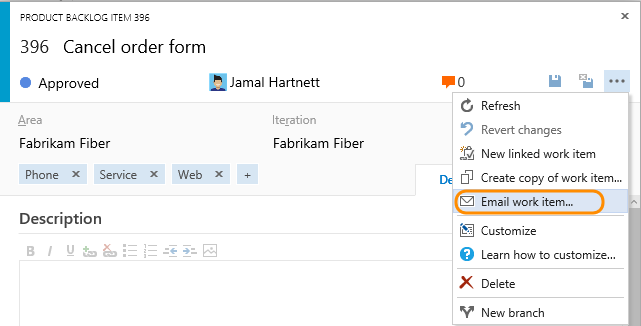    

**From the web portal**, open the work item and click the  mail icon. 
  

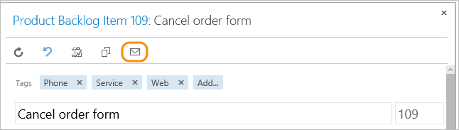  

<blockquote style="font-size: 13px"><b>Note:</b> If you connect to an on-premises TFS, your TFS admin must have [configured an SMTP server](../../setup-admin/tfs/admin/setup-customize-alerts.md) for the email feature to work.</blockquote>   

**From Visual Studio or Team Explorer**, choose . This option requires that you configure Office Outlook on your client computer.  
 
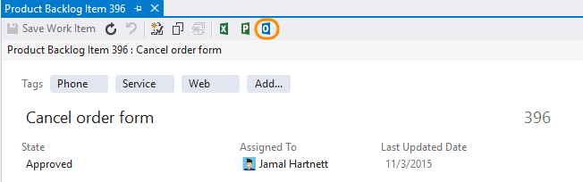  
  

**From Eclipse**, open the work item and click the  mail icon.  
  

  

  

### Email summary lists with links to items  

Another way to share items is by emailing summary lists, such as a sprint summary plan or active bugs list. You can do this from a backlog or query results list.  

Depending on the option and client you choose, summary lists may or may not include a hyperlink to the work item ID.  

<ul class="nav nav-pills" style="padding-right:15px;padding-left:15px;padding-bottom:5px;vertical-align:top;font-size:18px;">
<li style="float:left;" data-toggle="collapse" data-target="#attach-files">Email a list of items  </li>
<li style="float: right;"><a style="max-width: 374px;min-width: 120px;vertical-align: top;background-color:#AEAEAE;margin: 0px 0px 0px 8px;min-width:90px;color: #fff;border: solid 2px #AEAEAE;border-radius: 0;padding: 2px 6px 0px 6px;outline-style:none;height:32px;font-size:12px;font-weight:400" data-toggle="pill" href="#tee-email-list">Eclipse, TEE</a></li>
<li style="float: right;"><a style="max-width: 374px;min-width: 120px;vertical-align: top;background-color:#AEAEAE;margin: 0px 0px 0px 8px;min-width:90px;color: #fff;border: solid 2px #AEAEAE;border-radius: 0;padding: 2px 6px 0px 6px;outline-style:none;height:32px;font-size:12px;font-weight:400" data-toggle="pill" href="#team-explorer-email-list">Visual Studio</a></li>
<li style="float: right;"><a style="max-width: 374px;min-width: 120px;vertical-align: top;background-color:#AEAEAE;margin: 0px 0px 0px 8px;min-width:90px;color: #fff;border: solid 2px #AEAEAE;border-radius: 0;padding: 2px 6px 0px 6px;outline-style:none;height:32px;font-size:12px;font-weight:400" data-toggle="pill" href="#tfs-portal-email-list">TFS 2015, TFS 2013</a></li>
<li class="active" style="float: right"><a style="max-width: 374px;min-width: 120px;vertical-align: top;background-color:#007acc;margin: 0px 0px 0px 0px;min-width:90px;color: #fff;border: solid 2px #007acc;border-radius: 0;padding: 2px 6px 0px 6px;outline-style:none;height:32px;font-size:12px;font-weight:400" data-toggle="pill" href="#team-services-email-list">Team Services, TFS 2017</a></li>
</ul>
 

 
 

**To email items from the web portal**: Open a backlog or query and highlight the items from the list. Open the context menu for one of the selected items and select to email them.
   
   
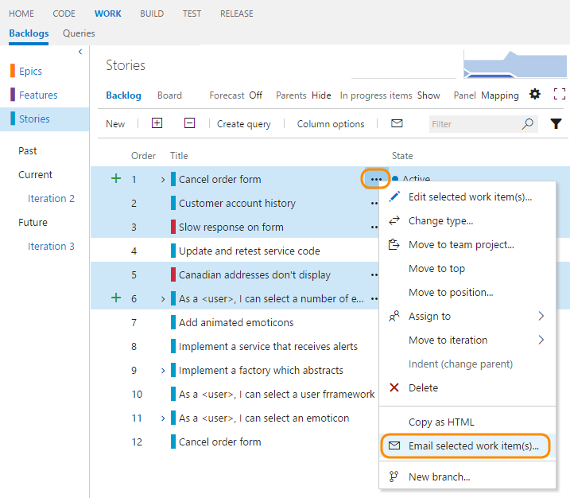 

If you want to mail a list of all items in the backlog or query, simply click the  mail icon. 
  

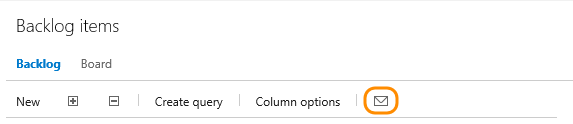  

<blockquote style="font-size: 13px"><b>Note:</b> Your TFS admin must have [configured an SMTP server](../../setup-admin/tfs/admin/setup-customize-alerts.md) for the email feature to work.</blockquote>   

**To email items from the web portal for TFS 2015**: Open a backlog or query and highlight the items from the list. Open the context menu for one of the selected items and select to email them.
     
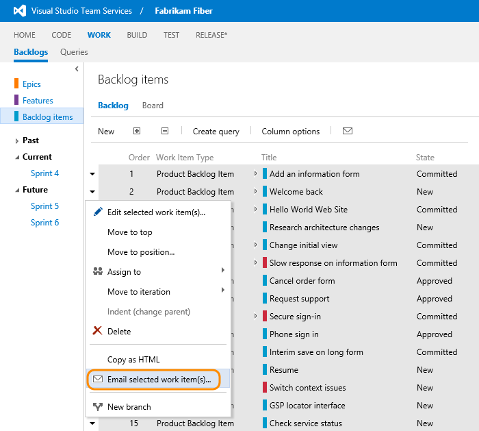 

If you want to mail a list of all items in the backlog or query, simply click the  mail icon. 
  

  
 

**To email items from Visual Studio**: Open a query, highlight the items from the list, and then choose the Send selection to Microsoft Outlook from the context menu. This option requires that you configure Office Outlook on your client computer.  
 
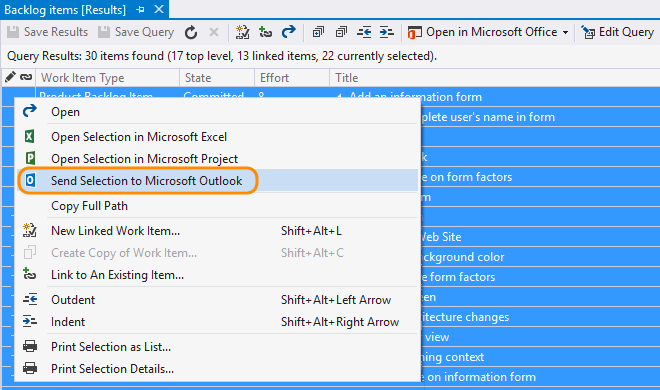   
 

**From Eclipse**: Open a query, highlight the items from the list, and then choose the Copy selected items to the clipboard from the context menu. Paste the clipboard contents to your email application.   
  
 
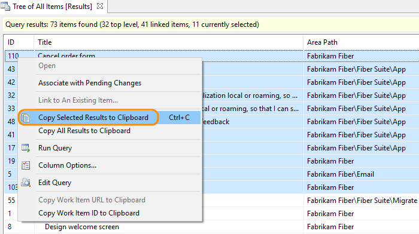  
 

 

### Copy formatted list of work items  

With this option, you can copy an HTML formatted table of selected items. You can then email this list using your choice of email client.  

1.  From the web portal, open a backlog or a list of query results.  

2.  Select the work items you want to copy.   

    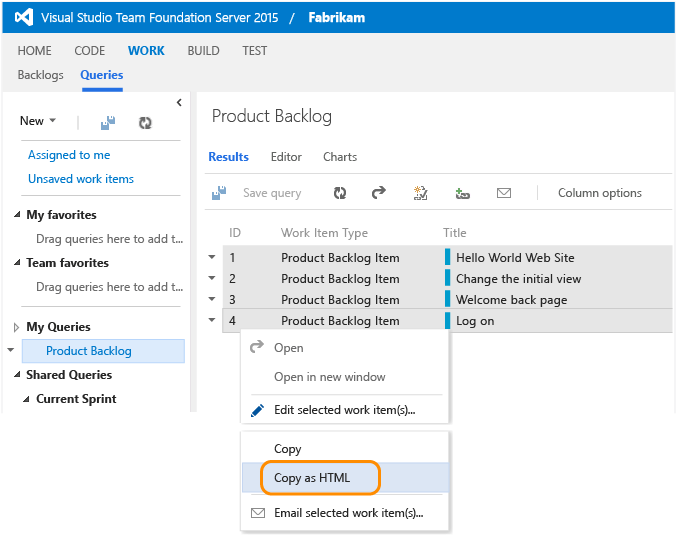  

    The formatted table contains a link to each work item included in your selected results list.  

3.  Paste the contents of the clipboard into your email client or other application. To open a linked work item, requires users to have read access to the team project or area node for those work items.   

### Print items  

To print the details of a work item, open a query in Visual Studio that contains the work item(s) you want to print, and select or highlight those items that you want to print. Then, choose the print option from the context menu.   

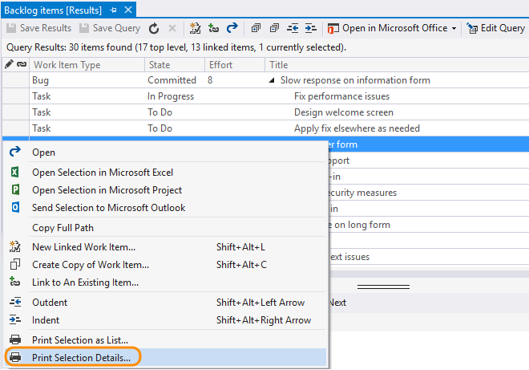   

## Copy the URL to a single work item  

<blockquote style="font-size: 13px"><b>Note:</b> All URLs you copy, regardless of the client you use to copy them, opens the work item in the web portal. </blockquote>  

<ul class="nav nav-pills" style="padding-right:15px;padding-left:15px;padding-bottom:5px;vertical-align:top;font-size:18px;">
<li style="float:left;" data-toggle="collapse" data-target="#attach-files">Copy the URL of a work item </li>
<li style="float: right;"><a style="max-width: 374px;min-width: 120px;vertical-align: top;background-color:#AEAEAE;margin: 0px 0px 0px 8px;min-width:90px;color: #fff;border: solid 2px #AEAEAE;border-radius: 0;padding: 2px 6px 0px 6px;outline-style:none;height:32px;font-size:12px;font-weight:400" data-toggle="pill" href="#tee-copy-url">Eclipse, TEE</a></li>
<li style="float: right;"><a style="max-width: 374px;min-width: 120px;vertical-align: top;background-color:#AEAEAE;margin: 0px 0px 0px 8px;min-width:90px;color: #fff;border: solid 2px #AEAEAE;border-radius: 0;padding: 2px 6px 0px 6px;outline-style:none;height:32px;font-size:12px;font-weight:400" data-toggle="pill" href="#team-explorer-copy-url">Visual Studio</a></li>
<li style="float: right;"><a style="max-width: 374px;min-width: 120px;vertical-align: top;background-color:#AEAEAE;margin: 0px 0px 0px 8px;min-width:90px;color: #fff;border: solid 2px #AEAEAE;border-radius: 0;padding: 2px 6px 0px 6px;outline-style:none;height:32px;font-size:12px;font-weight:400" data-toggle="pill" href="#tfs-portal-copy-url">TFS 2015, TFS 2013</a></li>

<li class="active" style="float: right"><a style="max-width: 374px;min-width: 120px;vertical-align: top;background-color:#007acc;margin: 0px 0px 0px 0px;min-width:90px;color: #fff;border: solid 2px #007acc;border-radius: 0;padding: 2px 6px 0px 6px;outline-style:none;height:32px;font-size:12px;font-weight:400" data-toggle="pill" href="#team-services-copy-url">Team Services, TFS 2017</a></li>
</ul>
 

**From the web portal**, simply copy the URL from the web browser address or hover over the title and then click the  copy-to-clipboard icon.

  

 **From the web portal for an on-premises TFS**, open the work item and then from the context menu for the browser, choose the copy link option. 
 
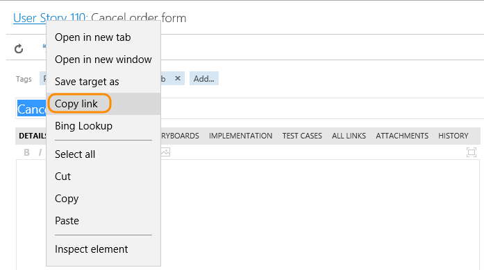 

**From Visual Studio**, right-click the work item tab to copy the URL. The URL opens the work item in the web portal. 
 
   

**From Eclipse**, open a query that contains the work item, and then open the context menu to Copy the URL for the selected work item. 

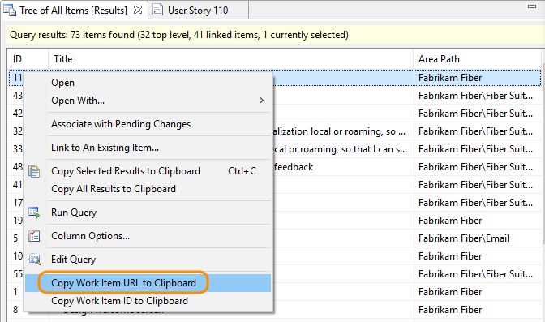   

 

## Rich text fields  

To convey detailed information, you can format text and insert images inline within the description field or any HTML field type.   

The rich text formatting toolbar appears above each text box that can be formatted. It only becomes active when you click within the text box. You can format text in HTML data fields, such as the Description, Accepted Criteria, and History. Available fields depend on the work item type, if you've [customized the process](../process/customize-process.md), and the platform you work on.   

The specific set of formatting features differs depending on the client you use. In all clients, you can bold, italicize, and underline text. You can also add and remove hyperlinks, format text as ordered or unordered lists, and add images. 

<ul class="nav nav-pills" style="padding-right:15px;padding-left:15px;padding-bottom:5px;vertical-align:top;font-size:18px;">
<li style="float:left;" data-toggle="collapse" data-target="#attach-files">Rich text fields</li>
<li style="float: right;"><a style="max-width: 374px;min-width: 120px;vertical-align: top;background-color:#AEAEAE;margin: 0px 0px 0px 8px;min-width:90px;color: #fff;border: solid 2px #AEAEAE;border-radius: 0;padding: 2px 6px 0px 6px;outline-style:none;height:32px;font-size:12px;font-weight:400" data-toggle="pill" href="#team-explorer-rich-text">Team Explorer</a></li>
<li style="float: right;"><a style="max-width: 374px;min-width: 120px;vertical-align: top;background-color:#AEAEAE;margin: 0px 0px 0px 8px;min-width:90px;color: #fff;border: solid 2px #AEAEAE;border-radius: 0;padding: 2px 6px 0px 6px;outline-style:none;height:32px;font-size:12px;font-weight:400" data-toggle="pill" href="#tfs-portal-rich-text">TFS 2015, TFS 2013, TEE</a></li>
<li class="active" style="float: right"><a style="max-width: 374px;min-width: 120px;vertical-align: top;background-color:#007acc;margin: 0px 0px 0px 0px;min-width:90px;color: #fff;border: solid 2px #007acc;border-radius: 0;padding: 2px 6px 0px 6px;outline-style:none;height:32px;font-size:12px;font-weight:400" data-toggle="pill" href="#team-services-rich-text">Team Services, TFS 2017</a></li>
</ul>
 

**Rich text formatting toolbar - Team Services &  TFS 2017 web portal** 

 

In Team Services, you can use the  icon or CTRL+Spacebar to remove formatting from highlighted text.

<blockquote style="font-size: 13px"><b>Note: </b>The History field is no longer a rich-text field. To annotate the work item history, add to the Description or Discussion fields. </blockquote> 

**Rich text formatting toolbar - TFS web portal and Team Explorer Everywhere** 
 

**Rich text formatting toolbar - Visual Studio**  

From Team Explorer you can choose the font, font size, and text and background colors.

If inline images aren't displaying correctly, see [Resolve images that don't display in Team Explorer](#images-missing-te).

You can also use the following shortcut keys to format your text:

- **Bold**: Ctrl+B  
- *Italic*: Ctrl+I  
- <u>Underscore</u>: Ctrl+U 
    

You can copy and paste HTML text or an image from another application directly into the text box using Ctrl+C and Ctrl+V shortcuts.

## Link items

To support traceability and add context to work items, you can link items to other work items or objects. From a links control tab, you can choose from various link types to based on the objects you want to link to. 

Again, your link options will differ depending on the client you use. For specific guidance, see these resources:

- [Add link to work items](../backlogs/add-link.md)  
- [Link items to support traceability and manage dependencies](link-work-items-support-traceability.md)  

## Attach files

To help track a work item, use the  or **Attachments** tab to attach a file with supplemental information. 
 

For example, you can attach a screen image that illustrates a problem, a line of code in a text file, a log, an e-mail thread, or a product feature's specification.

<ul class="nav nav-pills" style="padding-right:15px;padding-left:15px;padding-bottom:5px;vertical-align:top;font-size:18px;">
<li style="float:left;" data-toggle="collapse" data-target="#attach-files">Attachments tab or page</li>
<li style="float: right;"><a style="max-width: 374px;min-width: 120px;vertical-align: top;background-color:#AEAEAE;margin: 0px 0px 0px 8px;min-width:90px;color: #fff;border: solid 2px #AEAEAE;border-radius: 0;padding: 2px 6px 0px 6px;outline-style:none;height:32px;font-size:12px;font-weight:400" data-toggle="pill" href="#team-explorer">Team Explorer</a></li>
<li style="float: right;"><a style="max-width: 374px;min-width: 120px;vertical-align: top;background-color:#AEAEAE;margin: 0px 0px 0px 8px;min-width:90px;color: #fff;border: solid 2px #AEAEAE;border-radius: 0;padding: 2px 6px 0px 6px;outline-style:none;height:32px;font-size:12px;font-weight:400" data-toggle="pill" href="#tfs-portal">TFS 2015, TFS 2013, TEE</a></li>
<li class="active" style="float: right"><a style="max-width: 374px;min-width: 120px;vertical-align: top;background-color:#007acc;margin: 0px 0px 0px 0px;min-width:90px;color: #fff;border: solid 2px #007acc;border-radius: 0;padding: 2px 6px 0px 6px;outline-style:none;height:32px;font-size:12px;font-weight:400" data-toggle="pill" href="#team-services">Team Services, TFS 2017 </a></li>
</ul>
 

**Attachment control toolbar - Team Services &  TFS 2017 web portal**

  

<blockquote style="font-size: 13px">
 
From Team Services, you can drag and drop files into the attachment area. From the browse menu, you can multi-select several files and attach within a single action. Also, from Team Services and TFS 2017.1 and later versions, you can add attachments to your pull request comments. You can also add attachments in pull request comments by drag-and-drop or by browsing. For details, see [Syntax support for Markdown files, widgets, and pull request comments, Attachments](../../reference/markdown-guidance.md#attach). </blockquote> 

You can edit, open, save, or delete an attachment by clicking an attachment and opening it's  actions menu. 

<blockquote>
 
For Team Services, you can add up to 100 attachments to a work item. Attempts to add more result in an error message upon saving the work item.    
</blockquote> 

**Attachment control toolbar - TFS 2015 web portal and Team Explorer Everywhere** 

  

Click the  plus icon to add an attachment. Click an item and then click  to open the attachment or  to save a copy.  
  

**Attachment control toolbar - Visual Studio Team Explorer** 

<blockquote style="font-size: 13px">
 
From Visual Studio, you can drag and drop files into the attachment area. 
</blockquote> 

Click the  plus icon to add an attachment.
 

Click one or more items and then right-click to open the menu options to download or delete several attachments.
 

By default, the size of work item attachments is limited to 4 MB. For on-premises deployments, you can use the TFS web service to [increase the size of files you attach up to 2GB](https://msdn.microsoft.com/library/ms400780.aspx).

## Storyboard 
Storyboarding your ideas and goals increases visual understanding. With [PowerPoint Storyboarding](../office/storyboard-your-ideas-using-powerpoint.md) you can bring your ideas to life with storyboard shapes, text, animation, and all the other features that PowerPoint provides.  

>[!NOTE]  
><b>Feature availability: </b> Storyboarding with PowerPoint requires [Office PowerPoint 2007 or later](http://www.microsoftstore.com/store/msstore/pd/PowerPoint-2010/productID.216564300) and the TFS Storyboarding add-in. You install the TFS Storyboarding add-in for PowerPoint by installing one of the latest editions of [Visual Studio (2013 or later)](https://www.visualstudio.com/downloads/download-visual-studio-vs) or [Team Foundation Server Standalone Office Integration 2015 (free)](https://www.visualstudio.com/downloads/#team-foundation-server-office-integration-2015-update-3-1). 

By linking your storyboard to a work item, you provide your team access to the shared file where they can add their comments. From the ,  **Links**, or a **Storyboards** tab, you can link storyboards that you created using PowerPoint Storyboarding or other application. When you make changes to a linked storyboard, the work item continues to link to the file with the latest changes.

<ul class="nav nav-pills" style="padding-right:15px;padding-left:15px;padding-bottom:5px;vertical-align:top;font-size:18px;">
<li style="float:left;" data-toggle="collapse" data-target="#attach-files">Start storyboarding</li>
<li style="float: right;"><a style="max-width: 374px;min-width: 120px;vertical-align: top;background-color:#AEAEAE;margin: 0px 0px 0px 8px;min-width:90px;color: #fff;border: solid 2px #AEAEAE;border-radius: 0;padding: 2px 6px 0px 6px;outline-style:none;height:32px;font-size:12px;font-weight:400" data-toggle="pill" href="#team-explorer-storyboard">Team Explorer</a></li>
<li style="float: right;"><a style="max-width: 374px;min-width: 120px;vertical-align: top;background-color:#AEAEAE;margin: 0px 0px 0px 8px;min-width:90px;color: #fff;border: solid 2px #AEAEAE;border-radius: 0;padding: 2px 6px 0px 6px;outline-style:none;height:32px;font-size:12px;font-weight:400" data-toggle="pill" href="#tfs-portal-storyboard">TFS 2015, TFS 2013, TEE</a></li>
<li class="active" style="float: right"><a style="max-width: 374px;min-width: 120px;vertical-align: top;background-color:#007acc;margin: 0px 0px 0px 0px;min-width:90px;color: #fff;border: solid 2px #007acc;border-radius: 0;padding: 2px 6px 0px 6px;outline-style:none;height:32px;font-size:12px;font-weight:400" data-toggle="pill" href="#team-services-storyboard">Team Services, TFS 2017 </a></li>
</ul>
 

**Start storyboarding - Team Services & TFS 2017 web portal**

You can open Storyboarding with PowerPoint from the  actions menu within a work item form. 

  

To link to an existing storyboard, click the  Links tab and add a storyboard link.  

**Storyboards tab control - TFS 2015 web portal and Team Explorer Everywhere** 

From the **Storyboards** tab, click Start Storyboarding to open Storyboarding with PowerPoint. Or, you can link to an existing storyboard.
  

  

**Storyboards tab control - Visual Studio Team Explorer** 

To open PowerPoint with storyboarding, see [Storyboard your ideas using PowerPoint](../office/storyboard-your-ideas-using-powerpoint.md).  

## Email release summary

From the Release hub, [choose a specific release](../../build/actions/view-manage-releases.md) and click the  Send Email icon to share the results of that release.  

>[!NOTE]  
><b>Feature availability: </b>This feature is currently available only from Team Services.
 

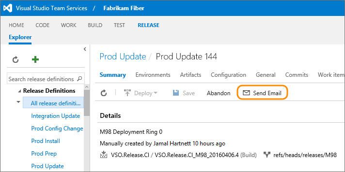

In the To box, start typing the name of the team member you want to send the summary mail to. 

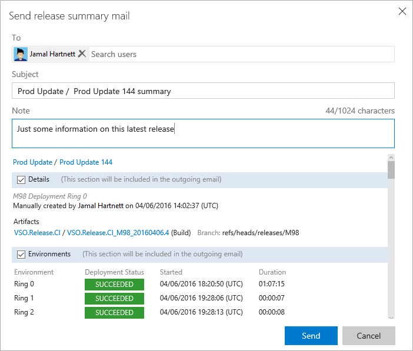

Optionally, enter a note about the release or un-check any section you don't want included. The default is to include all details, environmental summary, issues, and work items associated with the release.   

##Related notes  

As you can see, there are many ways to share information using work items alone. See these additional tools and features to support planning, tracking, and sharing information with your team.   

Plan

- [Create your backlog](../backlogs/create-your-backlog.md)   
- [Sprint planning](../scrum/sprint-planning.md)   
- [Remove/delete work items](../backlogs/remove-delete-work-items.md)   

Track

- [Define a query](using-queries.md)   
- [Add a link to work items](../backlogs/add-link.md)   
- [Follow a work item or pull request](../../collaborate/follow-work-items.md)   
- [Tag work items](add-tags-to-work-items.md)   
- [History & audit](history-and-auditing.md)   
- [Link to Git objects](../backlogs/connect-work-items-to-git-dev-ops.md)   
- [Dashboards](../../report/dashboards.md)      

Office clients

- [Excel](../office/bulk-add-modify-work-items-excel.md)    
- [Project ](https://msdn.microsoft.com/library/ms181675.aspx)     
- [Storyboarding](../office/storyboard-your-ideas-using-powerpoint.md)        

Other

- [Work from the account hub](../../connect/account-home-pages.md)  
- [Productivity tips](../productivity/productivity-tips.md)     
- [Markdown widget](../../report/widget-catalog.md#markdown-widget)   
- [Practices that scale](../scale/practices-that-scale.md)       

 
### Work item hyperlink format  
How do you define a hyperlink that opens a work item? Specify a URL that conforms to the following syntax:

**Team Services**:

   <b>https://</b>*AccountName.visualstudio.com/ProjectName/*<b>_workitems?id=</b>*WorkItemNumber*<b>&_a=edit</b>

   Example: `https://fabrikam/DefaultCollection/Phone%20Saver/_workitems?id=133&_a=edit`

**For TFS 2017, TFS 2015**:

   <b>http://</b>*ServerName:Port*/<b>tfs/</b>*CollectionName/TeamProjectName*/<b>_workitems?id=</b>*WorkItemNumber*<b>&_a=edit</b>

   Example: `http://fabrikamprime:8080/tfs/DefaultCollection/Phone%20Saver/_workitems/133&_a=edit`

**For TFS 2013.2**:

   <b>http://</b>*ServerName:Port*/<b>tfs/</b>*CollectionName/TeamProjectName*/<b>_workitems/edit/</b>*WorkItemNumber*

   Example: `http://fabrikamprime:8080/tfs/DefaultCollection/Phone%20Saver/_workitems/edit/133`

**For on-premises TFS 2013.1 and earlier versions**:
   <b>http://</b>*ServerName:Port*/<b>tfs/</b>*CollectionName/TeamProjectName*/<b>_workitems#_a=edit&id=</b>*WorkItemNumber*  

   Example: `http://fabrikamprime:8080/tfs/DefaultCollection/Phone%20Saver/_workitems#_a=edit&id=133`

**where**:

-   *AccountName* specifies the name of the Team Services account  
-   *ServerName* specifies the name of the TFS application tier server   
-   *Port* specifies the port, default=8080
-   *CollectionName* specifies the name of the team project collection.
-   *TeamProjectName* specifies the team project name
-   *WorkItemNumber* specifies the ID of the bug, task, or other work item.

### SharePoint project portal (on-premises TFS)  

If you work from an on-premises TFS, you can use a SharePoint site to share and access documents from your team project. Your team can use the SharePoint site, also referred to as the project portal, to share information in the following ways:  
- Share data contained in reports or dashboards  
- Share team progress using predefined or customized SharePoint dashboards  
- Share documents, files, images  
- Share team knowledge and processes using the SharePoint wiki.    

To learn more, see [Share information using the project portal](../../report/sharepoint-dashboards/share-information-using-the-project-portal.md).  

[!INCLUDE [temp](../../_shared/images-not-appearing-vs.md)] 

### Marketplace extensions  

You may find additional ways to share information and collaborate as a team by adding a [Marketplace extension](https://marketplace.visualstudio.com/?targetId=754f8691-19ce-47a2-a1e8-ebeab1e67955#VSTS). 

