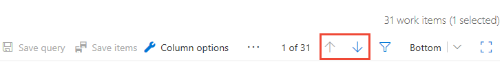
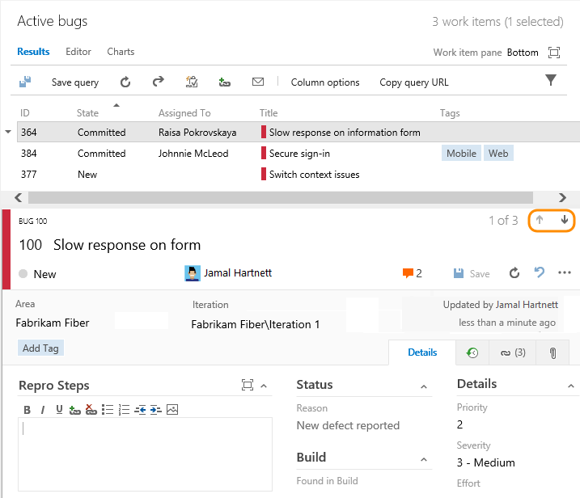
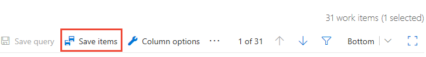

# Triage work items  

[!INCLUDE [temp](../_shared/version-vsts-tfs-all-versions.md)]

Using a work item query you can quickly review and update work items. Oftentimes team use the triage mode for a query to perform the following tasks: 
- Set the priority of a bug or work item 
- Assign a work item to a sprint or team member 
- Add details to the description, acceptance criteria, or repo steps 
- Link related work items 
- Update the status of work items 

In this topic you'll learn how to:

> [!div class="checklist"]   
> * Use triage query mode to update a list of work items    
> * Bulk save work items that you've updated        

> [!NOTE]  
> **Feature availability**: The triage experience varies slightly based on the new or old queries user interface. The New Queries experience is supported on VSTS. To enable the new experience, see [Preview features](../../collaborate/preview-features.md). To learn more about the new experience, see [New Queries experience](queries-preview.md).  

## Open a query to triage a list of work items 

To view, open, or create a query, see [View, run, or email a work item query](view-run-query.md) or [Create managed queries with the query editor](using-queries.md). 

From the query **Results** page, you can quickly move up and down within the list of work items using the up and down arrows. As you review each work item, you can assign it, add details, set priority, or modify any field within the work item form.  

### VSTS: New queries experience

The buttons to move up or down within the query results list are outside the work item form. Click Bottom to cycle through the choices for where the work item form appears: Bottom, Right, or Off. 

 

### VSTS: Old queries experience, TFS 2017, TFS 2015, TFS 2013

The buttons to move up or down within the query results list are inside the work item form. Click Bottom to cycle through the choices for where the work item form appears: Bottom, Right, or Off.

 
## Save bulk changes made to work items 

You can update several work items through the triage process, and then do a bulk save when you are finished. Work items shown in bold text indicate that local changes have not yet been saved to the data store.   

### VSTS: New queries experience

Click **Save items** to save all work items you've modified. 

 

### VSTS: Old queries experience, TFS 2017

Click the  double-save icon to save all work items you've modified.

### TFS 2015 and TFS 2013

Click the  double-save icon to save all work items you've modified.

  

