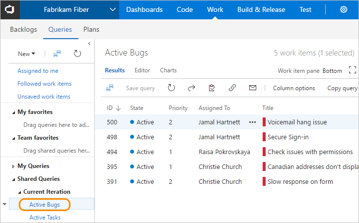

# Create managed queries with the query editor

[!INCLUDE [temp](../_shared/version-vsts-tfs-all-versions.md)]

You can create queries in VSTS, the  web portal for Team Foundation Server (TFS), and Team Explorer. Also, you can open a query in [Excel](../backlogs/office/bulk-add-modify-work-items-excel.md) or [Project](../backlogs/office/create-your-backlog-tasks-using-project.md) to perform bulk additions and modifications.  

For details on constructing query clauses and information on each query operator&mdash;such as, `Contains`, `In`, `In Group`, and `<>`(not operator) &mdash;and macros, see [Query fields, operators, and macros](query-operators-variables.md). For an index of example queries, see [Create managed queries](example-queries.md#examples). 

In this topic you'll learn:  

> [!div class="checklist"] 
> * How to open and edit a query   
> * How to add or create a query 
> * How to group query clauses 
> * Understand when to use a flat-list, tree, or direct-links query 
> * How to query across team projects    

[!INCLUDE [temp](../_shared/image-differences.md)]

<a id="flat-list-query"/>
## Open and edit a query  

The easiest way to define a query is to start with an existing shared query. 
The following example shows how to find all closed bugs by modifying the 
Active Bugs shared query provided with the Agile process template. Examples are based on the user interface provided through the web portal. 

1.	Open a shared query. For example, from the web portal, open the Active Bugs or similar flat list query.   
  
	Queries, Open Shared queries, Active Bugs" style="border: 2px solid #C3C3C3;" />

	>[!TIP]  
	>If you're working in Visual Studio Team Explorer, open the **Work** page to access your queries and shared queries. If Team Explorer isn't visible, click **View>Team Explorer** from the top level menu.   

2.	Edit the query to find closed bugs and then run the query. 
	Use  to insert a clause above the current clause. Use  to delete a clause.  Queries are automatically scoped to the current team project. To find work items defined in several team projects, see [Query across team projects](using-queries.md#across-projects).   	

	**VSTS, TFS 2018 - New queries experience:**  	

	

	**VSTS, TFS 2017, TFS 2015:**  
	
	 

	**TFS 2013:**  
	  

3.	Save the query to your My Queries folder.  
	  
	      
	  
	  To save a query to the Shared Queries folder, you need to be a [team administrator](../scale/manage-team-assets.md), a member of the [Project Administrators group](../../security/add-users-team-project.md), or have your Contribute permissions on the folder set to Allow. To learn more, see [Set query permissions](set-query-permissions.md).

<a id="flat-list" />
## Create a query

You can start a fresh, new query from the Queries page in the web portal or the Work Items page in Team Explorer.  

## Group clauses

Grouped clauses operate as a single unit separate from the rest of the query, similar to putting parentheses around a mathematical equation or logic expression. The And or Or operator for the first clause in the group applies to the whole group.

In the next example, the first expression returns all work items that are priority 1 and all active bugs of any priority. The second expression returns all active priority 1 work items and all priority 1 bugs, whether they are active or not.

| Grouped clauses  | Logical expression         |
| ----------------- | --------------------|
|  | Priority = 1 OR (Work Item Type=Bug AND State=Active) |
|  | Priority = 1 AND (Work Item Type=Bug OR State=Active) |

To group one or more clauses, select them and then choose the  group clauses icon.

If your query results do not return your expected set of work items, follow these steps: 

- Make sure that each clause is defined as you intended.  
- Verify And/Or assignments to each clause. If your results contain more work items than expected, often an Or clause is present instead of an And clause.  
- Determine if you need to group or change the grouping of the query clauses and the And/Or assignments of each grouped clause.  
- Add more query clauses to refine your query filter criteria.  
- Review the options available to specify [fields, operators, and values](query-operators-variables.md).  

<a id="tree-query" />
## Use a tree query to view hierarchies  

Use the tree query () to view a multi-tiered, nested list of work items. For example, you can view all backlog items and their linked tasks.

Expand (Expand node () or collapse () leaf nodes to focus on different parts of the tree.

Define the filter criteria for both parent and child work items. 

 

To find linked children, select Match top-level work items first. To find linked parents, select Match linked work items first.

>[!NOTE]  
>You can't construct a query that shows a hierarchical view of Test Plans, Test Suites, and Test Cases. These items aren't linked together using parent-child link types. You can [view the hierarchy through the Test Plans page of the Test hub](../../manual-test/getting-started/create-a-test-plan.md). 

<a id="directs-link-query" />
## Use direct links to view dependencies

Use the direct links query () to track work items that depend on other tracked work, such as tasks, bugs, issues, or features. For example, you can view backlog items that depend on other items being implemented or a bug being fixed. 

Use the direct links query to track dependencies your team has that other teams work on, or manage commitments your team has made to other teams. Specify the filter criteria for both top and linked work items, and select the types of links used to filter the dependencies. 

Filter your first-tier list of work items by choosing one of these options:

- Only return work items that have the specified links: First-tier work items are returned, but only if they have links to work items specified by the linked work items filter criteria. 

- Return all top level work items: All first-tier work items are returned regardless of the linked work items filter criteria. Second-tier work items that are linked to the first tier are returned if they match the linked work items filter criteria.

- Only return work items that do not have the specified links: First-tier work items are returned, but only if they do not have links to work items specified by the linked work items filter criteria.

To learn more about each link type, see [Link work items to support traceability and manage dependencies](link-work-items-support-traceability.md).

<a id="across-projects" />  
## Query across team projects  
By default, shared queries and new queries are scoped to the current team project. However, you can create queries to find work items defined within the team project collection. You save cross-project queries under a specific team project.     

> [!NOTE]  
> <b>Feature availability: </b>The **Query across projects** feature is supported from VSTS and the web portal for TFS 2015.1 or later version.  

### VSTS and TFS 2015.1  
To list work items defined in two or more team projects, checkmark **Query across projects**. For example, the following query finds all features created in all team projects within the last 30 days.
 
 

With the Query across projects checked, you can add the Team Project field to filter to a select number of team projects.   

>[!NOTE]  
>Separate multiple project names with the list separator that corresponds to the regional settings defined for your client computer, for example, a comma (,). 

The Team Project field becomes available only after you check  **Query across projects**.  Moreover, when Query across projects is unchecked, only those fields from those WITs defined in the current team project appear in the Field drop-down menu. When Query across projects is checked, all fields from all WITs defined in all team projects in the collection appear in the Field drop-down menu.  

### TFS 2015, TFS 2013 
To find all features created in all team projects within the last 30 days, remove the **Team Project=@Project** clause from the query.  

All fields from all WITs defined in all team projects in the collection always appear in the Field drop-down menu.  

Use **Team Project=@Project** to scope the query to find only those work items defined for the current team project. 

## Task board versus query list items

You may notice and wonder why the contents of the task board differ from those listed with its created query? To learn more, see [Task board items versus query list items](../backlogs/backlogs-boards-plans.md#task-board-items).

## Export a query  
From the query editor in Team Explorer, use the File menu to save a query as a .wiq file. When you create a team project, the shared queries are created based on [.wiq files defined in a process](../customize/reference/process-templates/define-work-item-query-process-template.md). 

See also:
- [Syntax for the Work Item Query Language (WIQL)](../../reference/wiql-syntax.md)  
- [Wiql Editor, a Marketplace extension](https://marketplace.visualstudio.com/items?itemName=ottostreifel.wiql-editor)  
 
> [!NOTE]  
> For queries made against VSTS, the WIQL length must not exceed 32K characters. The system won't allow you to create or run queries that exceed that length.  

## Related notes

That's the basics about using queries. For an index of query examples, see [Create managed queries](example-queries.md#examples). To add a custom field to track additional data, see [Customize your work tracking experience](../customize/customize-work.md). 

If you want to export a query to Excel, you can do that from [Excel or Visual Studio/Team Explorer](../backlogs/office/bulk-add-modify-work-items-excel.md). Or, to export a query directly from the web portal Queries page, install the [VSTS Open in Excel Marketplace extension](https://marketplace.visualstudio.com/items?itemName=blueprint.vsts-open-work-items-in-excel). This extension will add in **Open in Excel** link to the toolbar of the query results page. 

See also: 
- [Adhoc versus managed queries](adhoc-vs-managed-queries.md)  
- [Add work items](../backlogs/add-work-items.md)  
- [Chart a flat-list query](../../report/dashboards/charts.md)  
- [Change column options](https://docs.microsoft.com/en-us/vsts/work/backlogs/set-column-options?toc=/vsts/work/track/toc.json&bc=/vsts/work/track/breadcrumb/toc.json)
- [Define a query as a hyperlink](define-query-hyperlink.md) 
- [Work item field index](../work-items/guidance/work-item-field.md) 
- [Query keyboard shortcuts](queries-keyboard-shortcuts.md)

[!INCLUDE [temp](../_shared/rest-apis-queries.md)]
 
[!INCLUDE [temp](../../_shared/help-support-shared.md)] 