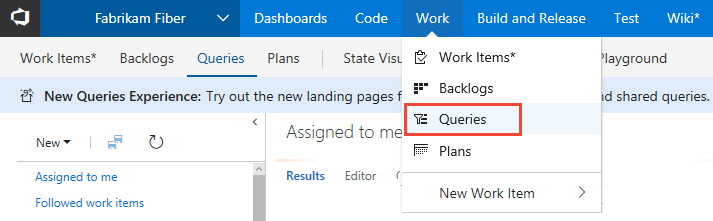
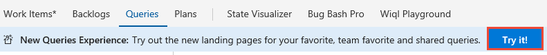
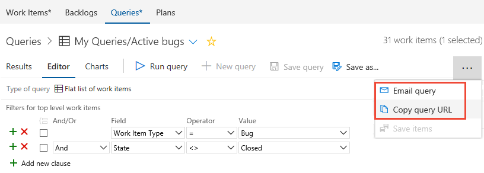

# View, run, or email a work item query  

<b>VSTS | TFS 2018</b> 

To find work items assigned to you or your team, run a query. A number of work item queries are predefined with your process. Also, members of your team may have created shared queries that you can view and run. Oftentimes, it's easier to define a new query by building on the query definition that's already available to you. 

<!---
> [!NOTE]    
>**Feature availability**: The New Queries experience is supported on VSTS and TFS 2018 and later versions. To learn more, see [New Queries experience](queries-preview.md).  
-->

By default, all contributors and stakeholders can view and run all shared queries. You can change the permissions set for a shared query folder or shared query. For details, see [Set query permissions](set-query-permissions.md).  

<!---
Use this topic to learn: 
>[!div class="checklist"]    
> * About the differences between the old and new queries experience
> * How to view all or favorited queries  
> * How to filter a query list    
> * How to run a query 
-->

[!INCLUDE [temp](../_shared/prerequisites.md)]

## Open the Queries page from the web portal

0. From your web browser, open the **Work** hub, **Queries** page.   
 
	 

0. If you see the following message, click **Try it!** to enable the new queries experience.   
 
	 

	Otherwise, you can enable it from the [Preview features menu](../../collaborate/preview-features.md). 
 
	If it is your first time opening the hub, the page opens to **Favorites** which lists all queries you have favorited. Otherwise, you can click **All** to view all queries you've defined and shared queries defined for the team project.  

	> [!TIP]    
	> Queries you or your team have favorited show up on the **Favorites** page. Queries you have favorited along with other objects also appear on your Account hub page. To learn more, see [Set personal or team favorites](../../collaborate/set-favorites.md). 

## Run a query 

0. Click **All** to open the page where you can view all queries you've defined or that are shared within your team project. Expand **My Queries** as needed.

	  
	 
	To view all work items assigned to you, click **Assigned to me**. This query uses the **@Me**  macro to list all work items assigned to you.  
	To view all work items you are following, click **Followed work items**. This query uses the **@Follows**  macro (ID in @Follows) to list all work items you've elected to follow. To learn more, see [Follow a work item or pull request](../../collaborate/follow-work-items.md).   

0. To run any query, simply click the title of the query.

	> [!TIP]    
	> The **Queries** hub, as with many web portal hubs and pages, remembers the page you were last on and returns you to that view.
	
0. Click **Shared Queries** to expand the folder. 

## View, run, rename, or delete a query
From either the **Favorites** or **All** page, click the  Actions icon of a query to run, edit, rename, or delete the query. 

For shared queries, you can also choose to perform one of these tasks: 
- **Add to team queries**: Select the team to add the query as a team favorite
- **Security...**: to set permissions for the query. To learn more, see [Set query permissions](set-query-permissions.md).   
- **Add to dashboard**: Adds a Query tile widget to the team dashboard you select. To learn more, see [Add widgets to a dashboard](../../report/add-widget-to-dashboard.md).  

## Tasks you can perform from the Favorites or All pages

You can perform most tasks for viewing and running queries from each of the queries list pages as indicated in the following table. Only queries you save under **My Queries** and have favorited show up under **My Favorites**. Only queries saved under **Shared Queries** can be favorited by a team. 
  

> [!div class="mx-tdBreakAll"]
> |Task |Favorites |All | 
> |-------------|----------|---------| 
> |View all favorited queries, yours or a team you belong to |  |  | 
> |View all your queries or shared queries for the current team project |  |  | 
> |Run a query, open the context menu for a query  | | |
> |Expand or collapse container folders or query folders | | |
> |Filter the list of queries | | |
> |Favorite a query: Click  |  | | 
> |Unfavorite a query: Click  | | | 
> |Add a new query: Click  | | | 

For details on adding new queries, see [Create managed queries with the query editor](using-queries.md). 

## Filter the list of queries

Enter a keyword into the filter box to filter the set of queries displayed on either the **Favorites** or **All** pages. 

## Email query items or share a query URL 

From the Query Editor or Results page, you can select to email a formatted list of query items or copy the query URL. 

<!---
**VSTS: New queries experience** -->

Click the  Actions icon to open the menu and choose from the options listed: **Email query** or **Copy query URL**. 
 
 

<!---**VSTS: Old queries experience, TFS 2017**  
	
Choose **Copy query URL**. To email query items, see [Copy a list of work items](../backlogs/copy-clone-work-items.md#html).  

 

-->
::: moniker range="vsts"
> [!NOTE]  
> With **Email query**, the system will email the formatted list to those team mates you select. To email a formatted list to people not part of the team project, you'll need to use the **Copy as HTML** option described in [Copy a list of work items](../backlogs/copy-clone-work-items.md#html). 
::: moniker-end

::: moniker range="tfs-2018"
> [!NOTE]
> With **Email query**, the system will email the formatted list to those team mates you select. To email a formatted list to people not part of the team project, you'll need to use the **Copy as HTML** option described in [Copy a list of work items](../backlogs/copy-clone-work-items.md#html). For on-premises TFS, all email actions require an [SMTP server to be configured](/tfs/server/admin/setup-customize-alerts). If you don't have an SMTP server configured, you can work around this by using **Copy as HTML**. 
::: moniker-end

## Try this next
> [!div class="nextstepaction"]
> [Perform an adhoc search](search-box-queries.md) 

#### Related topics

- [Change column options](../backlogs/set-column-options.md?toc=/vsts/work/track/toc.json&bc=/vsts/work/track/breadcrumb/toc.json)
- [New Queries Experience](queries-preview.md) 
- [Set personal or team favorites](../../collaborate/set-favorites.md) 
- [Query keyboard shortcuts](queries-keyboard-shortcuts.md)
