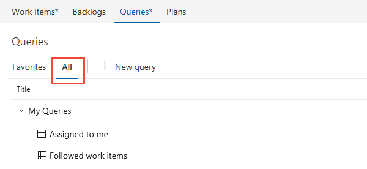
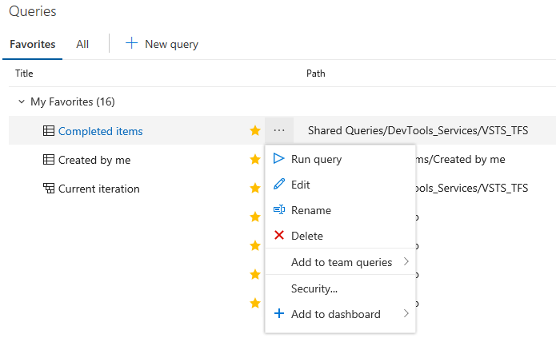
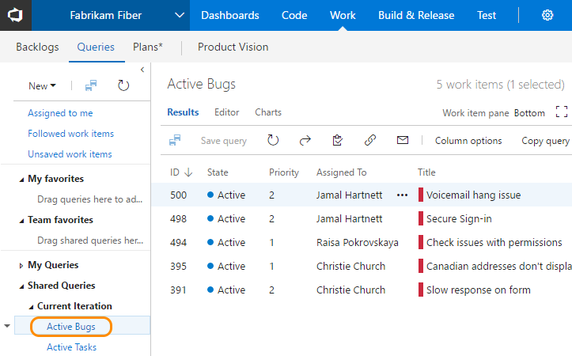
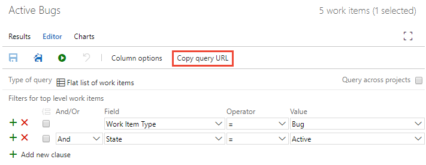

# View, run, or email a work item query  

[!INCLUDE [temp](../_shared/version-vsts-tfs-all-versions.md)]

To find work items assigned to you or your team, run a query. A number of work item queries are predefined with your process. Also, members of your team may have created shared queries that you can view and run. Oftentimes, it's easier to define a new query by building on the query definition that's already available to you. 

By default, all contributors and stakeholders can view and run all shared queries. You can change the permissions set for a shared query folder or shared query. For details, see [Set query permissions](set-query-permissions.md).  

[!INCLUDE [temp](../_shared/prerequisites.md)]

## Open Queries 

[!INCLUDE [temp](../_shared/new-agile-hubs-feature.md)] 

[!INCLUDE [temp](../_shared/open-queries.md)] 

## Run a query 

To run any query, expand a folder and choose the title of the query.

> [!TIP]    
> The **Queries** tabs, as with many web portal tabs, remembers the view you last navigated to and returns you to that view.
	
The view opens to display the query **Results**.

::: moniker range="vsts"
0. Choose **All** to open the page where you can view all queries you've defined or that are shared within your team project. 

> [!div class="mx-imgBorder"]  
>   

0. Choose **My Queries** as needed. 
	- To view all work items assigned to you, choose **Assigned to me**. This query uses the **@Me**  macro to list all work items assigned to you.  
	- To view all work items you are following, choose **Followed work items**. This query uses the **@Follows**  macro (ID in @Follows) to list all work items you've elected to follow. To learn more, see [Follow a work item or pull request](../work-items/follow-work-items.md).  

0. Choose **Shared Queries** to expand the folder and access queries saved as shared queries. 
::: moniker-end

## View, rename, or delete a query

::: moniker range="vsts"
From either the **Favorites** or **All** page, choose the  actions icon of a query to run, edit, rename, or delete the query. 

  

For shared queries, you can also choose to perform one of these tasks: 
- **Add to team queries**: Select the team to add the query as a team favorite
- **Security...**: to set permissions for the query. To learn more, see [Set query permissions](set-query-permissions.md).   
- **Add to dashboard**: Adds a Query tile widget to the team dashboard you select. To learn more, see [Add widgets to a dashboard](../../report/add-widget-to-dashboard.md). 
::: moniker-end
::: moniker range=">= tfs-2013 <= tfs-2018"
Choose the  context menu icon of a query to edit, rename, or delete the query.

::: moniker-end

::: moniker range="vsts"
## Tasks you can perform from the Favorites or All pages

You can perform most tasks for viewing and running queries from each of the queries list pages as indicated in the following table. Only queries you save under **My Queries** and have favorited show up under **My Favorites**. Only queries saved under **Shared Queries** can be favorited by a team. 
  

> [!div class="mx-tdBreakAll"]
> |Task |Favorites |All | 
> |-------------|----------|---------| 
> |View all favorited queries, yours or a team you belong to |  |  | 
> |View all your queries or shared queries for the current team project |  |  | 
> |Run a query, open the context menu for a query  | | |
> |Expand or collapse container folders or query folders | | |
> |Filter the list of queries | | |
> |Favorite a query: Click  |  | | 
> |Unfavorite a query: Click  | | | 
> |Add a new query: Click  | | | 

For details on adding new queries, see [Create managed queries with the query editor](using-queries.md). 

::: moniker-end

::: moniker range="vsts"
## Filter the list of queries

Enter a keyword into the filter box to filter the set of queries displayed on either the **Favorites** or **All** pages. 

::: moniker-end

## Email query items or share a query URL 

From the **Query Editor** or **Results** view, you can email a formatted list of query items or copy the query URL. 

::: moniker range="vsts"

Choose the  actions icon to open the menu and select from the options listed, **Email query** or **Copy query URL**. 
 
> [!div class="mx-imgBorder"]  
>   

> [!NOTE]  
> With **Email query**, the system will email the formatted list to those team members you select. To email a formatted list to people who aren't project members, you'll need to use the **Copy as HTML** option described in [Copy a list of work items](../backlogs/copy-clone-work-items.md#html). 

::: moniker-end
::: moniker range=">= tfs-2013 <= tfs-2018"
	
Choose **Copy query URL**. To email query items, see [Copy a list of work items](../backlogs/copy-clone-work-items.md#html).

  

> [!NOTE]
> With **Email query**, the system will email the formatted list to those team mates you select. To email a formatted list to people not part of the team project, you'll need to use the **Copy as HTML** option described in [Copy a list of work items](../backlogs/copy-clone-work-items.md#html). For on-premises TFS, all email actions require an [SMTP server to be configured](/tfs/server/admin/setup-customize-alerts). If you don't have an SMTP server configured, you can work around this by using **Copy as HTML**. 
::: moniker-end

## Try this next
> [!div class="nextstepaction"]
> [Perform an adhoc search](search-box-queries.md) 

#### Related topics

- [Change column options](../backlogs/set-column-options.md?toc=/vsts/work/track/toc.json&bc=/vsts/work/track/breadcrumb/toc.json)
- [Set personal or team favorites](../../project/navigation/set-favorites.md)  
- [Query keyboard shortcuts](queries-keyboard-shortcuts.md)

