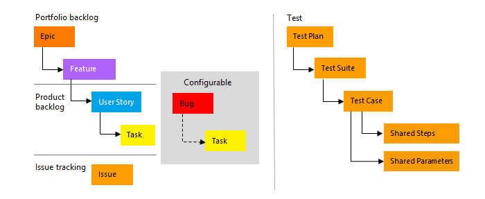
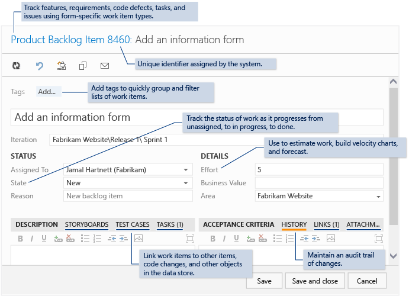
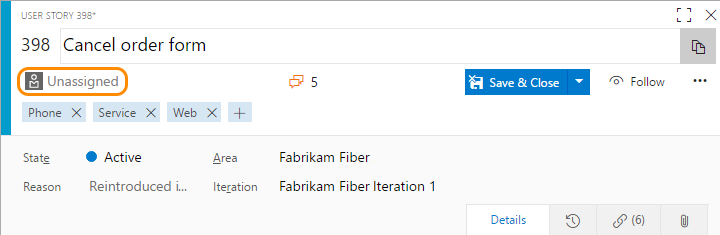

# About work items 

[!INCLUDE [temp](../_shared/version-vsts-tfs-all-versions.md)]

You can use work items to track anything you need to track. 

Each work item represents an object stored in the work item data store. Each work item is assigned a unique identifier, an ID, which is unique within an account or project collection.  

## Work item types

To track different types of work, different work item types (WITs) are defined. The WITs available to you differ depending on the process or process template used to create your team project.  

For example, the following WITs are available to you when you choose the Agile team project. 

To learn more about processes and process templates, see [Choose a process](./guidance/choose-process.md).

 
## Work item form 

Each work item supports tracking data contained in work item fields. Also, it captures changes as updates are made within the History field. 

Each form contains a number of controls as shown below and described in [Work item form controls](work-item-form-controls.md). 

::: moniker range=">= tfs-2018"

::: moniker-end

::: moniker range="tfs-2017"

The new form and its corresponding features are available from the web portal. The new form is automatically available when you add team projects to a new collection. For existing team projects, an admin is required to [enable the new form](../customize/manage-new-form-rollout.md).

# [New web form](#tab/new-web-form)

The new web form provides a number of experiences not provided with the old web form. To learn more, see [New work item experience](../customize/process/new-work-item-experience.md). 

# [Old web form](#tab/old-web-form)

---

::: moniker-end

::: moniker range=">= tfs-2013 <= tfs-2015"

::: moniker-end

## Assign work items to a team member

You can only assign a work item to one person at a time. The Assigned To field is person-name field designed to hold an account identity recognizable by the system. Within the work item form, click the Assigned To field to select a team member. Or, you can begin typing the name of a team member to quickly focus your search to a select few. 

  

Anyone who has write access to a team project can assign work items to a team member. This includes team members and [stakeholders](../../organizations/security/get-started-stakeholder.md).  

**Note the following:**
- You can assign a work item only to team members recognized by the system, ones that you have added as team members 
- You can assign a work item to one and only one team member at a time. If work is split across two or more team members, then you should consider creating additional work items that you'll assign to each member responsible for the work to be completed  
- Over time, the drop-down menu of person-name fields will display most recently selected names
- Some drop-down menus that support assignment from the backlog or board pages in the web portal are automatically limited to team members   
- The system shows the display name and adds the account name when required to disambiguate identical display names  
- You can assign several work items at once from the backlog or query results, see [Bulk modify work items](../backlogs/bulk-modify-work-items.md) for details. 

::: moniker range="vsts" 
###Integration with Azure Active Directory 

When your system is configured with Azure Active Directory (AAD), then the system will synchronize person-name fields with these directories. Person-name fields include Activated By, Assigned To, Closed By, Created By, and Resolved By. 

You can grant access to a team project by adding security groups that you created in AAD or by adding accounts to existing or custom groups defined from the collection setting Security hub. To learn more, see [Access with Azure Active Directory (Azure AD)](../../organizations/accounts/add-users-to-aad.md).
::: moniker-end

::: moniker range=">= tfs-2013 <= tfs-2018" 
###Integration with Active Directory

When TFS is configured with Active Directory (AD), then TFS will synchronize person-name fields with these directories. Person-name fields include Activated By, Assigned To, Closed By, Created By, and Resolved By. 

You can grant access to a team project by adding security groups that you created in AD or by adding accounts to existing or custom groups defined from the collection setting Security hub. To learn more, see [Set up groups for use in TFS deployments](/tfs/server/admin/setup-ad-groups). 
::: moniker-end

 
::: moniker range=">= tfs-2013 <= tfs-2018"

> [!NOTE]    
>To minimize the list of names that appear in the drop-down menus of person-name fields, you can scope the field to only those groups that you want to appear in the menu. You do this by adding one or more of the following child elements to the **FIELD** definition in the work item type definition: **ALLOWEDVALUES**, **PROHIBITEDVALUES**, and **VALIDUSER**. For details, see [Apply a field rule](../customize/reference/apply-rule-work-item-field.md).

::: moniker-end

## Assign work items to a sprint 

To schedule work items to be worked on during at specific time period, you assign the Iteration field. to learn more, see [Schedule sprints](../scrum/define-sprints.md). 

## Track bugs as requirements or tasks 

Many Scrum teams treat bugs the same as any backlog item or user story. Others see bugs as work that belongs to implementing a story, and therefore treat them as a task. Bugs, like product backlog items (PBIs) and user stories, represent work that needs doing. So, should you track your bugs along with other items in the product backlog items or as tasks linked to those backlog items? How does your team estimate work?  

Based on how your team answers these questions, they can choose how they want to track bugs from one of these three choices. To change the team setting, see [Show bugs on backlogs and boards](../customize/show-bugs-on-backlog.md). 

## Find or list work items 

You can use the search box to perform an adhoc search to find specific work items based on select field criteria. Or, you can create a query to perform a managed search which will list work items based on your query criteria. With managed searches you can perform a number of other tasks, such as to triage work items, create a trend or status chart and add to the dashboard, and more. 

To learn more, see these topics: 
- [Create managed queries to list, update, or chart work items ](../track/example-queries.md)  
- [View, run, or email a query](../track/view-run-query.md)  
- [Adhoc vs managed queries](../track/adhoc-vs-managed-queries.md)  
- [Work item query charts](../../report/dashboards/charts.md)  

## Customize a work item type (WIT) 

You can add or modify the fields contained within a WIT or add a custom WIT. The process you use depends on the process model in effect for your team project. 
::: moniker range="vsts"
To learn more, see [Customize an inheritance process](../../organizations/settings/work/inheritance-process-model.md). 
::: moniker-end

::: moniker range=">= tfs-2013 <= tfs-2018"
To learn more, see [Customize the On-premises XML process model](../customize/on-premises-xml-process-model.md). 
::: moniker-end

## Fill in work item fields quickly using work item templates 

With work item templates you can quickly create work items which have pre-populated values for your team's commonly used fields. For example, you can create a task template that will set the area path, iteration path, and discipline or activity whenever you use it to create a task.  

<!---
Based on the platform or version you use, you can perform the following tasks. 
- Capture a work item as a template 
- Add a work item using a template
- Apply templates to work items
- Manage work item templates
 
Prior to creating templates, consider how you and your team(s) will use the templates. If you'll be using several templates, determine a naming convention that will help users easily select the right template for their use. To learn more, see [Use templates to add and update work items](../backlogs/work-item-template.md).

If you want to use custom fields in your templates, define those fields prior to creating your templates. 

You can specify any number of fields you want, including ones that the user will change&mdash;such as Title or Description. If you want the work item assigned to a specific team, define the team Area Path as part of the template.  

Once you have a template defined, you can share it via email or a dashboard. Copy the link to the template and paste it within a markdown widget. See [Add Markdown to a dashboard](../../report/dashboards/add-markdown-to-dashboard.md).  
-->
 

## Required permissions

As a member added to the Contributors group of a team project, you can use most features provided under the **Work** hub. If you've been added with stakeholder access, you are limited to certain features. For details, see [Work as a Stakeholder](../../organizations/security/get-started-stakeholder.md). 

To learn more about permissions and access, see [Permissions and access for work tracking](../../organizations/security/permissions-access-work-tracking.md). 

::: moniker range="vsts" 
To add team members to a team project, see [Add users to your VSTS account](../../organizations/accounts/add-team-members-vs.md).
::: moniker-end
::: moniker range=">= tfs-2013 <= tfs-2018"
To add team members to a team project, see [TFS team project](../../organizations/security/add-users-team-project.md). 
::: moniker-end

To learn more about user accounts, permissions, and access, see [Security & Identity](../../organizations/security/index.md).
<!--- User names you add are all members of the Project Collection Valid Users group.  Also, these names are automatically synchronized with Azure Active Direct or Active Directory when AAD or AD is configured as part of the account (VSTS) or deployment (TFS).-->   

  
## Clients that support tracking work items  
You can add work items from various clients, such as: 
- From the web portal backlog pages, you can add user stories, backlog items, features, and epics from the [quick add panel](../backlogs/create-your-backlog.md). 
- From the [Team Explorer add-in to Visual Studio](../../user-guide/work-team-explorer.md), you can add most types of work items from the Work page.  
- If you work in [Eclipse](https://eclipse.org/home/newcomers.php), you can create work items using [Team Explorer Everywhere](/vsts/java/download-eclipse-plug-in). 
- From Test Manager or the web portal, you can [create test cases that automatically link to a user story or product backlog item](../../test/create-test-cases.md).
- You can create bugs from the web portal, Visual Studio, or when [testing with Microsoft Test Manager](https://msdn.microsoft.com/library/dd286731.aspx).  

For an overview of all clients that connect to your team project, see [Tools and clients that connect to VSTS and TFS](../../user-guide/tools.md). 

## Try this next 

> [!div class="nextstepaction"]
> [Add a work item](../backlogs/add-work-items.md?toc=/vsts/work/work-items/toc.json&bc=/vsts/work/work-items/breadcrumb/toc.json)
