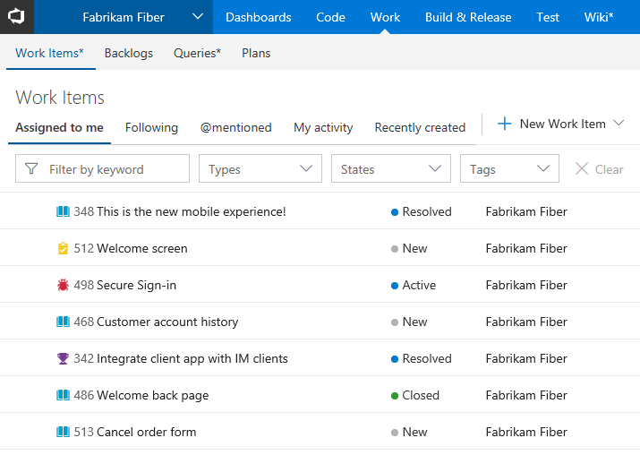
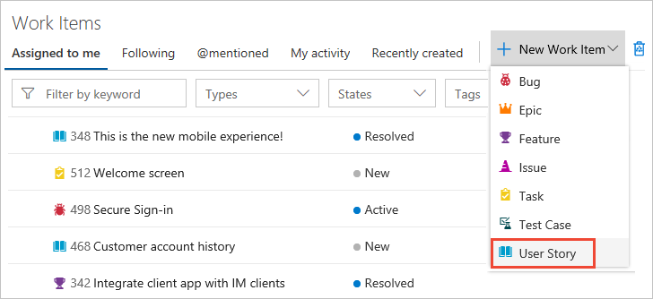
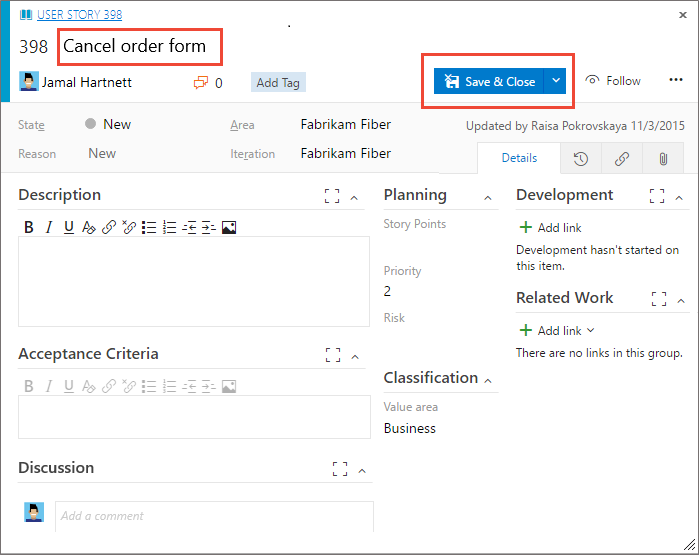
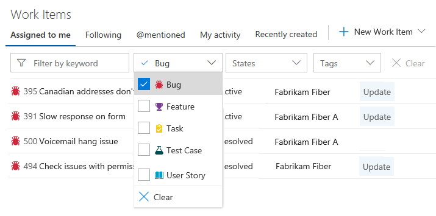

# View and add work items using the Work Items page  

**VSTS**  

We have launched the preview of the new **Work Items** page under the **Work** hub in your VSTS account. You can enable it from the [Preview features menu](../../collaborate/preview-features.md) that you access from your account profile.

>[!NOTE]   
><b>Feature availability: </b>The **Work Items** page is in preview and currently available from VSTS only.  

The set of features available to you through this page and its personalized pivots and filter functions will help streamline your ability to find work items important to you defined across teams within a team project. 

## Open the Work Items page

You can start viewing and adding work items once you connect to a team project. If you don't have a team project yet, create one in [VSTS](../../accounts/set-up-vs.md). If you haven't been added as a team member, [get added now](../../accounts/add-account-users-assign-access-levels.md).

Open a browser window, click the **Work** hub, and then the **Work Items** page. If you don't see the **Work Items** option, you must enable it from the [preview features menu](../../collaborate/preview-features.md).

## View work items

With the Work Items views, you can focus on relevant items inside a team project via these five pivots:

* **Assigned to me**: lists all work items assigned to you in the project in the order they were last updated. To open or update a work item, simply click its title.
* **Following**: lists all work items that you're [following](../../collaborate/follow-work-items.md). 
* **Mentioned**: lists all work items in which you've been mentioned in the last 30 days.   
* **My activity**: lists all work items that you have recently viewed or updated. 
* **Recently created**: lists all work items recently created in the project. 

## Add a work item
Add a work item from within the hub is just one click away. You can add a work item for any type that's enabled in the project from the **New item** drop down menu.  

0. Click New Work Item and choose the work item type you want. 

	For example, here we choose User Story. 

	

0. Enter a title and then save the work item. Before you can change the State from its initial default, you must save it.  

	  

	You can [add tags to any work item to filter backlogs and queries](../track/add-tags-to-work-items.md).

	Work items you add are automatically scoped to your [team's area and iteration paths](../scale/set-team-defaults.md). To change the team context, see [Switch team project or team focus](../../teams/switch-team-context.md?toc=/vsts/work/work-items/toc.json&bc=/vsts/work/work-items/breadcrumb/toc.json).
 

## Filter to create personal views
Work items can be filtered by typing a keyword or using one or more of the fields provided, such as work item type, assigned to, state, and tags. The page remembers the filters you set for each pivot, supporting personalized views across all pivots.  

>[!NOTE]  
>Depending on the process chosen when the team project was created&mdash;[Agile](guidance/agile-process-workflow.md), [Scrum](guidance/scrum-process-workflow.md), or [CMMI](guidance/cmmi-process-workflow.md)&mdash;the types of work items you can create will differ. For example, backlog items may be called product backlog items (Scrum), user stories (Agile), or requirements (CMMI). All three are similar: they describe the customer value to deliver and the work to be performed.
>
> For an overview of all three processes, see [Choose a process](../work-items/guidance/choose-process.md). 

## Related notes
- [Work from the account home page](../../user-guide/account-home-pages.md)
- [Enable preview features](../../collaborate/preview-features.md)
- [Keyboard shortcuts for work item forms and the Work Items page](work-item-form-keyboard-shortcuts.md)

### Got feedback?

Fill out the comment box that appears when you turn the feature off. See also our [comprehensive feedback and support page](../../user-guide/provide-feedback.md).