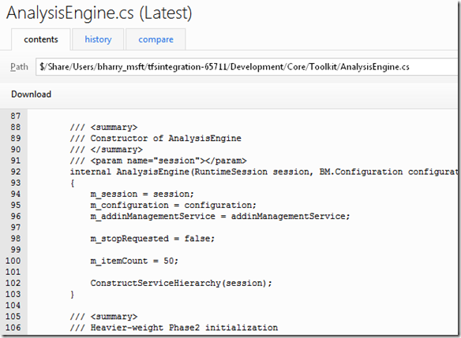
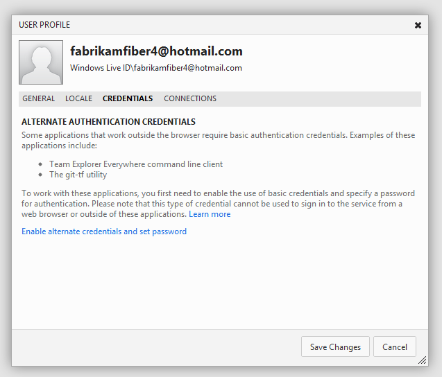

#Team Foundation Service updates - Aug 27

Last sprint was mostly focused on new project management features – kanban and some task board improvements. This sprint, we’ve turned our attention to more code centric improvements.

##A new source viewer and diff experience

Probably the most exciting improvement this sprint is a new source viewer and diff experience. Until this sprint, we had a very simple source code browsing experience. You can see an example here…

This sprint, we are releasing a much improved source browsing experience… The first thing that is immediately obvious is that the new viewer supports syntax highlighting. We currently support syntax coloring for Batch files, CoffeeScript, C++, C#, CSS, F#, HTML, Jade, Java, JavaScript, PHP, ASP.NET Razor, Visual Basic, and XML. If there are others that are important to you let us know and we’ll get them on the backlog.

We’ve also added a search experience to the source viewer so that you don’t have to use just the built in browser search. It supports regular expressions (click the R circle), whole word matches (the W circle) and Case sensitive matches (the C circle). Matches highlight in the document as you type and you can use the up and down arrows to move between matches.

The new source viewer has also been used to replace our previous “diff” experience. In addition to the syntax highlighting and search experience I listed above, it provides a richer diff experience – including a “diff map”, diffs within a line, and more…

##Updates to the hosted build image

We updated the build VM image on our hosted build service, adding some new components that people have been asking for… We’ve added SharePoint 2010 to the hosted build image so that you can now do hosted builds of your SharePoint components. There are a number of other things that we are working on (WiX, Phone Tools, etc) that we weren’t quite able to get in for this update but will as soon as we can.

##Basic auth support

A couple of weeks ago we [announced](http://blogs.msdn.com/b/bharry/archive/2012/08/13/announcing-git-integration-with-tfs.aspx) support for bridging between local Git repositories and TFS servers. At the time I explained it didn’t work for Team Foundation Service but support would be coming soon. It’s here now! It’s worth noting that, in the short term Git-tf has been available, this rose to the [2nd top voted suggestion](http://gittf.codeplex.com/workitem/3). This makes it so that both of the top two suggestions have now been addressed.

Part of today’s rollout is support for basic authentication which enables two important new scenarios:

1. Using the Team Explorer Everywhere command line with Team Foundation Service. You will need to download the latest TEE client to get this to work (we had to make a recent bug fix for basic auth).
2. Using Git-tf with Team Foundation Service.

To enable basic auth for your account, you need to create alternate credentials. Unfortunately, we can’t use your LiveID credentials with basic auth. These credentials will not replace your LiveID credentials. You will still log into the service with your LiveID and most tools you connect with will use LiveID. The reason for the alternate basic auth credentials is that LiveID requires an interactive web page login and there are scenarios where that is not an appropriate solution. The alternate credentials give us a simple username/password pair that can be used in the appropriate scenarios (like Git-tf and the TEE command line). To enable alternate credentials, you need to edit your user profile.

Click the “Enable alternate credentials and set password” link on the Credentials page.

Then enter a password and save the changes. You now have a username and password you can use with the cross platform TEE command line and with the Git-tf command line. See the [learn content](/azure/devops/git/auth-overview?view=azure-devops#alternate-credentials) for more info on how to use this.

That’s it for sprint 35. We’re already busy on sprint 36 and looking forward to bringing more great stuff your way. Please feel free to use our [UserVoice site](https://visualstudio.uservoice.com/forums/330519-vso) if you want to help prioritize our investments.

By the way, we've updated this page so you can bookmark it ([http://tfs.visualstudio.com/news/](http://tfs.visualstudio.com/news/)), and you'll always get the most recent news.

Thanks,

Brian Harry