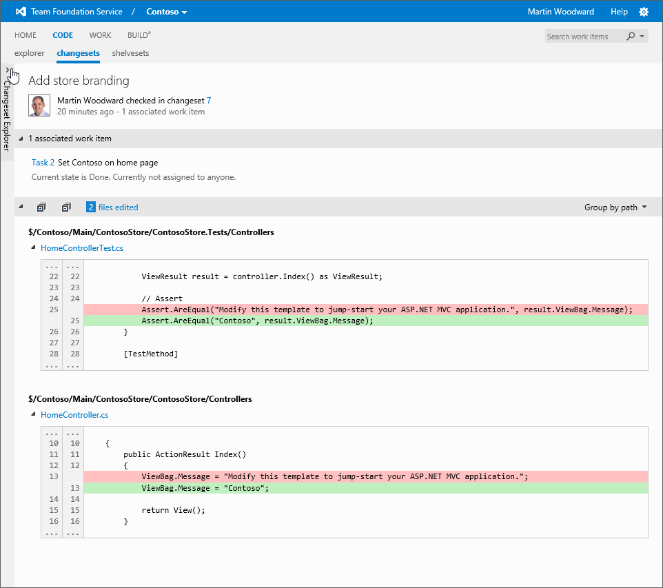

#Team Foundation Service updates - Dec 10

As part of our ongoing efforts to make sure that Team Foundation Server is a great home for developers, we’ve been investing more in the web experience for version control. We are shipping the first round of these improvements in this sprint, but expect more goodness to follow over the coming weeks and months.

The first thing that you will notice is purely cosmetic. We’ve renamed the “Source” hub and changed the hub order. It’s now the first thing after the team home page and we’ve called it “Code”, making the top bar read “Code, Work, Build” which I think makes a fine motto to live life by.

Clicking into the Code hub brings you into the updated Code Explorer view. We've been trying to make the explorer much more productive while also cleaning things up a bit. The navigation pane on the left hand side is now a full folder view allowing you to drill into your folder structure. Also you can easily switch between files by simply clicking on them. If you do not want to see the navigation pane then just click on the arrow to collapse it. It will remember your preference next time you come to this page.

As you drill down into the folders you will notice that if you stay in a folder for a while then the details of the last changeset that affected each file are fetched for you along with the check-in comment and the person who made the change. Clicking on the file will show you the contents of it in the [rich code viewer that we've had since August](https://visualstudio.microsoft.com/articles/news/2012/aug-27-team-services). But if you click on the changeset comment it will take you to a fantastic, newly improved changeset summary view showing you exactly what happened in the changeset all from a single page. This even includes inline diffs for files that have been edited and a summary of the total number of files edited, added or deleted.

By default the navigation pane is minimized when looking at the changeset summary, but you can click on the arrow on the left hand side if you want to expand the view to look at the individual files in the changeset. Alternatively, you can just click on the filename in the changeset summary view to see the contents of the file including a full diff view – also allowing you to switch between a side-by-side or inline diff view of the files depending on what you prefer.

Jumping back to the code explorer, you can easily see the history for the current path you are viewing by selecting the history tab. Here you will see a list of changesets affecting that path (or children of it) and you can quickly drill down into any of the changesets.

If you want to only see changes that you personally made then you can click “my changes”. For more complex changeset filtering, select the “advanced search” link as shown above. For example, you can filter by team member name, a date range or changeset range.

As I mentioned, this is the first of a series of improvements to this area that you should see coming over the next few sprints. I appreciate that we’ve moved things around quite a bit this time. We’ve got most of the core structure that we want in place now and the experience we’ve had dogfooding this internally is that the changes have not been too disruptive to people adjusting to the new UI. The improvements made to the left hand navigation pane alone have hugely increased productivity when browsing around the source code. That said, we currently have one minor feature that we want to improve. There is no way to type a changeset number in and quickly go to it without using the advanced search panel in the history view. We’ll be doing some work in a future sprint to make this easier to get to, but for now I hope you’ll find the other changes we’ve made worth it. Let us know what you think.

While the changes to the version control experience are the biggest UI change we’ve made this sprint, we’ve been busy elsewhere. In our ongoing attempt to keep the hosted build machine updated with the latest & greatest, we added the following to the hosted build machines this sprint:

- [Azure SDK 1.8](https://www.windowsazure.com/develop/net/)
- [TypeScript 0.8.1](http://typescript.codeplex.com/)
- VS 2012 Update 1 - VS is installed on the build image to ensure you can build everything on the build machine that you can on your dev box using VS. We updated the VS image to the recently released Update 1.

Besides a bunch of bug fixes, that’s it for sprint 40. As always, let us know how we’re doing on [User Voice](https://visualstudio.uservoice.com/forums/330519-vso), the [MSDN Forums](http://social.msdn.microsoft.com/Forums/TFService/threads), and [Twitter](http://twitter.com/search?q=%23tfservice).

Happy holidays!! We’re not planning a deployment on New Year’s Eve (for obvious reasons) so we’ll see you again after the new year.

Thanks,

Martin Woodward and Jamie Cool