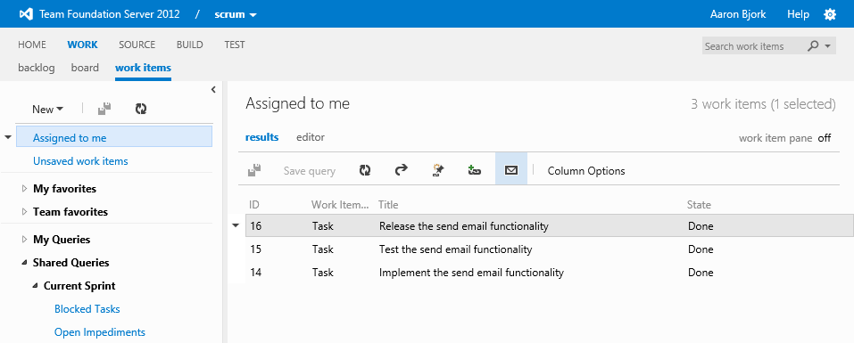

#Team Foundation Service updates - Nov 19

##Send work items in email

Have you ever wanted to grab a set of work items or a query result and send them in email? In this sprint we added the ability to do just that. This feature was in previous releases of Team Foundation Server, but unfortunately was omitted in the 2012 release. Today, we’ve added it back to the service, and will be shipping it to on-premises customers as a part of VS Update 2.

How does it work? You start from a query in the work items hub. From the toolbar, click the email icon. You can also select individual work items (or multiple items by holding down the CTRL key) and then click Email selected work items from the context menu.

Enter the name(s) of a person in your project, format the mail to your liking, and click Send. Quick and easy.

##Build file counts and sizes

Build summary reports have been updated to include the count and size of files synced to a hosted build machine. Because we have a 1 GB limit for disk space in these environments, this information can help when diagnosing build failures due to running out of disk space. The count and size data is found on the diagnostics tab of the build summary report. Look for the Get Workspace step in the workflow.

##Account landing page

Finally, we made some very minor updates to the account landing page to improve the discoverability of the new team project action.

That’s our list for sprint 39. As always, let us know how we’re doing on [User Voice](https://visualstudio.uservoice.com/forums/330519-vso), the [MSDN Forums](http://social.msdn.microsoft.com/Forums/TFService/threads), and [Twitter](http://twitter.com/search?q=%23tfservice). See you again on December 10th.

Thanks,

Aaron Bjork