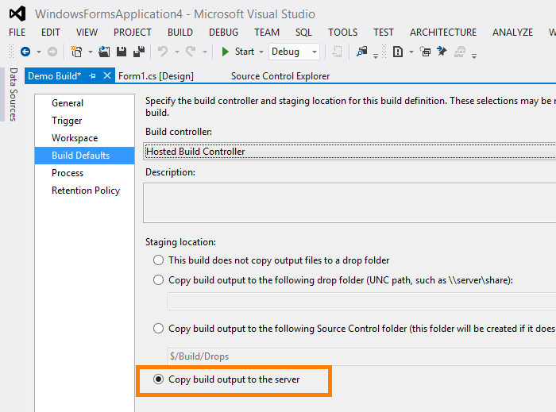

# Team Foundation Service updates - Oct 29

The update to the service this week contains a lot of bug fixes & one new feature in the build space.

## Build drops

With this update we are introducing a new option for hosted build drops. First some background. With the on-premises version of TFS, outputs from a build are dropped onto a file share. When we first introduced the hosted build service, dropping the outputs to a file share wasn’t an option since the build service does not have access to file shares inside your firewall. We solved this problem by putting the build outputs into a /drops folder in version control.

Beyond solving the immediate problem of where to put the build output, this also had some very nice characteristics. It allowed build drops to go into a location managed by TFS. Meaning you didn’t have to get a separate file share setup & the build outputs are backed up with all of your other TFS data. However, it also came with some drawbacks. For example, users now had to be sure to cloak the drops folder or their syncs would get increasingly long. In addition, each build drop generated multiple new commits, which effected the history for the entire repo & triggering unwanted version control notifications.

With this release we are introducing a new option for storing build outputs on the TFS server, managed by TFS, but not in the version control repository. Our goal is for this to have the advantages of drops in version control without the drawbacks. This drop location will be the replacement for the current version control mechanism and will eventually be available for on premises TFS customers as well. We have some further enhancements to add to this drop location, but eventually it will fully replace the existing version control option. In this update they exist side-by-side. We ask that you start migrating your build definitions away from version control drops to server drops as you are able to.

So how do you use it?

In the Visual Studio 2012 Update 1 RC client (you must have the new client) customers will have this additional option for storing build drops when using the hosted build service. The option is called "Copy build output to server".

For the first version of this feature we store your build output in a zip file on the server and give you a link to download that zip.

You will have the ability to view your build diagnostic logs in TFS Web Access or download your logs as a zip. Being able to view the detailed diagnostics log is a handy new feature that you can use for easier build debugging regardless of where you are dropping the build outputs. Beyond just viewing the log, you easily jump from one error to the next.

## Continued UX updates

As we mentioned in our last release notes, our plan is to continue refining the UI to ensure it’s easy to use and visually appealing. In this update we have updated the grid headers across the site so they are consistent in all experiences. We've worked at getting the right level of contrast between the column headers and the content as well as improving padding between the toolbar, grid headers, and grid content.

That’s it for sprint 38. See you again in 3 weeks.

Thanks,

Jamie Cool