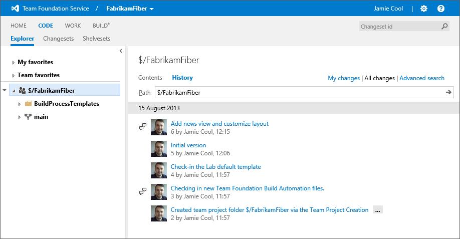

#Team Foundation Service updates - Aug 19

This sprint, we have a couple of areas of improvement. The first one I want to talk about is our new “Release archive”. A year or so ago, we adopted this faster cadence of 3 week service updates, multiple VS Updates and a 2013 release only 12 months after VS 2012. In the past several months, especially as the release of VS 2013 has become closer, we’ve had a lot of questions about which features are available and in what release – particularly “Which on premises release will a given cloud feature show up in?”. So today we’ve introduced a way for you to know – a [Release archive](/azure/devops/release-notes/). 
 
##Release archive
 
Here’s a snip from the middle of the page. The first column is the date that the feature was first introduced on the service. The third column is the on-premises release for the feature. "--“ means that we don’t currently have a targeted on-premises release, or that the feature is not relevant to on-premises. We’ve decided not to show every single small change to the service to avoid overwhelming you with an unbearably long list. Instead, we’ve tried to list the more significant changes – and still it’s a long list. J 
  

For now you can access this page through the [Release archive](https://visualstudio.microsoft.com/articles/news/features-timeline) link. On Wednesday, we’ll be adding a link to the [Team Foundation Service News](https://visualstudio.microsoft.com/team-services/updates/) page so you can get to it from there.

##Code commenting improvements

We’ve made a round of improvements based on feedback to make comments more discoverable and to allow you to navigate them more easily. Among other things, you can now see which changesets or commits have comments in them from the history view.

We’ve also made it easier to work with comments in a specific changeset or commit. You can now move back and forward through the comments. Also, you can use the tree view to navigate and filter the comments. 

The team is really focused on finishing up TFS 2013 right now. So, in general, new features on the service are going to continue be a bit light for the next few weeks as our focus stays there. We’ve got one more nice “big” new feature to show you before we wrap up the 2013 feature set (and move on to the 2013.1 feature set). Stay tuned for that in the next few weeks. As always let us know how we're doing on [User Voice](https://visualstudio.uservoice.com/forums/330519-vso), the [MSDN Forums](http://social.msdn.microsoft.com/Forums/TFService/threads), and [Twitter](http://twitter.com/search?q=%23tfservice).

Thanks,

Brian Harry

 
 
