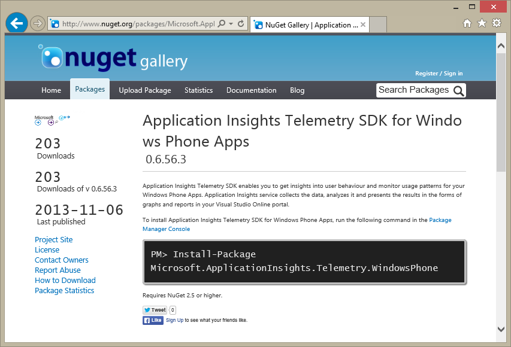

#Visual Studio Online updates - Dec 11

This is our first sprint deployment since our Commercial Public Preview launch in mid-Nov. Unfortunately, we had some instability following that launch. We’ve been hard at work since then fixing the issues, firming up our testing, adding additional resiliency into the system, etc. I [wrote at length](http://blogs.msdn.com/b/bharry/archive/2013/11/25/a-rough-patch.aspx) about some of the issues we hit on my blog. Please be assured that we will do everything we can to provide you a seamless and reliable experience. We are committed to doing work every sprint to make the service more reliable. Please let us know anytime we are failing to meet your expectations.

In addition to working on reliability, we’ve got a few nice new features this sprint…

##Application Insights – Response Stacked Distribution

When trying to understand trends in your application’s performance, average request time is not very useful. Simple averages mask outliers and do not provide you with a clear picture of your customer’s experience. People typically use percentiles or a similar approach to better understand what’s really happening. In this update we have added a new way to analyze and understand performance trends that we call the Response Stacked Distribution tile. By visualizing the trend over time, you will be better able to see how code changes have changed your responsiveness.

This tile simultaneously allows visibility into the trend of the overall request rates and the distribution of response times between them.

##Application Insights – Windows Store App support

In the initial release of Application Insights, we provided telemetry SDKs for web server, Windows Phone 8 and a JavaScript (for sending telemetry from the browser). In today’s update we added support for Windows Store apps. As with our other SDKs, you can use this capability to emit telemetry from your app for analysis in the Application Insights portal. 

You can read more about emitting telemetry from your Windows Store apps on [MSDN](https://msdn.microsoft.com/library/). And, we published the SDK to [NuGet.org](http://www.nuget.org/packages/Microsoft.ApplicationInsights.Telemetry.WindowsPhone/) for consumption.

##Asynchronous backlogs

Finally, we’ve made a few nice improvements to the performance of product backlogs (Backlogs, under the “Work” hub) that I want to bring to your attention. Prior to today’s update, switching between your backlogs (features, stories/PBIs/requirements, and tasks) resulted in a full page postback on each and every click. This is something that’s been on our backlog to improve for quite some time and I’m happy to report that moving between backlogs is now done asynchronously and with no postback. The result is a much faster and more fluid experience. Enjoy.

##Holidays

We’re not planning another deployment until after the New Year so this will be it for 2013. Happy holidays everyone! 

Thanks,

Brian
