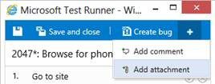

#Team Foundation Service updates - Feb 11

We have a fair number of updates this sprint.

##Continuous Integration for Git based Team Projects

Recently we announced the ability to use Git as your source control system with TFS. Not all automated build features are supported yet for Team Projects using Git. Today we are taking a big step in filling that gap by enabling the Continuous Integration (CI) trigger for Git based builds. Now you can build your project every time someone commits to Git.

Note: To enable CI for Git builds you need [CTP3 of Visual Studio 2012 Update 2](/visualstudio/releasenotes/vs2012-update2-vs).

##Test Case Management Improvements

Last sprint we launched a web based test case management experience. Today we have several improvements to add to it.

1. **View test step attachments when you run tests**

Any attachments that you have added to test steps when you created your test case (using Microsoft Test Manager) can now be viewed inline when you run the test using the Test Runner. If the attachment happens to be an image, it will show the actual image with the test steps. For other types of attachment, it shows the filename and size. Click the attachment to open it up in a separate browser instance.

2. **Add attachments when you run a test**

You can now add attachments to a test when you run it using Test Runner. These attachments can be log files you want to add, screenshots you have taken manually, or any other file. This helps you to document what happens when you run the test.

You can view all the attachments from the bottom bar in Test Runner.

If you want to look at them later, you can view them with the test results from Analyze Test Run in Microsoft Test Manager.

3. **Pause and resume tests in Test Runner**

You can now pause a test you are running. All the changes you make before you pause are preserved. For example, marking test steps as pass/fail, any comments added to a test step or test case, any attachments added to a test case and any bugs created. This lets you pause a test if you have to reboot as part of a test case, or where the dependency item may not be ready at the time of execution, or maybe you just need to go home and stop testing for the day and want to start where you left off the next day.

When you are ready to start testing again, you can resume the test at the same point from the Test hub.

##Work Item Tagging Improvements

If you’ve been using the new tagging feature, you may be wondering how to delete a tag that is no longer used on any work item. Now you don’t have to. Any tag that is no longer referenced by any work item will be automatically removed from the system by a background job. This cleanup job runs daily and cleans up tags that have not been used for 3 days.

##Version Control Improvements

You can now download the contents of your VC repo as a zip file. Just right click in the code browser and choose **Download as Zip**. If you only want to download a part of your tree, just right click on the folder you want to download.

Last sprint we added the ability in the web UI to track renames in the commit and file history for Git projects. This week we’ve expanded this support to TFVC based Team Projects. Now your web history will follow rename, branch & merge operations.

##Query Using OData

Also of note, during this sprint [Brian Keller announced](http://blogs.msdn.com/b/briankel/archive/2013/01/24/bringing-odata-to-team-foundation-service.aspx) the launch of the [Team Foundation Service OData API (Beta)](https://tfsodata.visualstudio.com/). You can use this api to query over the data in TFS service account using the OData protocol. There is even a Windows 8 sample application (with source) that you can use to try it out.

That's it for this sprint. See you again in 3 weeks. As always, let us know what you think and how we’re doing on [User Voice](https://visualstudio.uservoice.com/forums/330519-vso), the [MSDN Forums](http://social.msdn.microsoft.com/Forums/TFService/threads), and [Twitter](http://twitter.com/search?q=%23tfservice).

Thanks,

Jamie Cool
