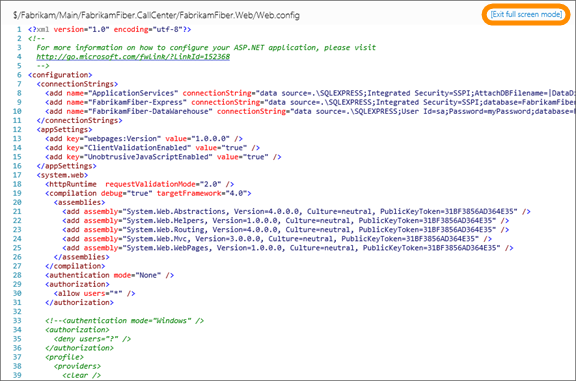
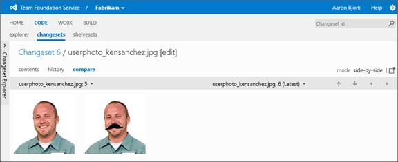

#Team Foundation Service updates - Jan 7

Happy New Year! This morning we made our first set of updates to the service for the 2013 calendar year. This sprint was relatively light due to the holidays, but we do have a few incremental changes to existing functionality that I want to highlight.

##Basic auth updates

Back in [last August](https://visualstudio.microsoft.com/articles/news/2012/aug-27-team-services) we introduced support for basic authentication. Originally this was to allow the bridging of local Git repositories and TFS with Git-TF, however we’ve found people wanting to do more things using the basic authentication mechanism. Today we’re introducing a couple of updates to allow the basic auth scheme to work with more services. First we now allow you to enter a secondary user name with your alternate credentials.

Why another user name? Some applications get tripped up when they come across special characters (ex: the “@” character in an email address) during authentication. This change allows you to specify a secondary user name not in the form of an e-mail address for use with these applications. The secondary user name is not required. So if you’re not running into any trouble today, you’ve got nothing to worry about.

We did make a few changes to the way our Basic authentication mechanism behaves to make it more compatible with other services. This means that if you were previously using Basic authentication from the [Team Explorer Everywhere command line](https://www.microsoft.com/download/details.aspx?id=30661), or from [Git-TF](https://www.microsoft.com/download/details.aspx?id=30474), then you need to update to the very latest versions of those clients. We apologize for the inconvenience here. It should be the last major change at the protocol level so it shouldn’t happen again soon.

##Email work items from backlogs

In our [November 19th update](https://visualstudio.microsoft.com/articles/news/2012/nov-19-team-services) we announced the ability to send emails for work item queries. In this sprint we added the ability to send email directly from the backlog pages as well. You’ll now see the send email toolbar button on both the product backlog and sprint backlog pages.

The steps to use the feature are the same. From the toolbar, click the **email** icon. You can also select a single item and click **Email selected work item** from the context menu. Enter the name(s) of a person in your project, format your message, and click **Send**.

##Web version control

As we [mentioned last time](https://visualstudio.microsoft.com/articles/news/2012/dec-10-team-services), you are going to be seeing some improvements to the web based version control experiences in the next few updates. This time round we fixed a bug we introduced in the way we were displaying times in version control across time zones. We also brought back an easy way to search for changesets by id.

The search box that is in the top right hand corner of the screen is now more context sensitive. Enter a number into it when browsing source control and it now assumes you are looking for a changeset id rather than a work item id.

We’ve also been making a big push to give you the most number of pixels possible to concentrate on the things that you want to do. Now when you browse the contents of a file the download button has become an icon and has moved up into the toolbar which gives you 3 extra lines of source that you can view before scrolling.

If you want to see even more lines, we added another button to take the code into “fullscreen” mode. This is available when you are browsing files and doing comparisons. To go back to the normal view simply click the **Exit full screen mode** link.

In the last update we showed off the new inline diff features. We have now added inline viewing and also diffing for images such as gifs, jpegs and png files. If you do a file comparison on an image that has changed, you now get to see the old and new image together so that you can play a little game of spot the difference. We’re going to be iterating on the image diffing functionality to make it even more useful but as you can see from the screen shot, it is already pretty handy.

##Collapsible left panel

Finally, in our last update on [December 10th](../2012/dec-10-team-services.md) our code pages received an update to the collapsed left panel which included a vertical label on the collapsed view. In this sprint we carried that change forward to all our left panels. For example, when you collapse the left panel on the backlog page, you’ll now see the label **Backlog Explorer** on the collapsed view.

We’ve got a lot coming your way in the next few months. As always, let us know how we’re doing on [User Voice](https://visualstudio.uservoice.com/forums/330519-vso), the [MSDN Forums](http://social.msdn.microsoft.com/Forums/TFService/threads), and [Twitter](http://twitter.com/search?q=%23tfservice).

Our next deployment is coming on January 21st so we’ll see you again in two weeks.

Thanks,

Aaron Bjork

