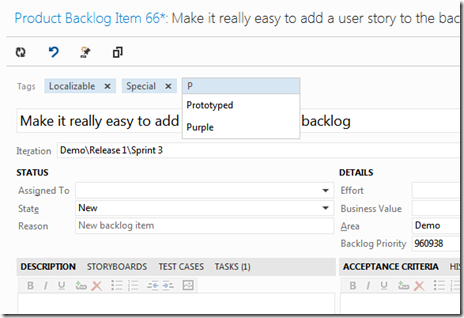
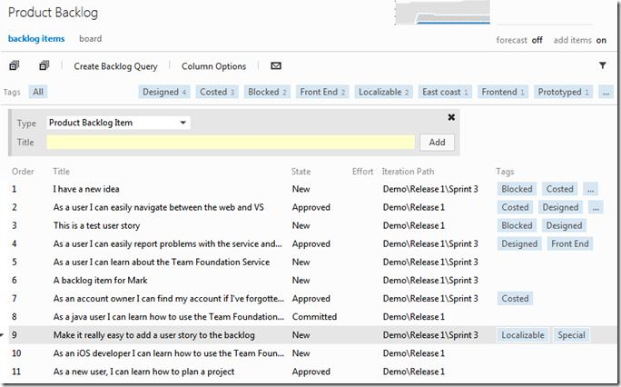
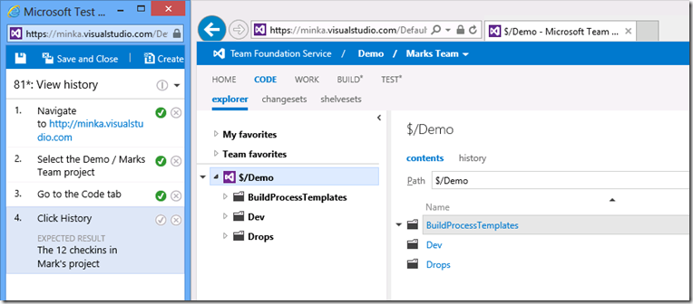

#Team Foundation Service updates - Jan 30

Today is a big step forward in our journey for the Team Foundation Service. Over the past several months, we have been working on a set of changes to make TFS more lightweight and to continue to adapt to the evolving modern devops processes. Today we unveil several of these improvements. This is just the beginning and we have a lot more work planned. Over the next several months, we’ll continue to evolve and expand these improvements.

Here is what we have for you right now:

##Work Item Tagging

We don’t currently support customization of your process (work item types, etc) on the service. And, even in the on premises product, customizing it can be more involved than some want to undertake. Some teams, particularly smaller ones, don’t need an involved process. They just need a set of work items – tasks, bugs, maybe user stories and they want a very simple and flexible way to flag or categorize work items in order to organize them. Today we are releasing the first version of work item tagging that allows just this.

Tags show up at the top of every work item. They are free form text that you can associate with any work item – no need to customize the process template or anything.

Adding a new tag is easy, you can pick from a list of existing tags. The list auto filters as you type. Or you can type a new one.

On the product backlog and in the query results, you can see the tags on the work items. Then you can quickly and easily filter using the tags.

For instance, here I’ve filtered to just the backlog items that have been Designed and Costed. Just click a tag in the tag bar on the right to add it to the filter and click a tag on the left to remove it.

##Git Support

The biggest change today is the introduction of Git support into the Team Foundation Service. App development has evolved to increasingly be organized as semi-autonomous services, lots of code sharing, and built by distributed and often independent teams. This means we are seeing more and more of a role for distributed version control in many development teams. This Git support does not replace the existing centralized TFS version control system – which many teams will still find matches their needs, but adds a choice for people who want a DVCS experience. For each project you create, you can choose whether you want to use TFS version control or Git.

With this update to the service, we have introduced fully fledged and 100% compatible Git support. You can use our ever improving web based source control experience to browse a Git repo. Note it looks just like today’s source browsing experience except that there’s a Git branch selector and an icon that make it super easy to clone the repo.

You can browse commits.

Explore changes, etc.

But it’s genuine Git and can be accessed from any Git client – like Xcode, any OSS Git command line, etc.

And, we are working on an integrated Git experience in Visual Studio. Note, it’s an experience in Team Explorer. But you can see it’s Git from the branch selector and the use of Git, rather than TFS, terminology.

Our approach to Git will be to fully integrate it into our devops experience – you can link commits to work items, do automated builds of Git repos, get a fully integrated VS experience and access it from any platform. We think adding a Git option will help TFS be applicable to even more work styles.

You can read more about how to get started with the new Git support in our learn content [here](/azure/devops/git/share-your-code-in-git-vs-2017?view=azure-devops).

What we released today is just the beginning. The Git support today is just scratching the surface of what we plan to provide. There’s enough there to get going and use it in real projects. Expect that in every sprint over the next several months it will continue to advance.

##Test Case Management

Many people do some amount of manual testing as part of their app development cycle. We have a product called [Microsoft Test Professional](https://www.microsoft.com/download/details.aspx?id=30662) that enables you to plan, execute and track manual testing activity. We’ve gotten feedback from our Test Professional users that there are scenarios where installing a rich client app in the test environment is prohibitive and a zero impact web experience is really needed. In this release of the service, we are previewing (note the little * on the Test hub indicating this is a preview feature) a web based manual test experience.

The new top level Test hub has a list of test plans, suites and test cases. You can see who the test cases are assigned to and their status. From here you can add, remove and edit test cases.

You can also “run” them, launching a simple web based manual test runner experience that allows you to follow the test case, step by step and sign off on each step as pass or fail.

Please check all these improvements out. As always, let us know what you think and how we’re doing on [User Voice](https://visualstudio.uservoice.com/forums/330519-vso), the [MSDN Forums](http://social.msdn.microsoft.com/Forums/TFService/threads), and [Twitter](http://twitter.com/search?q=%23tfservice).

Thanks,

Brian Harry

