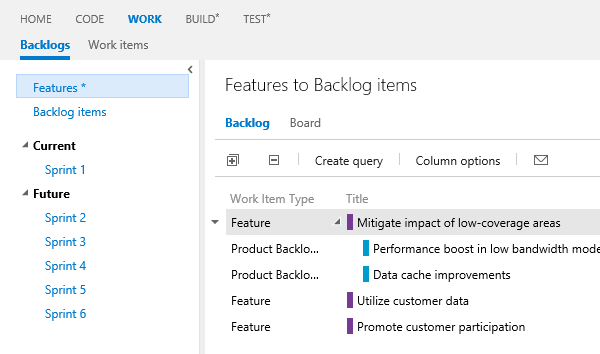
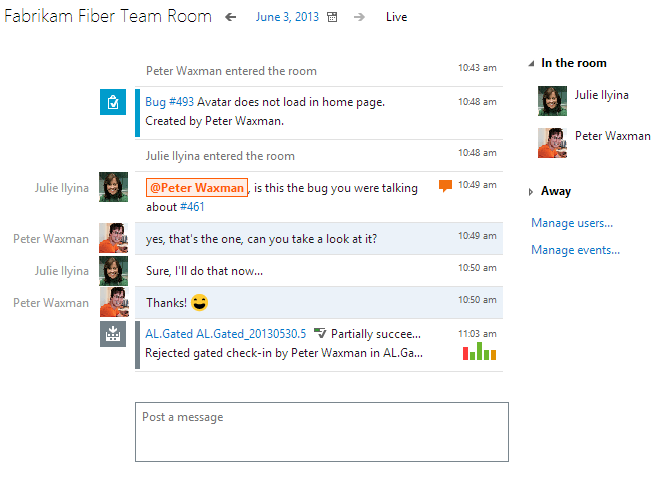

#Team Foundation Service Updates for TechEd 2013

Today, we released a new set of features on Team Foundation Service that we’ve been incubating for several sprints. There are some fairly significant ones here.

##Agile Portfolio Management

We introduced a new set of features that enable organizations with larger projects, multiple teams and backlogs to be able to decompose their backlogs at multiple granularities and roll up work. At each level you can have a backlog and kanban board. Each team can have a backlog of "backlog items" that contributes to a joint “Features” backlog. This is just the beginning and, roughly, every sprint it will get better.

##Lightweight code commenting

Lightweight code commenting is a new feature in our web experience that allows people to easily comment on code. It provides a very nice inline experience for commenting either on whole files or on changes. Code commenting enables interactive or time shifted conversations about code and can be done in a browser so, among other things, it will work wherever you are – including your favorite browser enabled cell phone.

##Team Room

One of the core value propositions of Team Foundation Service is to help software development teams collaborate. This is usually by providing transparency into what is happening in the software development process so that everyone stays up to date and knows how to make the best decisions. Today, we introduced on the service a new feature called “Team Rooms”.  A Team Room is a durable collaboration space that records everything happening in your team. You can configure notifications – checkins, builds, code reviews, etc to go into the Team Room and it becomes a living record of the activity in the project. You can also have conversations with the rest of your team in the room. It’s always “on” and “permanently” recorded, allowing people to catch up on what’s happened while they were out, go back and find previous conversations, etc.

##Continued progress on web based testing

Over the past 6 months or so, we released constant improvements to our capabilities. We’ve been building out the test case management capabilities to allow you to more fully manage your test plans without having to switch to the Test Professional client. You can now create/modify test plans, suites and shared steps on the web.

We’ve also improved test editing by enabling you to add step attachments, use shared steps, parameterize step data and more.

And we’ve improved the test running experience making it easier to capture screenshots, etc.

##Cloud Load Testing

Today we released a preview of an entirely new service component – **Cloud Load Testing**. I’m incredibly excited about this new ability.  Since VS 2005, we’ve supported Load Testing in Visual Studio Ultimate.  It allows you to validate performance, scale and reliability of your server apps. However, you have to set up and configure your own infrastructure to run load tests. With our new Team Foundation Service based load test solution, you can now load test your apps without configuring any infrastructure. Just use Visual Studio Ultimate Edition to create a load test and point it at Team Foundation Service and say Go!  And soon you have load test results for your application. We think this is going to be particularly valuable for people building Azure applications who want to verify the scalability of their apps before opening them to a broad user base.

To run a cloud based load test on Team Foundation Service, just create/record a load test and choose the option in your test settings.

And in a short time, you’ll see the progress on your test:

You can’t quite take advantage of this feature yet. While the service side is ready, you are going to need an update to the VS Ultimate client to take advantage of it. You’ll be able to start using it once you download and install the VS 2013 Preview available at the Build conference.

Please note the service is in “Preview” and as such we will be limiting the number and size of runs you will be able to do before the service releases. If you would like to join our early adopter program and exercise the service on some larger scale runs, let me know.

We’re really excited to have some very cool new features available on the service and we hope you like them. Please let us know what you think.

Thanks,

Brian

