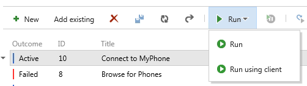

# Team Foundation Service updates - Jun 26

It’s an exciting day today as we announced and released Visual Studio 2013 Preview.  Visit [Soma's blog](http://blogs.msdn.com/b/somasegar/archive/2013/06/26/visual-studio-2013-preview.aspx) to read about the details.  Related to that announcement we have a few changes to the service that you’ll want to know about.

## Windows 8.1 support in the build service

We have added a second pool of build machines to the hosted service. This new pool is running Windows Server 2012 R2 which allows you to build Windows 8.1 store apps. To build a Windows 8.1 store app you need to configure your build definition to use the second pool.

To enable this feature, navigate your browser to the build section in your hosted account. You will see a new notification banner at the top of the page that will allow you to enable this new build pool for your account.  Once you have enabled the pool, a new build controller will become available for you to use. To use this controller, open your build definition in Visual Studio, go to the Build Defaults section and select the Windows 8.1 Preview Controller.

## Pasting images into work items

With today’s changes, you can now paste images directly from your clipboard into any HTML control on your work items (Description field, History, Repro Steps, etc) when using Internet Explorer 11 Preview or Chrome as your browser. 

## Opening Microsoft Test Runner

Customers can now easily transition from the Test Hub in web access to the Microsoft Test Runner (MTR) by clicking the Run using client button/context menu.  Doing so opens MTR and loads the selected test cases for data collection during manual testing. To use this capability, you need an updated MTR client from [Visual Studio Update 3](/visualstudio/releasenotes/vs2012-update2-vs) (also released today).

That’s it for today.

Thanks.

Aaron Bjork

