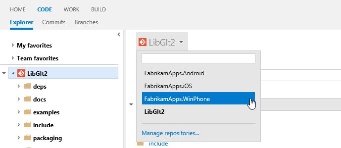
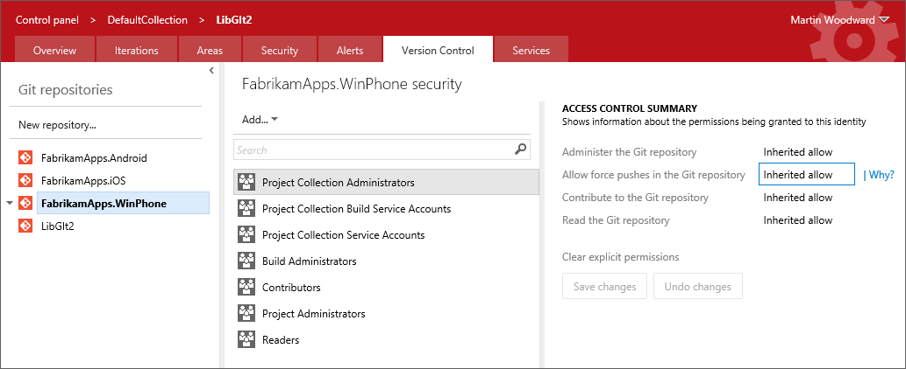

#Team Foundation Service updates - May 13

After being relatively quiet on the “news” front in our last sprint, I’m happy to share that we’ve got quite a few updates in today’s deployment.

##Color

Let’s start with color. We’ve long known that our site lacked color. Blue and grey were the predominant colors and they seemed to overwhelm most experiences. With today’s update, we’ve introduced color in a few key places. The most obvious is on work items. All work items are now assigned a color in the process template definition. The color appears in the web UI as a “color bar” on query results and backlogs. It is the background color for cards on your task boards and kanban boards. The result is that you can now glance at a query result or backlog and easily differentiate between work item types.

######Before

######After

##Icons and sentence casing

Most of the icons in our toolbars and menus have been revamped. The changes are subtle. Many of the icons got a splash of color and most use thinner borders.

We also updated the site to use sentence casing (the first letter of the first word is capitalized) on all headings, toolbars, etc. We had a fair amount of inconsistency here before, and we’re happy to see it all coming together. The only place we diverge here is our main navigation hubs which remain upper case.

######Before

######After

##Navigation

Three small updates were made to our navigation across the site. First, notice that the task board navigation hub has been moved from the top level down to the iteration. A side effect of this change is that you can now view a task board for past and future iterations, not just the current iteration (I can hear some of you cheering as you read this). This was a [very popular item](http://visualstudio.uservoice.com/forums/121579-visual-studio/suggestions/2901542-ability-to-view-task-board-for-past-sprints) on our UserVoice site and I’m happy to report that it’s marked as completed!

Second, we updated the navigation layer to remember the hub you last visited. This is especially handy when moving between WORK and CODE sections which each have multiple hubs. And finally, we changed the Team Foundation Service logo and text in the header to link directly to your account home page instead of our welcome portal.

##Git multi-repo support

When using Git in the Enterprise you will want your repositories modular and self-contained. This is to manage the history and permissions to your various modules in discrete components. Feedback was showing us that some people were creating multiple team projects just to have additional Git repositories. Rather than encouraging people down that route we’ve enabled multiple repositories per team project. This is a feature for more advanced users, by default you still just get one (the same name as your team project). Now you can select the repository name in the code explorer to switch to another repository in your team project.

The drop down gives you a filter and you can click **Manage repositories** to create, rename or delete repositories. You can also manage the security permissions on them in the new Version Control administration page.

If you rename a repository then you will need to manually update the remote URL where you have cloned it. Right now you can only use the advanced Team Explorer integration when the repository is the default one (i.e. the repository with the same name as the team project). You can still clone, push and pull into the other repositories in your team project from Visual Studio, but you’ll need to do this by cloning manually from the remote URL. A future version of the Git integration in Visual Studio will help you get connected to them more easily.

This was a [relatively new item](http://visualstudio.uservoice.com/forums/121579-visual-studio/suggestions/3811952-allow-multiple-git-repositories-in-a-single-team-p) requested on UserVoice and we’re happy to mark it as done.

##Branded login page

The final change in this sprint’s deployment is an update to our login page so that it’s now a branded Team Foundation Service experience. This was something we got a lot of feedback on. The flow prior to this update used a generic Microsoft account sign in page. This created a somewhat confusing experience.

That’s it for sprint 47. Let us know what you think. We're listening on [UserVoice](https://visualstudio.uservoice.com/forums/330519-vso), the [MSDN Forums](http://social.msdn.microsoft.com/Forums/TFService/threads), and [Twitter](http://twitter.com/search?q=%23tfservice).

Thanks,

Aaron Bjork

