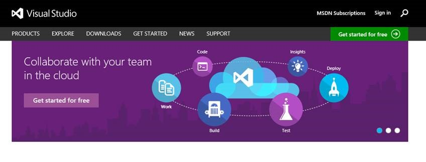
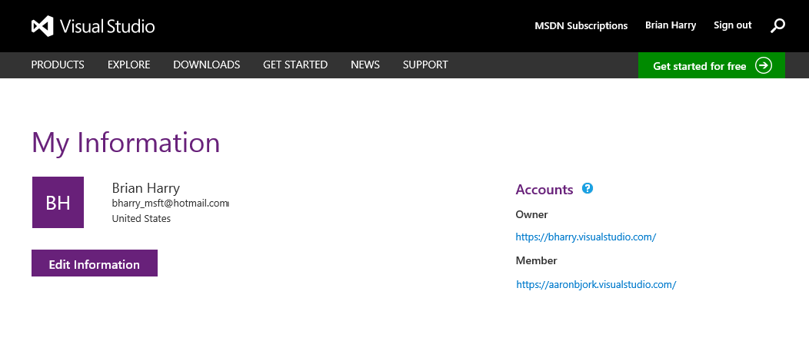
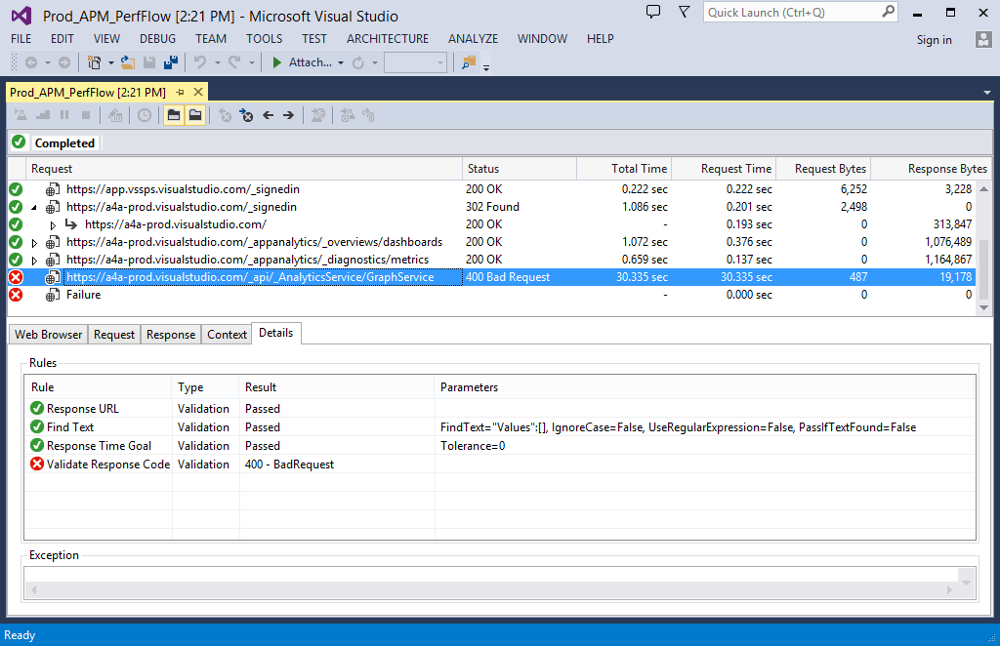
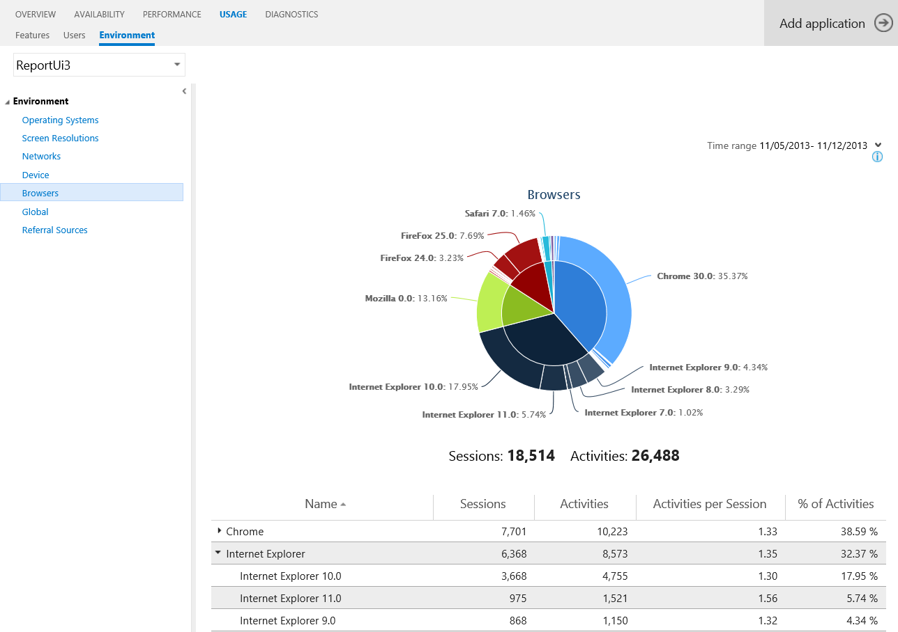

#Visual Studio Online updates - Nov 13

##Announcing Visual Studio Online

Today we take a very significant step in the evolution of our developer services. There are many pieces to it so bear with me while I get to them all. And please read all the way to the end for some exciting announcements.

The first thing you will notice is that we’ve changed our name. What was Team Foundation Service is now Visual Studio Online. The name change is not due to any one change we are making today but rather an indicator that Visual Studio Online is the services component of our developer tools. It will, of course, continue to support all the kinds of development you do – Windows, Azure, Java, iOS, etc. and the IDE you need – Visual Studio, Eclipse, Xcode, Android Studio, etc. But the name does indicate a continued broadening of our offering – you’ll see some more on this below if you continue to read.

With our new name comes a new portal. This is now a combined portal, including the breadth of our Visual Studio, Visual Studio Online and MSDN offerings. There’s a ton of useful information about our products, some “How-to” content for getting started, the latest news and more. http://visualstudio.microsoft.com is the only url you have to remember. From here you can sign in and get to your profile page which now has links both to the account you own and to all the accounts you’ve been invited to participate in.

##Visual Studio Online is Open for Business

Even bigger news is that we have now enabled paid usage of the service. Officially the service is in what we call “Commercial Preview” as we work through any issues that we may have with the billing system before announcing “General Availability” sometime in 2014. You can sign up for or transition your existing account to a paid account starting today.

Don’t worry though. First off, everyone who is a member of an account today has their use grandfathered as a free “Early Adopter” for 90 days. This will give everyone a few months to look at and understand the plans, ask questions and decide what to do. And, of course, we’ll continue to have free accounts for small teams. I don’t want to go into all the details here, but I do want to highlight a few key points…

-Every account gets 5 “Basic” users for free.
-Eligible MSDN subscriptions include VS Online access - there are no additional per user costs for MSDN subscribers.
-You license users and you pay for “consumable resources” – like automated builds, load tests, etc beyond the free quantities included with every account.
-While the service is in Commercial Preview, all list prices are reduced by 50% to account for the fact that the service is still officially a “preview”.
-Among the plans, you will find an option for small teams that allows you to license both VS Online and the VS Professional IDE on a monthly basis. This can be a very flexible and cost effective way for a small team to stay up to date with the latest version of Visual Studio.

You can read all the offer details [here](https://visualstudio.microsoft.com/products/visual-studio-online-overview-vs) on our new portal.

I assume some people will decide, for any number of reasons, that it’s time for them to migrate from the cloud to an on-premises Team Foundation Server installation. We promised months ago that we would provide a good migration path and we will. It’s not quite ready yet, but we’re expecting to have it available for anyone to use by January – at least a month before the “Early Adopter” period is over. This solution will enable you to export all of your data from VS Online as a Team Project Collection that can be imported into TFS. We’ll provide more details in a future news post.

To get started with a paid account, the first thing to understand is that we are coupling your VS Online subscription to your Windows Azure account. VS Online is a Windows Azure resource and you can manage your subscription and billing with Windows Azure and, consequently, take advantage of all of the Windows Azure purchasing options and discounts. To get a detailed walk-through, visit our [getting started topic](https://visualstudio.microsoft.com/get-started/set-up-billing-for-your-account-vs).

Once your account is connected, you can use the [Windows Azure portal](https://manage.windowsazure.com/) to change your subscription.

Use the new Users hub in VS Online to assign licenses to users.

##Getting Support is Easy

Among the features of the new site you will find a new [support page](https://visualstudio.microsoft.com/support/support-overview-vs) that provides you with a full set of options for getting support – including a list of commonly asked questions, links to forums, contact info for customer support and more. We want to make it as easy as we can for you to get any help that you need.

##Announcing Visual Studio Online “Monaco”

With Visual Studio Online we want to offer a broad range of tools and services that support the different kinds of development you do. In support of that vision, today we are announcing the preview of “Monaco”, a new development service specifically designed for building and maintaining Windows Azure Websites. With Monaco, we want to provide developers with a lightweight, friction free companion to the Visual Studio desktop IDE that is accessible from any device on any platform. Monaco is a rich, browser based, code focused development environment optimized for the Windows Azure platform, making it easy to start building and maintaining applications for the cloud.

###Getting Started

To get started with Monaco you must first enable editing for your website. This is done on a per website basis, on the CONFIGURE tab in the Windows Azure Portal for your site, in the “general” section.

Once you enable editing, a link to “Edit in Visual Studio Online” will appear on the DASHBOARD tab of the portal, under “quick glance”.

You’ll be prompted for your deployment credentials. These are also available in the quick glance section of the portal. Once you are authenticated, you will be directed to the Monaco environment where you can start editing your site.

###The Monaco Environment

Changes are automatically saved and are live. Monaco has great support for HTML5 and JavaScript applications (including TypeScript and Node) as well as PHP applications. You can edit VB and C# ASP.NET Web Applications in Monaco. You can use MSBuild from the Console to compile the project.

This is just a brief overview of Monaco in order to get you up and running. For more information, check out the new video series for Monaco on Channel 9.

##Announcing Application Insights Limited Preview

Today we began a preview of Application Insights, a brand new service available through Visual Studio Online. Application Insights collects, processes and presents a wide variety of telemetry including performance, usage, availability, exception, crash, environment, log and developer-supplied data from all components of a modern application – including clients (devices and browser), servers, databases and services.

With this “360 degree view” of your application, Application Insights can quickly detect availability and performance problems, alert you, pinpoint their root cause and connect you to rich diagnostic experiences in Visual Studio for diagnosis and repair. It also supports continuous, data-driven improvement of an application. For example it highlights which features are most and least used, where users get “stuck” in an application, where and why exceptions are occurring, which client platforms are being used with which OS versions, and where performance optimizations will make the biggest impact on compute costs.

###Custom dashboards

In addition to “out of the box” pre-configured insights and reports, you can create custom dashboards showing the metrics you care most about.

###Integration with Visual Studio

One of the cooler things about Application Insights is its integration with Visual Studio. When your availability tests fail, or exceptions occur, Application Insights can bring you right to the offending line of code in the version of the source that is actually in production.

###Where should I focus my attention next sprint?

Without Application Insights, “what’s next” decisions are often guesswork. But with Application Insights, you’ll understand what users are doing, where they are succeeding, and which platforms matter most. If you want to instrument your application, you can capture any sort of custom insight. With this insight, your continuous improvement efforts can be more focused and impactful.

###Next Steps

If you are already Visual Studio Online user and want to participate in the limited preview, request an invitation code via the new Application Insights tile on your Visual Studio Online home page. If you aren’t yet a Visual Studio Online user, you can quickly sign up [here](http://go.microsoft.com/fwlink/?LinkId=307137).

As always we’re eager to hear any feedback on [User Voice](https://visualstudio.uservoice.com/forums/330519-vso), the [MSDN Forums](http://social.msdn.microsoft.com/Forums/TFService/threads) and [Twitter](http://twitter.com/search?q=%23tfservice).

Thanks,

Brian Harry

