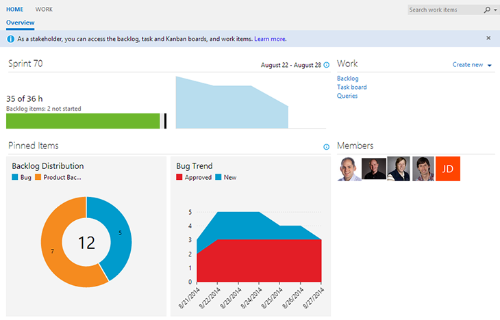

#Stakeholder licensing – Aug 27

##A license for Stakeholders

We’re delivering on the new "stakeholder license" that [I promised](http://blogs.msdn.com/b/bharry/archive/2014/07/09/upcoming-vs-online-licensing-changes.aspx) a few weeks ago. With this license, being activated today, any number of users in an account can be assigned a stakeholder license at no charge.

Stakeholders have access to the project home page and most of the "work" related functionality.

*(click to zoom)*

This includes the ability to view the backlog, add and edit items, run work item queries and more.

*(click to zoom)*

I hope and expect that enabling this will eliminate a lot of the friction in enabling the entire organization to participate in projects. Learn more about what you can do with a [stakeholder license](/azure/devops/organizations/security/get-started-stakeholder?view=azure-devops).

Enjoy!

Thanks,

Brian Harry

