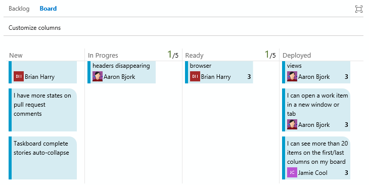
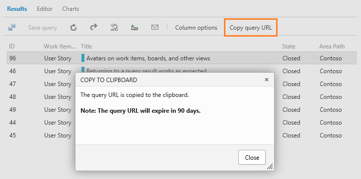
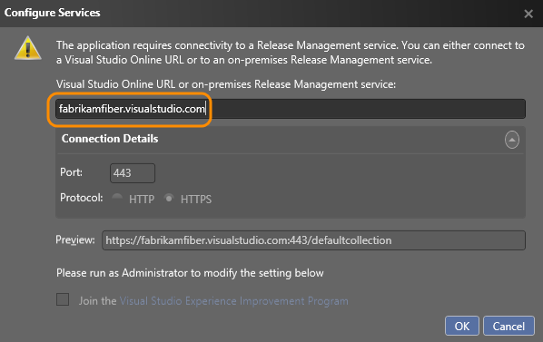

# A new identity control – Dec 2

We’ve got another sprint packed full of improvements for you…

## Identity control and avatars

One of my personal favorites in this week’s deployment is our new work item identity control. We’ve never really had a proper identity control in the product—instead, we made do with a simple drop-down list with alphabetically sorted names. It worked, but it was cumbersome when working with long lists and didn’t provide any additional information when dealing with people with the same name. Today that all changes as we roll out a shiny new identity control. The new control includes a user’s full name, avatar, and email address.

It should be very intuitive to use. When you put focus on the control, it starts by giving you an MRU (most recently used) list of people you’ve recently assigned work items to. If the person you’re after isn’t in that list, just click Search and we’ll pull back matching results from the users in your account. And, not only are we providing a new identity control, but we’ve refactored a bunch of places where we display a user’s name to include their avatar. You’ll now see avatars on cards on your work items, boards, and a bunch of additional places.

We know there might be a few rough edges to iron out here, so please let us know what you think. You can contact me directly on twitter at [@aaronbjork](http://twitter.com/aaronbjork) with any feedback.

## Pull request improvements

Next, let me walk through a few changes to the pull request experience. Code comments that are added during pull requests now have a state property that can be used to help you manage the feedback from reviewers. When created, comment states are initially set to **Active**, and may be changed to **Resolved**, **Won't Fix**, or **Closed** to communicate the results of the comment back to the reviewers. There is also a new view option in the Explorer view for the pull request to highlight only the Active comments.

And, in place of the simple Approved/Rejected voting choices, we have added more states to enable reviewers to provide more granular feedback. There are now two affirmative states: **Approved** and **Approved with Comments**, one neutral state: **No response**, and two negative states: **Code Not ReadyYet** and **Rejected**. Happy pull requesting.

## Taskboard changes

We made three updates to the Taskboard this sprint that I want to call your attention to. First, we now auto-collapse completed stories/PBIs on your board so that you don’t have to collapse them manually each time you open the board. This should help bring attention to unfinished work and save you a few clicks.

Second, we changed what happens when you move a story or PBI out of the current sprint and into a future sprint. Previously, all tasks including completed tasks were moved to the destination sprint. With today’s update, completed tasks are left in the sprint in which they were completed, and only tasks that are not finished are moved into the destination sprint.

Finally, we changed the upper bound limit on the board from 500 items to 1000. We had a few of you telling us that you had boards with more than 500 tasks on them and were bumping into that upper bound.

## Kanban board persisted column headers

We’re starting in a on a bunch of improvements to our Kanban boards. Some of the initial ones are quite small, but they’re aimed at making the boards more usable. This sprint we made a simple change to keep the column headers in view when scrolling vertically. Stay tuned for more updates to the board in coming sprints.

## Sharing personal queries

Finally, we’ve heard from many of you that it’s annoying that you can’t share ad hoc personal queries that live in your My Queries folder. It’s common to build a new query, save it to your My Queries folder, and then want to share it with someone on the team without having to pollute the Shared Queries folder. Now, you can just click the new **Copy query URL** command from your personal query and you’ll get a URL to the query that can be shared. Note that the URL will expire after 90 days.

## Release Management Preview as Visual Studio Online service

On November 12, we announced that Release Management is now available as a Visual Studio Online service as a Preview feature. With this, you can now configure [Release Management Update 4 client](http://go.microsoft.com/?linkid=9843000) to connect to a Visual Studio Online account. Once connected, you can and then [set up and manage releases to Azure](http://blogs.msdn.com/b/visualstudioalm/archive/2014/11/11/using-release-management-vso-service-to-manage-releases.aspx).

That’s it for this sprint. Keep all the feedback coming on [Twitter](https://twitter.com/VisualStudio) and [UserVoice](https://visualstudio.uservoice.com/forums/330519-vso).

Thanks,

Aaron Bjork