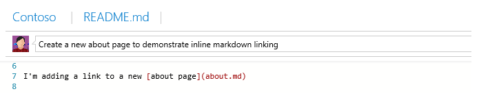
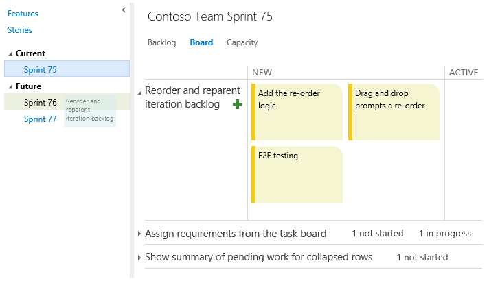

#Quick code editing, backlog filtering, and more – Dec 17

Before we jump into the changes coming this week, I want to call out that this will be our last deployment of 2014. Our next sprint ends right in the middle of the holiday season, so we’ve chosen to skip that deployment. We’ll see you again in late January with our next update. Happy holidays everyone!

##Quick code editing

This sprint we added the ability to make a quick edit to a file in version control directly from your web browser and then commit those changes straight back to the service. When browsing a source file, you now have an Edit command that puts the file into editing mode. Changes can then be made inline, complete with color coding and formatting support. As soon as you click the Save command, we create a new commit/changeset with your changes. Use the diff view to see exactly what changes you’re making before committing the changes. If the file is a Markdown or HTML file, you can also preview your changes before you save them.

Not only can you edit files, but we also added the ability to add, delete and rename files directly from the web. To add a new file (or files), right-click a folder in your repository and select **Add file(s)**, enter your check-in/commit comment, and you’re ready to go. The days are gone when you have to download your entire codebase just to rename or delete a file!

The new editing capabilities also show up in the **Welcome** hub, making it easy to create documentation for your projects. If you don't have a README.md file you can start with our template guide and commit your own.

We also enabled the ability to create links to existing (or new) markdown files by following the syntax in the screenshot below. Don’t worry if the page doesn’t exist, because you can edit and commit the new file when you click the link, wiki style.

With these features we hope the creation and editing of your project documentation is easy and fast!

##Filtering on backlogs and queries

Today we turned on a new feature that lets you quickly filter backlogs and query results. On the toolbar you’ll notice a new filter textbox. Just type in text from the items you’re looking for…

…and the backlog/result is immediately filtered to only show items with the matching text. This feature is really handy when you’re scanning a long backlog or query result for a specific item (or set of items). Note that the matching is done on data in the displayed columns—including tags.

While drag-and-drop reordering is disabled when filtering, the context menu on each item still lets you move an item to the top of your backlog or to a specific position.

##Sprint backlog and task board improvements

We made three usability updates to sprint backlogs and the task board.

First, on all your sprint backlogs you can now drag and drop items to reorder and reparent. Just grab an item from the backlog and drop it in the correct location to reorder, and if you need to reparent a task, just grab it and drop it on the new parent.

The reparenting logic also works on the task board, making it easy to take a task from one story and move it to another. We also heard your feedback that you want a quick way to add items back to the product backlog, so we made sure you could drag stories from both the sprint backlog and task board directly to the product backlog (or any other sprint).

And, you might have noticed in the screenshot above that we made a small change to show a summary of all work not started and in progress on collapsed stories. All these changes came directly from your feedback. We’re happy to mark them as complete on UserVoice.

[https://visualstudio.uservoice.com/forums/121579-visual-studio/suggestions/2296825](https://visualstudio.uservoice.com/forums/121579-visual-studio/suggestions/2296825)

[https://visualstudio.uservoice.com/forums/121579-visual-studio/suggestions/6769822](https://visualstudio.uservoice.com/forums/121579-visual-studio/suggestions/6769822)

[https://visualstudio.uservoice.com/forums/121579-visual-studio/suggestions/6569087](https://visualstudio.uservoice.com/forums/121579-visual-studio/suggestions/6569087)

##New integrations: Slack and Azuqua

We are happy to announce two new integrations going live this sprint: Slack and Azuqua. [Slack](http://www.slack.com/) is a popular team collaboration service that helps teams be more productive by keeping all communications in one place (and easily searchable from virtually anywhere). [Azuqua](http://www.azuqua.com/) enables regular users to wire together complex business processes across multiple cloud services, including Facebook, Twitter, and Jira, without writing any code.

To learn more about these and the 20+ other integrations, visit [Visual Studio Online Integrations](https://marketplace.visualstudio.com/vsts).

##Preview APIs for adding and updating files in source control

REST APIs for adding, editing, renaming, and deleting files in TF Version Control and Git projects are now available for preview. These JSON-based APIs (which are used by the new quick code editing feature) enable you to create Changeset and Push resources via POST operations. For Git, you can add and update files in an existing branch or create a new branch. You can also rename, move, and delete files. One limitation, which will be addressed in the next deployment, is that these APIs are currently only callable when using basic authentication (not OAuth).

To learn more about these APIs, see [Visual Studio Online REST API Versions and History](/rest/api/vsts/?view=vsts-rest-4.1#where-are-the-earlier-versions-of-rest-apis-before-41).

##CodeLens for Visual Studio Online in Preview

Finally, we turned on the CodeLens feature for all Visual Studio Online accounts with today’s deployment. If you’re not familiar with CodeLens, head over to our [devops blog](http://blogs.msdn.com/b/visualstudioalm/archive/2014/12/11/codelens-in-visual-studio-online-is-now-in-public-preview.aspx) to read about how you can start using it.

That’s a wrap for this sprint and for the 2014 calendar year. If you’re ever interested in looking back over the changes we’ve made in the last year, visit our [features timeline](https://visualstudio.microsoft.com/articles/news/features-timeline), where we catalog all the updates to the service and map them to on-premises updates of Team Foundation Server. Thank you.

Thanks,

Aaron Bjork