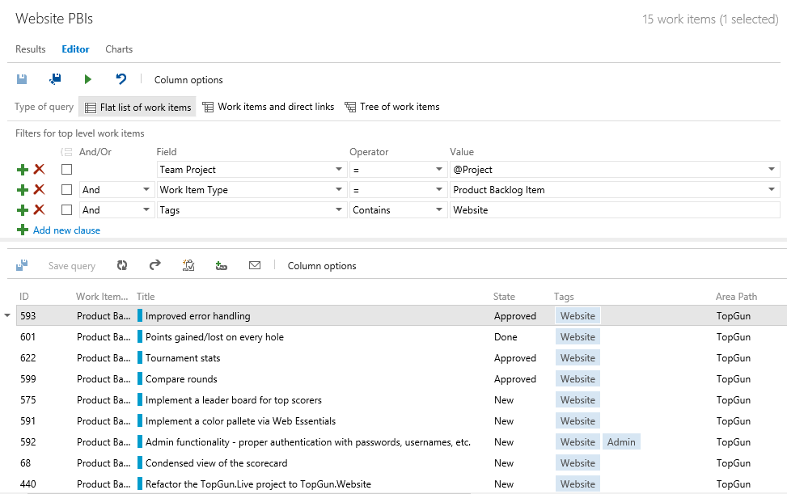

#Visual Studio Online updates – Jan 22

We’re back from the New Year and excited to talk about a few improvements to the service. 

##Querying tags

The first change I want to highlight is that we’ve enabled the ability to query work item tags. Tags are an easy and effective way to “mark up” work items with additional meta-data. However, without the ability to write and save queries that leverage those tags, they’re just not as useful as they could be. Today’s update changes all that. The tags field appears in the work item query editor just like other fields and works with the **Contains** and **Does Not Contain** operators. These operators use whole word matching (not case sensitive), and will return exact matches only. For example, if you create a query that looks for work items with the tag “Website”, your search will return "Website" tags, but not tags like "Website Related". 

##Removing weekends from the Burndown

We’ve added a new team configuration setting that enables you to specify the working days for your teams – effectively giving you the ability to remove those pesky weekend days from your burndown charts. If you follow us on [UserVoice](https://visualstudio.uservoice.com/forums/330519-vso) you know that this particular item is near the top of the list of things you’ve told us you can’t live without. Each team in your project controls this setting independently to enable teams in different geos to work more effectively in the same team project.

##Configurable CFD dates

Finally, we’ve added a new start date property to the continuous flow diagram (CFD) on your product backlog. Previously the start date was hard coded to the day you created your team project. We’ve found that people often create their projects before they start “working” and were frustrated that their cumulative flow diagrams always started with a long “inactive” period. Click the ellipsis in the top right hand corner of the chart to add a custom start date. 

That’s it for this sprint. 

Thanks,

Aaron Bjork

