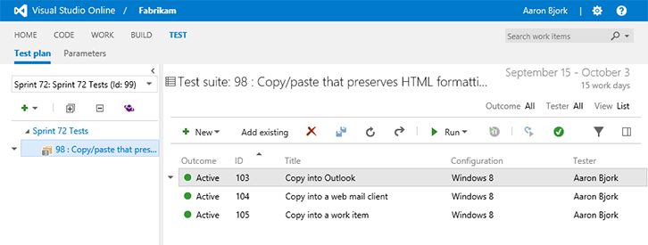
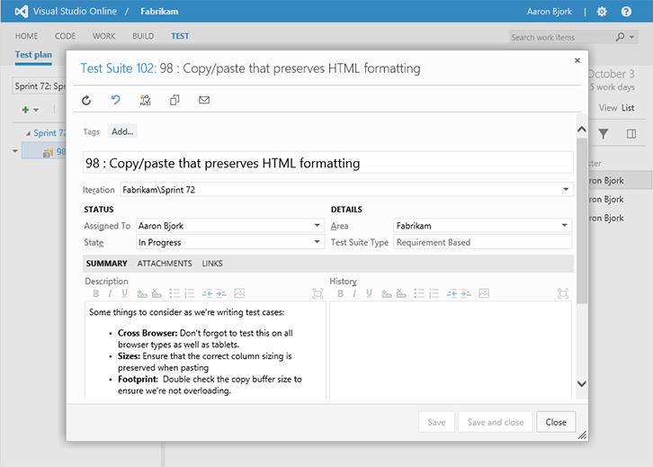

#Test artifacts as work items – Oct 14

##Test artifacts as work items

Work item based Test Plans and Test Suites, which were available with [TFS 2013 Update 3](http://blogs.msdn.com/b/bharry/archive/2014/05/30/visual-studio-team-foundation-server-2013-update-3-ctp1-vs-2013-3-1-if-you-wish.aspx), are now available on Visual Studio Online. Now that Test suites are work items you can assign owners to each suite and use the Summary field to capture important notes. Changes to Test Plans and Test Suites can be audited with work item history and permissions can be managed at a more granular level with the new **Manage Test Suites** permission.

Have a look at the screenshots below. In the first you’ll see the test artifacts as displayed inside the Test hub. We’ve got a Test Plan (“Sprint 72 Tests”), two Test Suites (“Sprint 72 Tests”, and “98: Copy/paste the preserves HTML formatting”), and three associated Tests Cases.

And below you’ll see the new Test Suite work item opened directly from this view.

Do note that any changes you make to these work items, including destroy, will be reflected across all the associated test artifacts. You can read more about how these artifacts work together at our Get Started topic [Create a test plan](/azure/devops/manual-test/getting-started/create-a-test-plan?view=azure-devops).

##Copy and paste query results

It’s common to want to grab the results of a work item query and shoot them to a colleague for review. This sprint we added a new command that preserves the table formatting of query results when copying and pasting. The new **Copy as HTML** context menu option will preserve the table structure from your query result so you can paste it into an email or other document type. In the screenshot below I’ve copied results from a work item query and pasted them directly into a new email for easy sharing.

That’s it for this deployment. Keep the feedback coming on [Twitter](https://twitter.com/VisualStudio) and [UserVoice](https://visualstudio.uservoice.com/forums/330519-vso).

Thanks,

Aaron Bjork