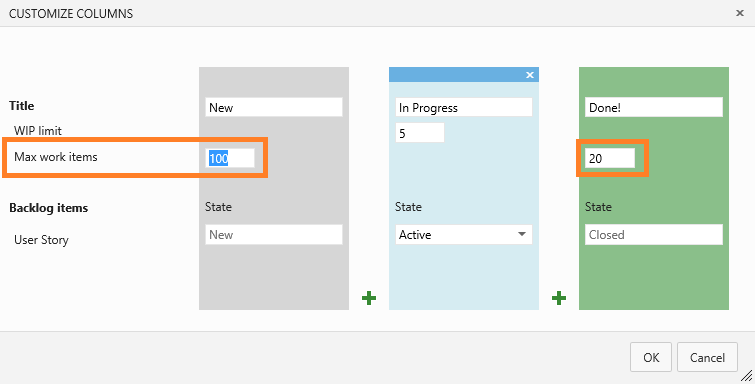

# Query usability, Hubot, new charts, and more - Sep 4

We've got lots of incremental improvements in today’s update. I’m not sure the best way to summarize them for you, so let’s just jump right in…

## Work Item query improvements

We made a bunch of incremental improvements around working with work items in the context of a query. The screenshot below highlights the changes you’ll see on a work item.

-Email command allowing you to send a nicely formatted email directly from the work item form.
-A new toolbar command to return directly to the query result you navigated from. If you’re a keyboard shortcut enthusiast, we’ve hooked up this command to ALT+Q. And if you’re used to using browser commands, the browser back button will do the same thing without resetting your position in the query.
-Full screen mode is now enabled on all queries and on all work items. Just click the command in the toolbar to ditch all the chrome and maximize screen real estate.
-Additionally, we included a new right-click command on query results that allow you to open a work item in a new browser tab (not shown in the screenshot).

## Quick search through tree controls

Often when triaging or assigning work items it’s necessary to change the area and/or iteration path. However, it’s not uncommon for these trees to be deep and difficult to navigate. In this sprint we implemented an inline search that matches values in the tree as you type. In the screenshot below you can see that only the matching leaf values (and their parents) are being displayed as I type.

## Longer trend charts

We added two new chart durations to work item charts – **Last 12 weeks** and **Last year**. These charts don’t plot the data daily, instead they use the data from the first day of the week or month respectively. We’re keeping a close eye on these charts to ensure our sampling is correct, so let us know if these new options don’t match expectations or work well for your scenarios.

## More cards!

We added a simple configuration to our Kanban board to let you increase the number of cards that show up in the first or last column on your boards. Before today’s change this number was capped at 20. Enjoy.

## Test Cases related to Test Suites

It’s very common for test cases to end up belonging to more than one test suite. Because of this, you want to know the relationships a test case has before you start editing. Today’s deployment brings a new view that allows you to do just that. Simply change the pane filter to **Test Suite** and you’ll have visibility to all related test suites.

## WIT REST API v1.0 (preview 2)

You all gave us a ton of feedback on our first preview of the v1.0 REST APIs that we've taken to heart and used to redesign our WIT API. Highlights include:

-Easier to create and patch work items
-Easier to execute ad-hoc WIQL commands
-Enumeration of area and iterations
-New metadata APIs to enumerate work item types, link types, categories and fields
-Less verbose JSON objects

[Documentation](/azure/devops/integrate/) has been updated so give it a try and let us know what you think.

## Event and resource versioning within service hooks

On a related note, for those of you building integrations with Visual Studio Online via service hooks, we now provide an advanced setting on the Web Hooks and Azure consumer services to let you (or your users) control what version of the WIT service hook events to receive—v1.1 or v1.2. This feature is useful in letting app developers control what version of WIT artifacts are delivered to their services when work item events happen in Visual Studio Online. Existing web hook subscriptions will continue to receive the v1.1 format.

## Hello Hubot

With the help of our community, we now have support for connecting Visual Studio Online Team Rooms to the popular, open source chat bot service [Hubot](https://github.com/github/hubot). Hubot integration helps improve productivity by making it simple to create work items, queue a build, recall what you last worked on, and more—all from within a Visual Studio Online team room. And with an extensible infrastructure, you can extend what your Hubot service can do by adding community or custom built scripts. Get started today by [setting up your own Hubot service](http://go.microsoft.com/fwlink/?LinkID=402677) that you can connect to your Team Rooms.

That’s it for this sprint. Keep all the great feedback coming on [Twitter](https://twitter.com/VisualStudio) and [UserVoice](https://visualstudio.uservoice.com/forums/330519-vso).

Thanks,

Aaron Bjork
