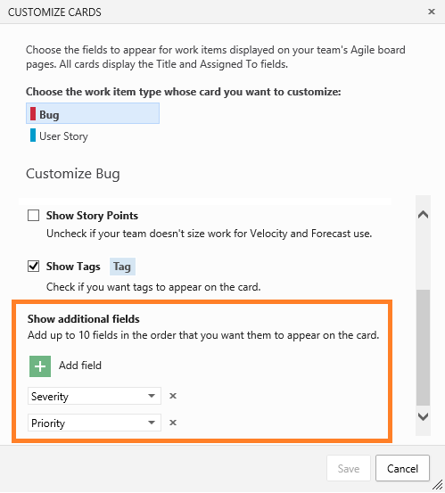
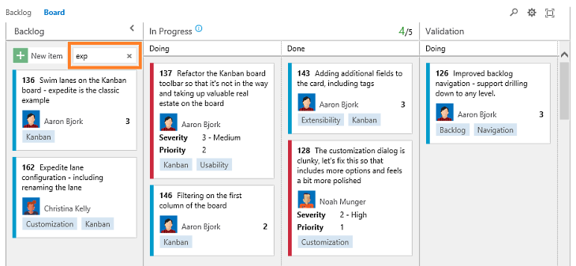
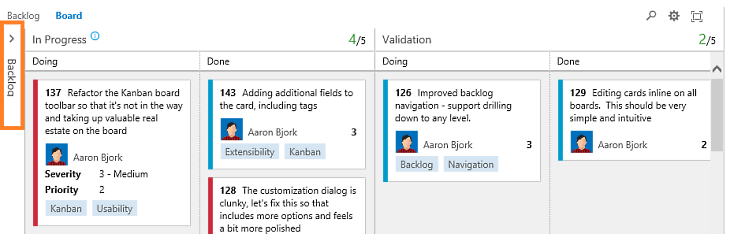

# Add fields to cards, board filtering – Apr 27

## Adding fields to cards

Continuing with our work to give you more card and board flexibility, this sprint we turned on the ability to add additional fields to cards on the Kanban board. Fields like title and assigned to are generally wanted on every card, but it’s often nice to bring a bit more information to cards so you can take action on them without having to open them for more details. Notice in the picture below that the Bug cards have both the Severity and Priority fields added.

This new setting is per team and work item type, and allows for up to 10 additional fields to be added.

In a few more sprints we’ll have even more here, letting you use conditional formatting rules based on field/value pairs. Stay tuned. **Note:** The option to show additional fields is available only on Kanban boards. We'll be turning this feature on for Taskboards in our next deployment.

## Kanban board filtering

Another nice improvement you’ll notice is the ability to filter the Kanban board. Type any text you like in the filter box in the top right, and the board automatically hides all cards not matching the text entered. Filtering works on all data displayed on the cards—including title, ID, assigned to, tags, and any additional fields added.

There’s an additional filter box in the first column that filters only new work. This is handy when you’re looking for something from your backlog and you don’t want to lose context of all the other work that’s already in flight.

We also added a simple new feature that lets you collapse the first column of the board to get it out of the way. Just click the little chevron in the top of the first column and it collapses out of the way.

## Card options on the Taskboard

Last sprint we enabled a set of configuration options on the Kanban board (adding tags, the ID field, etc.). This sprint those options make their way to the Taskboard. The functionality is identical to the Kanban board, allowing you to pick display options for each work item type on your Taskboard.

## Account Restore

And finally, we’ve added a new capability that enables you to restore a deleted account. This has been a pain point for quite a few customers who have deleted accounts, only to realize later that they still need data from the account. With today's update, account owners can now restore a deleted account as long as it's within 90 days of when the account was deleted.

1. Go to your profile page by selecting your identity on the top right corner.
2. Click **Restore** on the deleted account.

	That’s it for this sprint. We’ll be back in three weeks with more goodness. If you have questions, feel free to reach out on [Twitter](https://twitter.com/AzureDevOps). And if you’ve got ideas on what you’d like to see prioritize, head over to [UserVoice](https://visualstudio.uservoice.com/forums/330519-vso) to either add an idea or add your support to an existing one.

Thanks,

Aaron Bjork