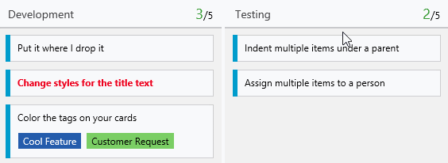
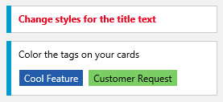

# Multi-select backlog items, reorder when changing columns, client libraries availability – Aug 7

## Multi-select items on the product backlog

On the product backlog, many have wanted to select multiple items when performing actions. Well, now you can! On all the backlogs, you can select multiple items (using shift-click) and perform any of the actions in the context menu:

We are currently working on enabling drag operations on multiple items; for example, [drag/drop reordering](http://visualstudio.uservoice.com/forums/121579-visual-studio/suggestions/2970520-drag-and-drop-reordering-for-multiple-consecutive) or dragging to an iteration. Look for this soon.

## Reorder cards when changing columns

Ever get frustrated when you drag a card to a column and then it drops to some place that didn’t make sense, sometimes scrolling the browser to that location? Yeah, we didn’t like that either, and we fixed it. You can now reorder the card when you change the column, so the card will stay where you drop it. We also eliminated the auto-scrolling we used to do, so the board keeps it location after you drop.

## Color tags and titles on your cards

We’ve added two small, but powerful ways to add visual cues to your board. You can now change the color and style of title text as well as add color to specific tags. To try this out, click the gear icon. You can format title text under “Styles” and color tags under “Tag colors”.

## Libraries for integrating with Visual Studio Online now available at nuget.org

For .NET developers building Windows apps and services that integrate with Visual Studio Online, NuGet packages containing libraries for integrating with work item tracking, version control, build, and other services are now available. These packages replace the traditional TFS Client OM installer and make it easy to acquire and redistribute the libraries needed by your app or service. To learn more, see the [overview of the client library packages](http://go.microsoft.com/fwlink/?LinkId=613084).

If you have questions, feel free to reach out on [Twitter](https://twitter.com/AzureDevOps). Ideas? Head over to [UserVoice](http://visualstudio.uservoice.com/forums/330519-vso) to add your idea or vote for an existing one.

Enjoy!

Gregg Boer