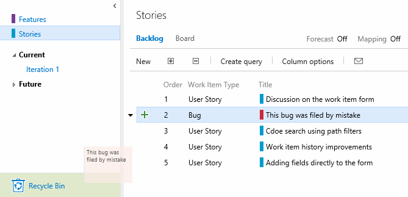

# Custom work item fields and more – Dec 10

We’ve got quite a few things to cover in this week’s deployment. Let’s jump right in…

## Custom work item fields

I’m happy to announce that, with our deployment this week, all customers now have the ability to customize work items. This new capability includes:

- Adding new fields (date/time, string, integer, decimal)
- Rearranging work item layouts
- Process inheritance
- Process security

As many of you know, we’ve been waiting quite a while to get this capability ready for VS Team Services. While we’re excited about this first step, I want to assure you that we’re far from done. Our next steps will include support for pick-list fields, state customization, HTML fields, completely custom work item types, completely custom processes, and more. You can read all about today’s updates in Justin’s [blog post](http://blogs.msdn.com/b/visualstudioalm/archive/2015/08/24/adding-a-custom-field-to-a-work-item.aspx?wa=wsignin1.0).

## Work item discussion

One of the most common requests from users of our new work item form has been the ability to see discussions in the main page and in the context of other fields. You’ll now find the discussion experience lives on the bottom left of all work item types and lets you interact with others without having to move away from the core fields. The new discussion experience also includes support for @mentions (people) and #mentions (other work items) directly in the discussion control.

## Work item history improvements

Today’s update also includes some improvements to the history experience for all work item types.

- Pagination and revision count
- Separation of the state graph from history
- Auto-expansion of the most recent revision
- Absolute timestamps
- Some UX styling improvements
- Performance improvements

Most of these changes are cosmetic, but you’ll see more coming to improve work item history next year.

## Deleting work items

And finally (and I can’t believe I’m actually saying it), you now have the ability to delete work items, complete with a recycle bin experience! This capability replaces the previously used "Removed" states on work items. We’ve implemented delete as a unique permission, so you can hang on to fine-grained control over who has access to this capability.

## Dashboards edit mode

We’ve added a new mode to all dashboards called “edit mode”. Edit mode helps prevent the inadvertent moving of widgets on your dashboards during the day-to-day consumption experience. To enter edit mode, click the pencil icon in the bottom right-side of your dashboard. Once in edit mode, you can remove, rearrange, configure, and add new widgets.

## Keyboard shortcuts

Continuing on with the global shortcut keys announced last time, we have now enabled keyboard support for the TEST hub:

## On-Premises support for Exploratory Testing extension:

You can now use the browser-based exploratory testing extension to connect to your on-premises Team Foundation Servers (TFS 2015 RTM and TFS 2015 Update1), in addition to your VSTS accounts. Support for TFS 2013 and TFS 2012 will be coming later.

## Scope code search using path filters

We’ve heard from many of you that you’d like to be able to filter your code search results by file path. With this update we’ve included a path filter in the left pane enabling you to scope search results for both TFVC and Git projects to a specified folder. Code Search also remembers the user’s last settings such as the project, repository, and path searched, and automatically applies these in subsequent queries.

That’s it for Sprint 92. Please reach out on [Twitter](https://twitter.com/AzureDevOps). If you have ideas on things you’d like to see us prioritize, head over to [UserVoice](http://visualstudio.uservoice.com/forums/330519-vso) to add your idea or vote for an existing one.

Thanks,

Aaron Bjork
