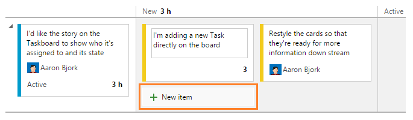

# Kanban split columns, inline adding and editing – Feb 18

This week’s deployment brings a brand new look to our boards and some new functionality that many of you have been waiting for. Let’s jump right in…

## Adding and editing directly from the board

First, notice that all cards have a slightly updated look—cards are now a bit wider, and have a solid white background (instead of a colored background). Why the changes? We’re laying the groundwork for more customization options on the cards, including adornments, additional fields, and tags. Those customizations options aren’t ready in this deployment, but they’re coming soon, so stay tuned.

Next, we’ve updated all boards to support adding new cards and inline editing. The Kanban board now has a **New item** button at the top of the first column that adds a new card. Once added, all data on the card can be edited directly from the card itself.

The Taskboard received similar styling updates. The **New item** button adds a Task directly to the story, and all data on the Taskboard can be edited inline.

## Split columns on the Kanban board

Next, we’ve added a new feature to our Kanban board called “Split Columns”. Kanban teams use a pull model to move work through the board. To do this effectively, each column on your board is split into two subcolumns—Doing and Done. Moving a card into the Done column provides a clear signal that work is ready to progress, and that the card can be pulled by the person/team who owns that next stage.

Click the Customize Columns link on the toolbar to split any of the columns on your board.

## Assign multiple people to test suites

We enabled this sprint the ability to invite multiple sign-off owners to run the same test cases. Right-click a test suite in the Test hub and you’ll be presented with a dialog to assign individuals and email them about the work. Doing so will iterate through each test case in the test suite and create a test for each individual. In the mail sent, a link is provided that takes the user directly to the tests assigned.

Application Insights in the Azure Preview Portal

Finally, we want to give everyone a heads up that new customers on-boarding apps to Application Insights must now use [Application Insights in the Azure Preview Portal](https://azure.microsoft.com/services/application-insights/). While existing users of Application Insights in the Visual Studio Online Portal are unaffected, we recommend all customers begin monitoring in the Azure Preview Portal. Because historical data will not migrate between portals, adding the second telemetry collection will ensure monitoring is unaffected while you transition your apps.

Additional information is available here: [Application Insights: Moving from Visual Studio Online Portal to Azure Preview Portal](http://blogs.msdn.com/b/visualstudioalm/archive/2015/02/06/application-insights-moving-from-visual-studio-online-portal-to-azure-preview-portal.aspx)

Feel free to reach out with feedback on [Twitter](https://twitter.com/VisualStudio) and don’t forget to share what you’d like to see us prioritize on [UserVoice](https://visualstudio.uservoice.com/forums/330519-vso).

Thanks,

Aaron Bjork