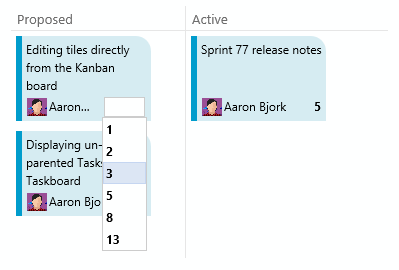

# VS Online Basic license expanded – Jan 27

## Basic license expanded

First and foremost, I’m excited to announce that this week we are rolling out upgrades across Visual Studio Online to make the following features available to ***all users*** with a “Basic” license:

- Web-based test execution
- Agile portfolio management
- Work item chart authoring
- Team Rooms

This change means all teams of five or fewer members have access to these features in Visual Studio Online for free, while larger teams can access this functionality at a much lower price point. Brian Harry will be talking more about the impact of this change on his blog at [http://blogs.msdn.com/bharry](http://blogs.msdn.com/bharry).

Now that the big news is out of the bag, let’s jump into a few improvements to the service…

## Taskboard improvements

We made three changes to the Taskboard this sprint that I want to highlight. First, you can now reorder Tasks directly on the Taskboard. Just grab a tile and move it around to change its order. The picture below demonstrates, as you can see that I’m dragging Task 1 from the first position to the last position.

Second, notice that the parent user story now looks more like a card, matching its visual representation in other parts of the product. And finally, we updated both the Taskboard and the iteration backlog views to include unparented Tasks. This means that ***all*** Tasks assigned to an iteration now show up regardless of whether or not they are parented to a user story.

## Editing tiles on the Kanban board

We also turned on the ability to edit the assigned user and effort values for cards on your Kanban boards. This is the first in a series of changes coming that accrue toward a complete add, edit, and reorder experience directly from the board. Last week I outlined the [list of improvements](http://blogs.msdn.com/b/visualstudioalm/archive/2015/01/21/agile-project-management-futures.aspx) like this that are on their way in upcoming sprints.

Feel free to reach out with feedback on [Twitter](https://twitter.com/VisualStudio) and don’t forget to share what you’d like to see us prioritize on [UserVoice](https://visualstudio.uservoice.com/forums/330519-vso).

Thanks,

Aaron Bjork