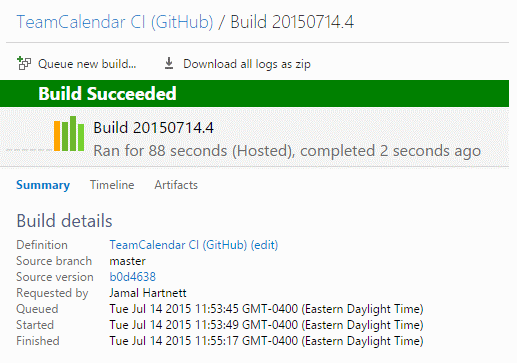

# Multiple activities per team member – Jul 17

## Multiple activities per team member

When planning capacity for a sprint, you can now assign multiple activities to a single team member. Just hover over or click on a row, then click the “…” menu to add a new activity. If you have someone who does both development and testing, you can fine tune the capacity to match your team’s skill sets. This has been a [popular request on UserVoice](https://visualstudio.uservoice.com/forums/121579-visual-studio/suggestions/2308935) for quite a while, and we are excited to finally give you this feature. We expect better planned iterations from all of you now!

## Configure settings directly from backlogs/boards

We have been working hard to consolidate our configuration options into a single place. You will now see the gear icon appear on all the backlog and board pages. Clicking it shows all the settings available for that page. As new settings become available, you’ll find them here.

## Hide empty fields on cards

We have added the ability to hide empty fields on the card. This means less whitespace, smaller cards, and more cards on your board! To enable this feature, click the gear icon, select “Fields”, and uncheck “Show empty fields”.

## Card coloring on Taskboard

In the [July 7th release](jul-07-team-services.md), we added the ability to change the color of cards on your board. This deployment brings that functionality to the Taskboard as well. In addition, we’ve also added support of macros: @Today, @Me, and @CurrentIteration. This opens up some cool opportunities to add visual language to your board. In the example below, we show a rule that turns cards grey if they haven’t been touched in 2 days.

## Drag any item to an iteration from anywhere

You can now drag any work item from any board or any backlog to a sprint. Yup, that’s right. Any item from anywhere. No more guessing when you can drag and when you can’t. It all just works.

## Build your projects hosted in GitHub

You can now setup a continuous integration build in Visual Studio Online for projects hosted on GitHub. With this feature enabled, code pushed to GitHub triggers a build in Visual Studio Online. The build results page provides a direct link to the associated commit in GitHub, with the status of the commit(s) updated to reflect the status of the build. You can also show the status of your build directly on your GitHub repo's readme file or on your own web site using the “build badge” feature.

Note: a basic version of this feature has been available since April, but the process to set up the connection to your GitHub repository is now faster and easier with this deployment.

To learn more about this feature, see [Build your GitHub-hosted projects in Visual Studio Online](http://go.microsoft.com/fwlink/?LinkID=618519).

## New Visual Studio Online integrations

The number of tools and services that integrate with Visual Studio Online continues to grow! Check them all out in the [Visual Studio Online Integrations](https://marketplace.visualstudio.com/vsts) directory, including these services new to the directory:

- [Aha](http://go.microsoft.com/fwlink/?LinkId=618521)!: helps busy product managers create brilliant product strategy and roadmaps. The Visual Studio Online integration enables you to push work item updates in your team projects to your Aha! products, and to open new work items directly from Aha!
- [GitHub](http://go.microsoft.com/fwlink/?LinkId=618519): build/continuous integration support for GitHub repositories right from Visual Studio Online.
- [Power BI](http://go.microsoft.com/fwlink/?LinkID=618520): easily visualize data through dashboards and reports for your team projects. Initially, support for version control (TF Version Control and Git) data is available.
- [TestRail](https://marketplace.visualstudio.com/vsts): provides comprehensive web-based test case management. Create work items in your team project from test result and link test cases to work items.

If you have a tool or service that integrates with Visual Studio Online, we want to know about it! Send an e-mail to [vsointegration@microsoft.com](mailto:vsointegration@microsoft.com).

There you have it. If you have questions, feel free to reach out on [Twitter](https://twitter.com/AzureDevOps). Ideas? Head over to [UserVoice](http://visualstudio.uservoice.com/forums/330519-vso) to add your idea or vote for an existing one.

Enjoy!

Gregg Boer

